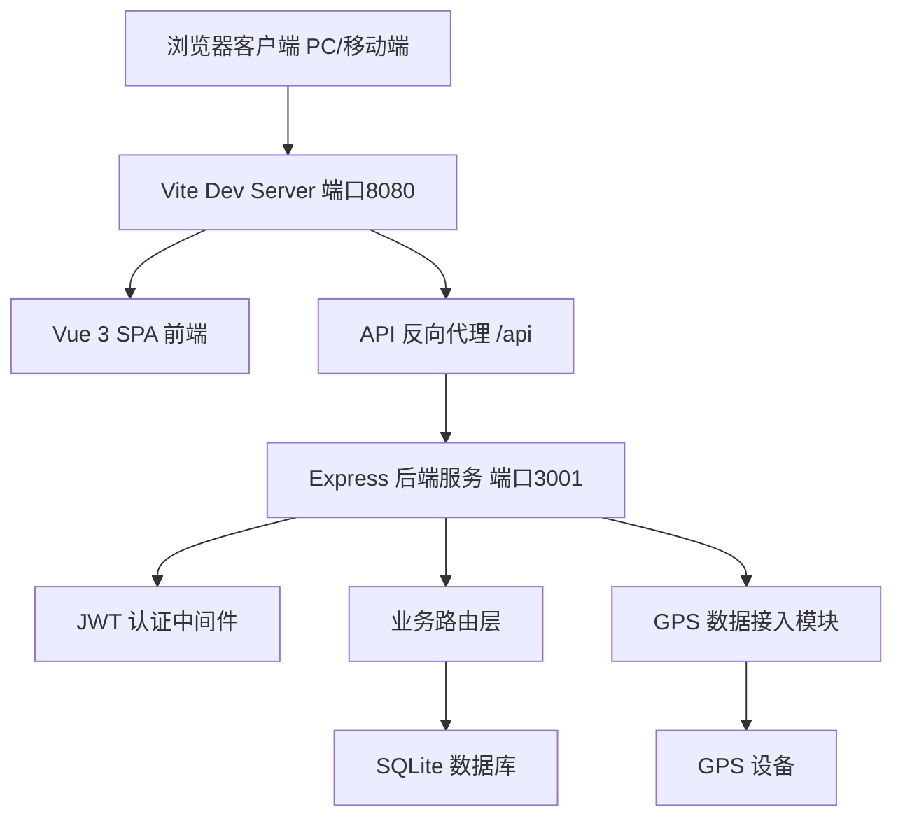
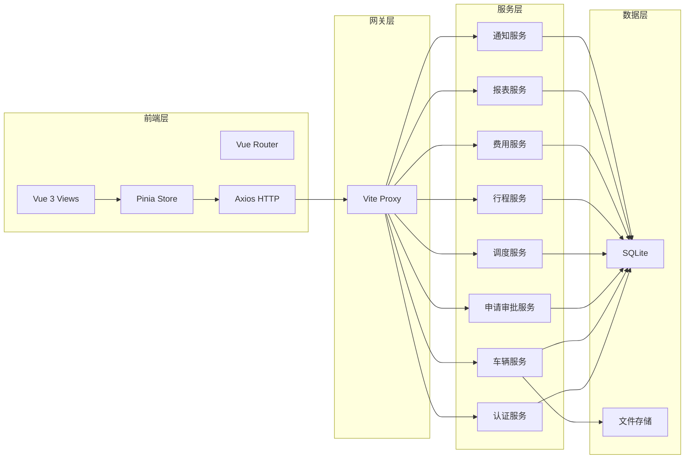
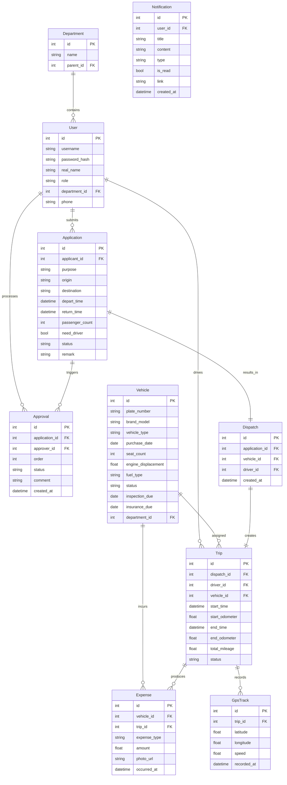
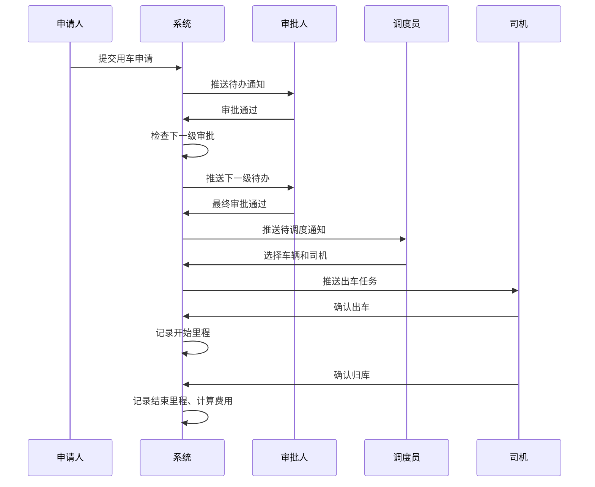

# 央企公务用车管理系统 - 技术设计文档

Feature Name: official-vehicle-management
Updated: 2026-06-22

## 描述

基于 B/S 架构的央企公务用车全生命周期管理系统。前端采用 Vue 3 + Element Plus 构建 SPA 管理后台，后端采用 Node.js + Express 提供 RESTful API，使用 SQLite 作为轻量数据库。系统支持 PC 端和移动端自适应访问。

## 架构

### 系统架构图



### 分层架构



## 组件与接口

### 前端路由设计

| 路径 | 名称 | 组件 | 权限 |
|------|------|------|------|
| `/login` | 登录 | LoginView | 公开 |
| `/` | 仪表盘 | DashboardView | 全部 |
| `/vehicle/list` | 车辆档案 | VehicleListView | 车队管理员、管理员 |
| `/vehicle/detail/:id` | 车辆详情 | VehicleDetailView | 车队管理员、管理员 |
| `/apply/create` | 用车申请 | ApplyCreateView | 普通员工 |
| `/apply/list` | 申请记录 | ApplyListView | 普通员工 |
| `/approve/list` | 审批待办 | ApproveListView | 部门负责人、分管领导 |
| `/dispatch/list` | 调度管理 | DispatchListView | 调度员 |
| `/trip/list` | 行程记录 | TripListView | 司机、管理员 |
| `/track/monitor` | 轨迹监控 | TrackMonitorView | 纪检监察 |
| `/expense/list` | 费用管理 | ExpenseListView | 财务人员 |
| `/report/dashboard` | 统计报表 | ReportView | 管理层 |
| `/system/users` | 用户管理 | UserManageView | 管理员 |
| `/system/roles` | 角色管理 | RoleManageView | 管理员 |

### 前端组件树

```
App.vue
├── Layout (Sidebar + Header + Content)
│   ├── SidebarMenu          # 侧边栏菜单（按角色动态加载）
│   ├── HeaderBar             # 顶部栏（消息通知、用户信息）
│   ├── Breadcrumb            # 面包屑导航
│   └── RouterView
│       ├── DashboardView      # 仪表盘
│       │   ├── StatCards       # 统计卡片
│       │   ├── RemindAlert     # 到期提醒
│       │   └── RecentChart     # 近期图表
│       ├── VehicleListView
│       │   ├── SearchForm      # 搜索筛选
│       │   ├── DataTable       # 数据表格
│       │   └── VehicleFormDialog # 编辑弹窗
│       ├── ApplyCreateView
│       │   └── ApplyForm       # 申请表单
│       ├── ApproveListView
│       │   ├── ApproveFilter   # 状态筛选
│       │   └── ApproveTable    # 审批列表
│       ├── DispatchView
│       │   ├── PendingList     # 待调度列表
│       │   ├── VehicleSelector # 车辆选择器
│       │   └── DriverSelector  # 司机选择器
│       ├── TrackMonitorView
│       │   ├── MapContainer    # 地图容器
│       │   ├── VehicleTracker  # 车辆追踪面板
│       │   └── TrackPlayback   # 轨迹回放
│       ├── ReportView
│       │   ├── StatCharts      # 统计图表
│       │   └── ExportButton    # 导出按钮
│       └── UserManageView
│           ├── OrgTree         # 组织架构树
│           └── UserTable       # 用户表格
```

### 后端 API 设计

| 模块 | 方法 | 路径 | 说明 |
|------|------|------|------|
| 认证 | POST | `/api/auth/login` | 用户登录 |
| 认证 | GET | `/api/auth/me` | 获取当前用户信息 |
| 车辆 | GET | `/api/vehicles` | 车辆列表（支持筛选） |
| 车辆 | POST | `/api/vehicles` | 新增车辆 |
| 车辆 | PUT | `/api/vehicles/:id` | 更新车辆 |
| 车辆 | DELETE | `/api/vehicles/:id` | 删除车辆 |
| 申请 | POST | `/api/applications` | 提交用车申请 |
| 申请 | GET | `/api/applications` | 查询申请列表 |
| 申请 | GET | `/api/applications/:id` | 申请详情 |
| 审批 | GET | `/api/approvals/pending` | 待审批列表 |
| 审批 | POST | `/api/approvals/:id/approve` | 审批通过 |
| 审批 | POST | `/api/approvals/:id/reject` | 审批驳回 |
| 调度 | GET | `/api/dispatch/pending` | 待调度列表 |
| 调度 | POST | `/api/dispatch/assign` | 派车 |
| 行程 | GET | `/api/trips` | 行程列表 |
| 行程 | POST | `/api/trips/start` | 开始出车 |
| 行程 | POST | `/api/trips/end` | 结束行程 |
| 费用 | GET | `/api/expenses` | 费用列表 |
| 费用 | POST | `/api/expenses` | 录入费用 |
| 报表 | GET | `/api/reports/summary` | 汇总统计 |
| 报表 | GET | `/api/reports/export` | 导出报表 |
| 用户 | GET | `/api/users` | 用户列表 |
| 用户 | POST | `/api/users` | 新增用户 |
| 用户 | PUT | `/api/users/:id` | 更新用户 |
| 通知 | GET | `/api/notifications` | 消息列表 |
| 通知 | PUT | `/api/notifications/:id/read` | 标记已读 |

## 数据模型

### ER 图



## 核心业务流程

### 用车申请审批调度流程



## 正确性约束

1. 车辆状态在任意时刻最多对应一个有效出车记录（防止重复派车）
2. 用车申请审批必须按组织架构逐级进行，不可跳级
3. 费用必须关联到具体车辆或具体行程，不可发生孤儿费用
4. 用户密码存储使用 bcrypt 加盐哈希
5. JWT token 有效期 8 小时，过期后需重新登录
6. 所有 API（除登录接口外）必须携带有效 JWT token

## 错误处理

| 场景 | HTTP 状态码 | 响应内容 |
|------|-------------|----------|
| 未登录访问 | 401 | `{error:"未登录或token已过期"}` |
| 无权限操作 | 403 | `{error:"无操作权限"}` |
| 资源不存在 | 404 | `{error:"资源不存在"}` |
| 参数校验失败 | 422 | `{error:"参数错误",details:[...]}` |
| 车辆已被占用 | 409 | `{error:"该车辆在指定时段已被占用"}` |
| 服务器错误 | 500 | `{error:"服务器内部错误"}` |

## 测试策略

- **单元测试**：对服务层核心逻辑（审批流转、车辆状态机、费用计算）编写 Jest 单元测试
- **API 测试**：使用 supertest 对每个 API 端点编写集成测试，覆盖正常流程和异常场景
- **前端测试**：使用 Vitest + Vue Test Utils 测试关键组件逻辑

## 附录

### 技术栈版本

| 组件 | 版本 |
|------|------|
| Vue | 3.4.x |
| Vite | 5.x |
| Element Plus | 2.x |
| Pinia | 2.x |
| Vue Router | 4.x |
| Node.js | 20.x |
| Express | 4.x |
| SQLite (better-sqlite3) | 9.x |
| JWT (jsonwebtoken) | 9.x |
| ECharts | 5.x |
