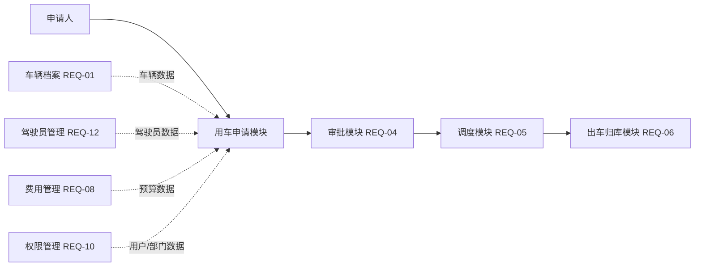
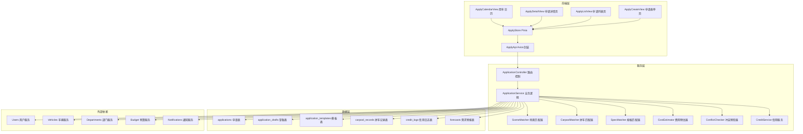
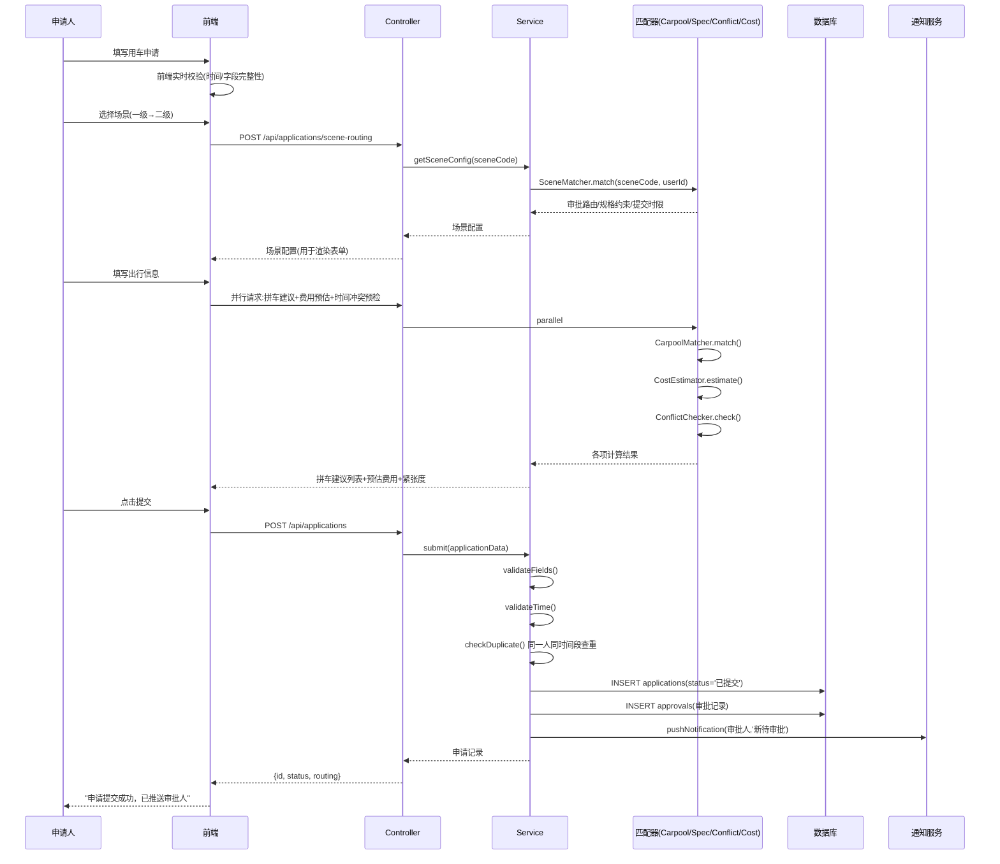
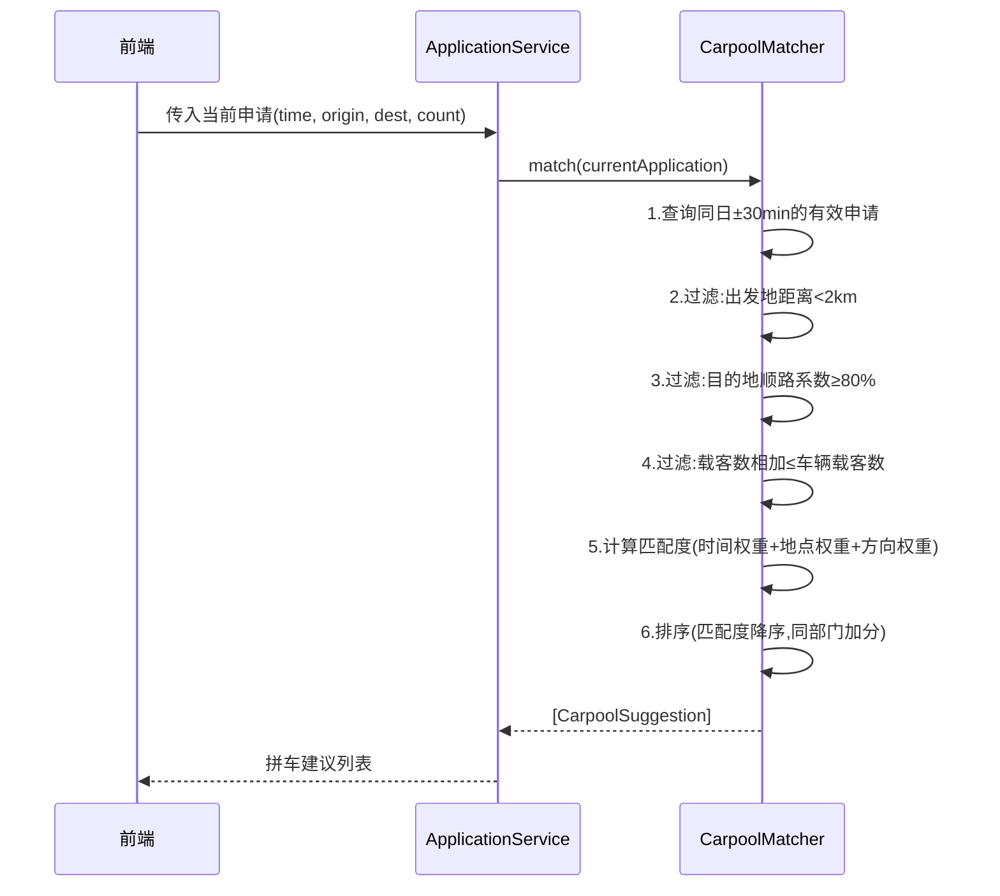

# REQ-03 用车申请 — 概要设计

**文档类型**: 概要设计说明书
**对应需求**: [REQ-03-用车申请](../requirements/REQ-03-用车申请.md)
**更新日期**: 2026-06-22

---

## 1. 模块概述

### 1.1 模块定位

用车申请模块是公务用车管理系统的**流程入口模块**，承担着从"用车需求表达"到"进入审批流转"之间的全部业务逻辑。它在系统中的位置如下：



### 1.2 模块边界

| 边界维度 | 包含 | 不包含 |
|----------|------|--------|
| 功能范围 | 场景选择、表单填写、草稿管理、拼车匹配、费用预估、时间冲突预检、需求预报、申请变更/撤回/取消 | 审批流转（REQ-04）、调度派车（REQ-05） |
| 数据范围 | applications 表、drafts 表、templates 表、carpool 表、credit 表、forecast 表 | approvals 表、dispatches 表 |
| 用户角色 | 普通员工、部门内勤 | 审批人、调度员（仅读取数据） |

---

## 2. 架构分层设计



### 2.1 分层职责

| 层级 | 组件 | 职责 |
|------|------|------|
| 前端层 | ApplyCreateView | 表单填写、实时校验、草稿保存、拼车建议展示、费用预估展示 |
| 前端层 | ApplyListView | 申请列表（我的申请/代申请/部门申请）、状态筛选、排序 |
| 前端层 | ApplyDetailView | 申请详情、全流程追踪、关联信息查看 |
| 前端层 | ApplyCalendarView | 日历视图、资源紧张度热力图 |
| 前端层 | ApplyStore | 前端状态管理（表单数据、草稿状态、拼车匹配结果） |
| 服务层 | ApplicationController | RESTful API 路由分发、参数校验、认证鉴权 |
| 服务层 | ApplicationService | 核心业务逻辑编排 |
| 服务层 | SceneMatcher | 场景→审批路由映射、场景→规格约束映射 |
| 服务层 | SpecMatcher | 四维规格匹配算法（人×场景×人数×距离） |
| 服务层 | CarpoolMatcher | 加权拼车匹配算法 |
| 服务层 | ConflictChecker | 时间冲突预检、资源紧张度计算 |
| 服务层 | CostEstimator | 预估费用计算 |
| 服务层 | CreditService | 信用分计算与查询 |

---

## 3. 核心数据流程

### 3.1 申请提交主流程



### 3.2 拼车匹配流程



---

## 4. 组件与模块划分

### 4.1 前端组件树

```
ApplyCreateView.vue                    # 申请表单主页
├── SceneSelector.vue                  # 场景选择器(一级→二级级联+决策树引导)
├── ApplicationForm.vue               # 申请表单主体
│   ├── ApplicantInfo.vue              # 申请人信息区(自动带入/代申请切换)
│   ├── TravelInfo.vue                 # 出行信息区
│   │   ├── AddressInput.vue           # 地址输入框(自动补全+常用路线)
│   │   ├── DateTimePicker.vue         # 日期时间选择器(含冲突预检标识)
│   │   └── PassengerCount.vue         # 乘车人数(含车型建议)
│   ├── SceneSpecificFields.vue        # 场景特有字段(根据场景动态渲染)
│   └── RemarkInput.vue                # 备注输入(含事由质量评分)
├── CarpoolPanel.vue                   # 拼车建议面板(侧边栏/弹窗)
│   └── CarpoolCard.vue                # 单个拼车建议卡片
├── CostPreview.vue                    # 预估费用预览
├── CalendarQuickView.vue              # 日历快览(资源紧张度)
├── DraftBar.vue                       # 草稿恢复提示栏

ApplyListView.vue                      # 申请列表页
├── ApplicationFilter.vue              # 筛选器(状态/场景/时间)
├── ApplicationTable.vue               # 数据表格
└── ApplicationCard.vue                # (移动端)卡片视图

ApplyDetailView.vue                    # 申请详情页
├── ProgressTracker.vue                # 全流程进度追踪
├── ApplicationInfoPanel.vue           # 申请信息面板
├── ApprovalTimeline.vue               # 审批时间轴
├── RelatedInfoPanel.vue               # 关联信息(派车单/行程/GPS)
└── ChangeLogPanel.vue                 # 变更日志

ApplyCalendarView.vue                  # 用车日历
├── CalendarHeader.vue                 # 日历头部(日/周/月切换)
├── CalendarGrid.vue                   # 日历网格
├── CongestionHeatmap.vue              # 资源紧张度热力图叠加层
└── DayDetailPanel.vue                 # 日详情面板(列出当日所有用车)
```

### 4.2 后端服务结构

```
server/
├── routes/
│   └── applications.js                # 路由定义
├── controllers/
│   └── applicationController.js       # 请求处理、参数校验
├── services/
│   ├── applicationService.js          # 核心业务逻辑
│   ├── sceneMatcher.js                # 场景→约束映射
│   ├── carpoolMatcher.js              # 拼车匹配引擎
│   ├── specMatcher.js                 # 规格匹配引擎
│   ├── costEstimator.js               # 费用预估
│   ├── conflictChecker.js             # 时间冲突/资源紧张度
│   └── creditService.js               # 信用分服务
├── middleware/
│   └── applicationValidator.js        # 字段校验中间件
└── db/
    └── migrations/
        └── 003_applications.sql        # 申请表迁移脚本
```

---

## 5. 关键设计决策

| 决策点 | 方案 | 理由 |
|--------|------|------|
| 场景体系 | 三级分类(一级→二级→子场景模板) | 一级面向用户选择，二级确定审批路由和约束 |
| 规格匹配 | 四维矩阵(人×场景×人数×距离) | 脱离硬编码if-else，矩阵可配置化 |
| 拼车匹配 | 加权打分排序 | 多因素需综合权衡，权重可调 |
| 草稿存储 | 独立 drafts 表，7天TTL | 避免污染主申请表，定时清理 |
| 信用体系 | 事件驱动计分 | 耦合低，事件可追溯 |
| 预估费用 | 基于历史均值和当前价格 | 非精确结算，仅做参考 |
| 前端表单 | 场景驱动动态渲染 | 21种子场景，静态表单维护成本高 |

---

## 6. 接口协议总览

| 方法 | 路径 | 认证 | 说明 |
|------|------|------|------|
| POST | `/api/applications` | 是 | 提交申请 |
| POST | `/api/applications/draft` | 是 | 保存草稿 |
| GET | `/api/applications/drafts` | 是 | 获取草稿列表 |
| DELETE | `/api/applications/drafts/:id` | 是 | 删除草稿 |
| GET | `/api/applications` | 是 | 查询申请列表 |
| GET | `/api/applications/:id` | 是 | 申请详情 |
| PUT | `/api/applications/:id` | 是 | 修改申请 |
| DELETE | `/api/applications/:id` | 是 | 撤回申请 |
| POST | `/api/applications/:id/cancel` | 是 | 取消用车 |
| GET | `/api/applications/:id/timeline` | 是 | 全流程进度 |
| POST | `/api/applications/batch` | 是 | 批量申请 |
| POST | `/api/applications/forecast` | 是 | 填报预报 |
| GET | `/api/applications/forecast/list` | 是 | 预报汇总 |
| GET | `/api/applications/calendar` | 是 | 用车日历 |
| GET | `/api/applications/calendar/congestion` | 是 | 资源紧张度 |
| GET | `/api/applications/carpool-suggestion` | 是 | 拼车建议 |
| POST | `/api/applications/carpool-suggestion/:id/join` | 是 | 加入拼车 |
| GET | `/api/applications/templates` | 是 | 常用路线模板 |
| POST | `/api/applications/templates` | 是 | 保存模板 |
| GET | `/api/applications/estimate-cost` | 是 | 预估费用 |
| GET | `/api/applications/address-suggest` | 是 | 地址补全 |
| GET | `/api/applications/credit/:userId` | 是 | 信用分查询 |
| GET | `/api/applications/scene-routing` | 是 | 场景配置获取 |
