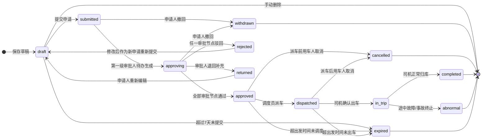

# REQ-03 用车申请 — 详细设计

**文档类型**: 详细设计说明书
**对应需求**: [REQ-03-用车申请](../requirements/REQ-03-用车申请.md)
**更新日期**: 2026-06-22

---

## 1. 数据库表设计

### 1.1 applications（用车申请表）

```sql
CREATE TABLE applications (
    id              INTEGER PRIMARY KEY AUTOINCREMENT,
    -- 申请编号（自动生成：SQ-YYYYMMDD-序号）
    app_no          TEXT NOT NULL UNIQUE,
    -- 申请人信息
    applicant_id    INTEGER NOT NULL REFERENCES users(id),
    applicant_dept  INTEGER NOT NULL REFERENCES departments(id),
    -- 代申请人（内勤代申请场景）
    proxy_id        INTEGER REFERENCES users(id),
    -- 实际用车人（本人申请时=applicant_id，代申请时为被代申请人）
    actual_user_id  INTEGER NOT NULL REFERENCES users(id),
    -- 场景分类
    scene_category  TEXT NOT NULL,       -- 一级场景(如 long_distance)
    scene_subtype   TEXT NOT NULL,       -- 二级场景(如 cross_city)
    -- 出行信息
    purpose         TEXT NOT NULL,       -- 用车事由(20-500字)
    origin          TEXT NOT NULL,       -- 出发地点
    destination     TEXT NOT NULL,       -- 目的地点
    waypoints       TEXT,                -- 途经点 JSON数组 ["A","B","C"]
    depart_date     TEXT NOT NULL,       -- 预计出发日期 YYYY-MM-DD
    depart_time     TEXT NOT NULL,       -- 预计出发时间 HH:MM
    return_date     TEXT NOT NULL,       -- 预计返回日期 YYYY-MM-DD
    return_time     TEXT NOT NULL,       -- 预计返回时间 HH:MM
    passenger_count INTEGER NOT NULL,    -- 乘车人数
    need_driver     INTEGER NOT NULL DEFAULT 1,  -- 是否需要司机 0/1
    is_secret       INTEGER NOT NULL DEFAULT 0,  -- 是否涉密出行 0/1
    -- 场景特有字段（JSON存储，根据scene_subtype动态结构）
    scene_specific  TEXT,                -- JSON对象
    -- 备注
    remark          TEXT,
    -- 生成信息
    estimated_cost  REAL,                -- 预估费用
    priority        INTEGER DEFAULT 0,   -- 调度优先级(越大越优先)
    -- 状态
    status          TEXT NOT NULL DEFAULT 'draft',
    -- 时间戳
    created_at      TEXT NOT NULL DEFAULT (datetime('now','localtime')),
    updated_at      TEXT NOT NULL DEFAULT (datetime('now','localtime')),
    submitted_at    TEXT
);

-- 状态枚举
-- status: draft|submitted|approving|approved|rejected|dispatched|
--          cancelled|expired|withdrawn|in_trip|completed|abnormal

-- 索引
CREATE INDEX idx_applications_applicant ON applications(applicant_id);
CREATE INDEX idx_applications_status ON applications(status);
CREATE INDEX idx_applications_depart ON applications(depart_date, depart_time);
CREATE INDEX idx_applications_scene ON applications(scene_category, scene_subtype);
```

**scene_specific JSON 结构示例（各场景不同）：**

```json
// 接待用车-接送站
{
  "guest_unit": "XX省国资委",
  "guest_title": "副主任",
  "guest_count": 3,
  "flight_no": "CA1234",
  "need_sign_board": true
}
// 长途公务出行
{
  "is_cross_province": true,
  "necessity_statement": "赴XX参加国家发改委组织的专项评审会，公共交通无法满足时间要求"
}
// 机要通信
{
  "doc_number": "MM-2026-0012",
  "security_level": "secret"
}
```

### 1.2 application_drafts（草稿表）

```sql
CREATE TABLE application_drafts (
    id              INTEGER PRIMARY KEY AUTOINCREMENT,
    user_id         INTEGER NOT NULL REFERENCES users(id),
    -- 完整的表单数据 JSON
    form_data       TEXT NOT NULL,       -- JSON快照
    -- 元数据
    scene_category  TEXT,
    depart_date     TEXT,
    destination     TEXT,
    -- 生命周期
    created_at      TEXT NOT NULL DEFAULT (datetime('now','localtime')),
    updated_at      TEXT NOT NULL DEFAULT (datetime('now','localtime')),
    expires_at      TEXT NOT NULL,       -- 创建时间+7天
    status          TEXT DEFAULT 'active'  -- active|expired|converted
);
```

### 1.3 application_templates（常用路线模板表）

```sql
CREATE TABLE application_templates (
    id              INTEGER PRIMARY KEY AUTOINCREMENT,
    user_id         INTEGER NOT NULL REFERENCES users(id),
    name            TEXT NOT NULL,       -- 模板名称（用户自定义）
    scene_category  TEXT NOT NULL,
    scene_subtype   TEXT NOT NULL,
    origin          TEXT NOT NULL,
    destination     TEXT NOT NULL,
    waypoints       TEXT,
    passenger_count INTEGER,
    need_driver     INTEGER DEFAULT 1,
    remark          TEXT,
    use_count       INTEGER DEFAULT 0,  -- 使用次数
    last_used_at    TEXT,
    created_at      TEXT NOT NULL DEFAULT (datetime('now','localtime'))
);
```

### 1.4 carpool_records（拼车记录表）

```sql
CREATE TABLE carpool_records (
    id                  INTEGER PRIMARY KEY AUTOINCREMENT,
    -- 发起方的申请ID
    initiator_app_id    INTEGER NOT NULL REFERENCES applications(id),
    -- 加入方的申请ID（加入后合并，各自的申请标记为carpooled）
    joiner_app_id       INTEGER NOT NULL REFERENCES applications(id),
    -- 合并后的主申请ID
    merged_app_id       INTEGER REFERENCES applications(id),
    -- 状态
    status              TEXT NOT NULL DEFAULT 'pending',
    -- pending(等待确认)|accepted(已确认)|rejected(已拒绝)|cancelled(已取消)
    initiator_confirm   INTEGER DEFAULT 0,  -- 发起方确认 0/1
    joiner_confirm      INTEGER DEFAULT 0,  -- 加入方确认 0/1
    created_at          TEXT NOT NULL DEFAULT (datetime('now','localtime')),
    confirmed_at        TEXT
);
```

### 1.5 credit_logs（信用日志表）

```sql
CREATE TABLE credit_logs (
    id              INTEGER PRIMARY KEY AUTOINCREMENT,
    user_id         INTEGER NOT NULL REFERENCES users(id),
    event_type      TEXT NOT NULL,       -- 事件类型
    -- event_type: cancel_24h_plus|cancel_4_24h|cancel_1_4h|
    --             cancel_1h|cancel_after_arrive|complete_normal
    application_id  INTEGER REFERENCES applications(id),
    score_change    INTEGER NOT NULL,    -- 分值变动
    balance_after   INTEGER NOT NULL,    -- 变动后余额
    description     TEXT,                -- 描述
    created_at      TEXT NOT NULL DEFAULT (datetime('now','localtime'))
);

-- 当前信用分通过 SUM(credit_logs.score_change) 实时计算
-- 初始分 = 100
-- 信用分 < 60 时触发调度优先级降权

CREATE INDEX idx_credit_user ON credit_logs(user_id);
```

### 1.6 forecasts（需求预报表）

```sql
CREATE TABLE forecasts (
    id              INTEGER PRIMARY KEY AUTOINCREMENT,
    dept_id         INTEGER NOT NULL REFERENCES departments(id),
    reporter_id     INTEGER NOT NULL REFERENCES users(id),
    -- 预报周
    week_start      TEXT NOT NULL,       -- 周一日期 YYYY-MM-DD
    -- 预报内容 JSON
    forecast_data   TEXT NOT NULL,
    -- forecast_data 结构:
    -- [{ "date": "2026-06-23", "duration": "half_day",
    --    "destination": "XX项目现场", "est_count": 3,
    --    "scene": "daily" }]
    created_at      TEXT NOT NULL DEFAULT (datetime('now','localtime'))
);

CREATE INDEX idx_forecasts_week ON forecasts(week_start);
CREATE INDEX idx_forecasts_dept ON forecasts(dept_id);
```

### 1.7 application_change_logs（变更日志表）

```sql
CREATE TABLE application_change_logs (
    id              INTEGER PRIMARY KEY AUTOINCREMENT,
    application_id  INTEGER NOT NULL REFERENCES applications(id),
    field_name      TEXT NOT NULL,       -- 变更字段名
    old_value       TEXT,                -- 变更前的值
    new_value       TEXT,                -- 变更后的值
    change_level    TEXT NOT NULL,       -- light|medium|heavy
    operator_id     INTEGER NOT NULL REFERENCES users(id),
    created_at      TEXT NOT NULL DEFAULT (datetime('now','localtime'))
);
```

---

## 2. 核心算法详细设计

### 2.1 场景路由映射算法（SceneMatcher）

**输入**：场景编码 `scene_category + scene_subtype`、申请人 `userId`

**输出**：场景配置 `SceneConfig`

**伪代码**：

```
function getSceneConfig(sceneCategory, sceneSubtype, userId):
    user = UserService.getById(userId)
    dept = DepartmentService.getById(user.deptId)

    // 基础配置从场景矩阵查询
    config = SCENE_MATRIX[sceneCategory][sceneSubtype]

    // 动态计算审批路由
    approvalChain = []
    for level in config.approvalLevels:
        if level == 'dept':
            approver = DepartmentService.getHead(dept.id)
        elif level == 'division':
            approver = DepartmentService.getDivisionLeader(dept.ancestorId)
        elif level == 'chief':
            approver = UserService.getByRole('单位主要负责人')
        elif level == 'security':  // 机要通信保密办审批
            approver = UserService.getByRole('保密办负责人')
        approvalChain.push({level, approverId: approver.id, approverName: approver.name})

    // 规格约束
    specConstraint = getSpecConstraint(user.level, sceneCategory, config.vehicleType)
    // 提交时限
    deadline = config.submitDeadline  // 如 "2h_before", "1_workday_before"
    // 是否触发节假日规则
    isHoliday = HolidayService.isHoliday(requestedDate)
    if isHoliday:
        approvalChain.push({level: 'discipline', approverId: 纪检备案})

    return { approvalChain, specConstraint, deadline, isHoliday }
```

### 2.2 规格匹配算法（SpecMatcher）

**输入**：申请人级别、场景类型、乘车人数、出行距离

**输出**：推荐车辆规格 `VehicleSpec`

**核心矩阵**（存储为配置表，运行时加载）：

```
SPEC_MATRIX = {
  "普通员工": {
    "daily":          { maxDisplacement: 2.0, maxPrice: 20, prefType: "轿车" },
    "long_distance":  { maxDisplacement: 2.0, maxPrice: 20, prefType: "轿车" },
    "reception":      { maxDisplacement: 2.5, maxPrice: 25, prefType: "轿车" },
    "inspection":     { maxDisplacement: 2.0, maxPrice: 20, prefType: "SUV" },
    "group":          { maxDisplacement: 2.0, maxPrice: 20, prefType: "中巴" }
  },
  "部门负责人": { ... },
  "分管领导":   { ... },
  "主要负责人": { ... }
}
```

**伪代码**：

```
function matchSpec(applicant, scene, passengerCount, distance):
    base = SPEC_MATRIX[applicant.level][scene]

    // 人数维度叠加
    if passengerCount >= 20: base.prefType = "大巴"
    elif passengerCount >= 13: base.prefType = "中巴"
    elif passengerCount >= 7: base.prefType = "商务车"

    // 距离维度叠加
    if distance >= 300: base.prefType = "轿车" // 长途优先舒适性

    // 新能源优先(条件过滤)
    if base.prefType in ["轿车", "SUV"]:
        electricVehicles = VehicleService.getAvailable({fuelType:'纯电', ...base})
        if electricVehicles.length > 0:
            base.recommendEV = true
            base.evRange = electricVehicles[0].range

    return base
```

### 2.3 拼车匹配算法（CarpoolMatcher）

**输入**：当前申请 `{departDate, departTime, origin, destination, passengerCount, deptId}`

**输出**：拼车建议列表 `CarpoolSuggestion[]`

**伪代码**：

```
function matchCarpool(currentApp):
    suggestions = []

    // 1. 时间窗口：同一天 ±30分钟
    candidates = db.query(`
        SELECT * FROM applications
        WHERE depart_date = ?
        AND status IN ('approved','dispatched')
        AND depart_time BETWEEN ? AND ?
        AND id != ?
    `, [currentApp.departDate,
        currentApp.departTime - 30min,
        currentApp.departTime + 30min,
        currentApp.id])

    for candidate in candidates:
        score = 0

        // 2. 出发地距离(使用坐标计算)
        originDist = geoDistance(currentApp.originCoord, candidate.originCoord)
        if originDist > 2: continue  // 过滤
        score += (2 - originDist) / 2 * 40  // 地点权重40分

        // 3. 目的地顺路系数
        routeOverlap = calcRouteOverlap(currentApp.route, candidate.route)
        if routeOverlap < 0.8: continue  // 过滤
        score += routeOverlap * 30  // 方向权重30分

        // 4. 时间匹配度
        timeDelta = abs(currentApp.departTime - candidate.departTime)
        score += (30 - timeDelta) / 30 * 20  // 时间权重20分

        // 5. 同部门加分
        if candidate.applicantDept == currentApp.deptId:
            score += 10  // 部门权重10分

        // 6. 载客数校验(必要条件)
        candidateVehicle = VehicleService.getById(candidate.assignedVehicleId)
        if currentApp.passengerCount + candidate.passengerCount > candidateVehicle.seatCount:
            continue  // 不满足必要条件，排除

        suggestions.push({ candidate, score })

    // 排序
    suggestions.sort(by score desc)
    return suggestions.slice(0, 5)  // 最多返回5条
```

**路线顺路系数计算**：

```
function calcRouteOverlap(routeA, routeB):
    // 路线的Hausdorff距离归一化
    maxDist = max(geoDistance(routeA.origin, routeA.destination),
                  geoDistance(routeB.origin, routeB.destination))
    hausdorff = hausdorffDistance(routeA.points, routeB.points)
    return max(0, 1 - hausdorff / maxDist)
```

### 2.4 预估费用算法（CostEstimator）

**输入**：`{originCoord, destCoord, departDate, returnDate, scene}`

**输出**：`EstimatedCost`

**伪代码**：

```
function estimateCost(params):
    // 预估里程
    estimatedKm = geoDistance(params.originCoord, params.destCoord) * 2  // 往返
    // 路线修正系数（非直线距离，公路系数1.3）
    estimatedKm *= 1.3

    // 油费预估
    avgFuelRate = db.query(`SELECT AVG(fuel_consumption) FROM vehicle_stats
                            WHERE vehicle_type = ? AND period = 'last_3_months'`)
    fuelPrice = ConfigService.get('fuel_price_per_liter')  // 7.8元/L
    fuelCost = estimatedKm / 100 * avgFuelRate * fuelPrice

    // 过路费预估
    tollRate = ConfigService.get('toll_rate_per_km')  // 0.4元/km
    tollCost = estimatedKm * tollRate

    // 停车费预估
    estHours = calcDuration(params.departDate, params.returnDate)
    parkingRate = getParkingRate(params.destCoord)  // 目的地平均停车费率
    parkingCost = estHours * parkingRate

    // 司机补贴（仅多日/长途）
    driverSubsidy = 0
    if estHours > 8 or params.scene == 'long_distance':
        days = ceil(estHours / 24)
        driverSubsidy = days * ConfigService.get('driver_daily_subsidy')  // 50元/天

    return {
        fuelCost, tollCost, parkingCost, driverSubsidy,
        totalCost: fuelCost + tollCost + parkingCost + driverSubsidy,
        estimatedKm
    }
```

### 2.5 资源紧张度计算（ConflictChecker）

```
function getCongestion(date):
    totalVehicles = VehicleService.countByStatus(['可用', '已预约', '已出车'])
    // 按30分钟粒度计算各时段占用数
    slots = generateTimeSlots(date)
    for slot in slots:
        occupied = db.count(
            "SELECT COUNT(*) FROM dispatches d JOIN applications a ON d.application_id = a.id
             WHERE a.depart_date = ? AND a.depart_time <= ? AND a.return_time > ?"
        , [date, slot.end, slot.start])
        slot.congestion = occupied / totalVehicles
    return slots
```

### 2.6 信用分计算（CreditService）

```
function addCreditEvent(userId, eventType, applicationId):
    scoreMap = {
        'cancel_24h_plus':      0,
        'cancel_4_24h':        -5,
        'cancel_1_4h':         -15,
        'cancel_1h':           -30,
        'cancel_after_arrive': -50,
        'complete_normal':     +2
    }
    change = scoreMap[eventType]

    currentScore = db.sum("SELECT SUM(score_change) FROM credit_logs WHERE user_id = ?", [userId])
    newScore = (currentScore || 100) + change

    db.insert('credit_logs', {
        userId, eventType, applicationId,
        scoreChange: change, balanceAfter: newScore
    })

    // 特殊事件:取消后到达,生成告警
    if eventType == 'cancel_after_arrive':
        AlertService.create({
            type: 'credit_alert',
            userId, applicationId,
            severity: 'high',
            description: `用户信用分大幅下降至${newScore}，触发部门负责人关注`
        })
        NotificationService.send(user.deptHead, '用户信用告警', ...)

    return newScore
```

---

## 3. 前端组件详细设计

### 3.1 SceneSelector.vue

**功能**：场景二层级联选择 + 决策树引导

**Props**：
| 属性 | 类型 | 说明 |
|------|------|------|
| `modelValue` | `{category, subtype}` | v-model 双向绑定 |

**Events**：
| 事件 | 参数 | 说明 |
|------|------|------|
| `update:modelValue` | `{category, subtype}` | 选择变更 |
| `scene-change` | `SceneConfig` | 场景确定后传出完整配置 |

**内部 State**：
```javascript
{
  showDecisionTree: false,          // 是否展示决策树引导
  selectedCategory: null,           // 选中的一级场景code
  selectedSubtype: null,            // 选中的二级场景code
  categoryList: [],                 // 一级场景列表
  subtypeMap: {},                   // { categoryCode: [subtypeObj] }
  sceneConfig: null,                // 选中场景的完整配置
  isLoadingConfig: false            // 正在加载场景配置
}
```

**使用示例**：
```html
<SceneSelector v-model="scene" @scene-change="onSceneChange" />
```

### 3.2 ApplicationForm.vue

**功能**：申请表单主体，根据场景动态渲染

**Props**：
| 属性 | 类型 | 说明 |
|------|------|------|
| `sceneConfig` | `SceneConfig` | 场景配置（审批路由+规格+时限+节假日信息） |
| `initialData` | `ApplicationData` | 草稿恢复时传入的初始数据 |

**Events**：
| 事件 | 参数 | 说明 |
|------|------|------|
| `submit` | `ApplicationData` | 表单提交 |
| `save-draft` | `ApplicationData` | 保存草稿 |
| `estimate-change` | `EstimatedCost` | 预估费用变化 |

**内部 State**：
```javascript
{
  form: {
    // 申请人信息（自动填入）
    applicantId, applicantName, applicantDept, applicantLevel,
    // 代申请
    isProxyMode: false,   proxyId: null, actualUserId: null,
    // 出行信息
    purpose, origin, destination, waypoints: [],
    departDate, departTime, returnDate, returnTime,
    passengerCount, needDriver: true, isSecret: false,
    // 场景特有
    sceneSpecific: {},
    remark: ''
  },
  // 实时计算结果
  carpoolSuggestions: [],           // 拼车建议列表
  estimatedCost: null,              // 预估费用
  congestionSlots: [],              // 资源紧张度数据
  // 校验状态
  errors: {},                       // 字段级校验错误
  purposeScore: 100,               // 事由质量评分
  // 界面状态
  showCarpoolPanel: false,
  showCalendarQuickView: false,
  isSubmitting: false
}
```

**关键方法**：

```javascript
// 实时监听：出发时间/出发地/目的地变更 → 重新获取拼车建议
watch([form.departDate, form.departTime, form.origin, form.destination],
  debounce(async () => {
    if (form.origin && form.destination) {
      this.carpoolSuggestions = await api.getCarpoolSuggestion({...})
      this.estimatedCost = await api.getEstimateCost({...})
      this.congestionSlots = await api.getCongestion(form.departDate)
    }
  }, 500)
)

// 事由质量评分
watch(() => form.purpose, (val) => {
  let score = 100
  if (val.length < 20) score -= 30
  if (/(外出|办事|出行)$/.test(val)) score -= 20
  if (!/[\u4e00-\u9fa5]{5,}/.test(val)) score -= 15
  this.purposeScore = Math.max(0, score)
})

// 提交校验
async function submit() {
  // 1. 前端校验
  const errors = validateForm(this.form, this.sceneConfig)
  if (Object.keys(errors).length > 0) { this.errors = errors; return }

  // 2. 后端提交
  try {
    const result = await api.submitApplication(this.form)
    this.$emit('submit-success', result)
  } catch (e) {
    if (e.code === 'DUPLICATE_APPLICATION') { /* 同期重复 */ }
    if (e.code === 'DEADLINE_EXCEEDED') { /* 超过时限 */ }
  }
}
```

### 3.3 AddressInput.vue

**功能**：地址输入框，支持自动补全和常用路线快捷选择

**Props**：
| 属性 | 类型 | 说明 |
|------|------|------|
| `modelValue` | `string` | 地址文本 |
| `placeholder` | `string` | |
| `userId` | `number` | 用于获取该用户的常用路线 |

**内部逻辑**：
- 输入时调用 `/api/applications/address-suggest?q=xxx` 获取补全列表
- 聚焦时展示"我的常用路线"下拉
- 选中后获取该地址的经纬度坐标（用于拼车匹配和费用预估）

### 3.4 ProgressTracker.vue

**功能**：申请全流程进度追踪可视化

**Props**：
| 属性 | 类型 | 说明 |
|------|------|------|
| `applicationId` | `number` | |

**数据获取**：`GET /api/applications/:id/timeline`

**展示逻辑**：根据应用状态渲染不同阶段的节点和连线，当前节点高亮，已完成节点标记打勾，驳回节点标红。

---

## 4. API 接口详细契约

### 4.1 POST /api/applications — 提交申请

**请求**：
```json
{
  "sceneCategory": "reception",
  "sceneSubtype": "pickup_station",
  "purpose": "赴大兴机场接国资委XXX副主任一行3人来我单位调研，需举牌接站",
  "origin": "集团公司总部",
  "destination": "北京大兴国际机场",
  "waypoints": [],
  "departDate": "2026-06-25",
  "departTime": "08:30",
  "returnDate": "2026-06-25",
  "returnTime": "11:00",
  "passengerCount": 4,
  "needDriver": true,
  "isSecret": false,
  "sceneSpecific": {
    "guestUnit": "XX省国资委",
    "guestTitle": "副主任",
    "guestCount": 3,
    "flightNo": "CA1234",
    "needSignBoard": true
  },
  "remark": "预计10:30到达，请注意航班动态",
  "proxyId": null,
  "actualUserId": 42
}
```

**响应 201**：
```json
{
  "code": 0,
  "data": {
    "id": 128,
    "appNo": "SQ-20260622-128",
    "status": "submitted",
    "approvalChain": [
      {"level": "dept", "approverId": 5, "approverName": "李强", "status": "pending"},
      {"level": "division", "approverId": 8, "approverName": "王分管", "status": "pending"}
    ],
    "estimatedCost": {
      "fuelCost": 85.50,
      "tollCost": 52.00,
      "parkingCost": 25.00,
      "driverSubsidy": 0,
      "totalCost": 162.50,
      "estimatedKm": 130
    },
    "createdAt": "2026-06-22T16:30:00"
  }
}
```

**错误响应**：
| 错误码 | 说明 |
|--------|------|
| `DUPLICATE_APPLICATION` | 同一用车人在相同时段已有有效申请 |
| `DEADLINE_EXCEEDED` | 申请提交时间不满足场景要求的最小时限 |
| `BUDGET_EXCEEDED` | 预估费用超出部门月度预算余额 |
| `INVALID_TIME_RANGE` | 出发/返回时间逻辑错误 |
| `OVER_CAPACITY` | 乘车人数超过当前可用车辆最大载客数 |

### 4.2 GET /api/applications/carpool-suggestion — 拼车建议

**请求**：query params
```
?departDate=2026-06-25&departTime=08:30&origin=集团公司总部&destination=怀柔科学城&passengerCount=3&deptId=12
```

**响应 200**：
```json
{
  "code": 0,
  "data": [
    {
      "candidateAppId": 95,
      "matchScore": 85,
      "applicantName": "张*",
      "applicantDept": "科技发展部",
      "departTime": "08:30",
      "destination": "雁栖湖国际会展中心",
      "passengerCount": 2,
      "vehiclePlate": "京A·88606",
      "vehicleType": "比亚迪汉EV",
      "availableSeats": 3,
      "scoreDetail": {
        "origin": 38, "route": 27, "time": 20, "dept": 0
      }
    },
    {
      "candidateAppId": 103,
      "matchScore": 72,
      "applicantName": "刘*",
      "applicantDept": "综合管理部",
      "departTime": "08:00",
      "destination": "密云水库管理处",
      "passengerCount": 1,
      "vehiclePlate": "京A·88602",
      "vehicleType": "别克GL8",
      "availableSeats": 4,
      "scoreDetail": {
        "origin": 35, "route": 22, "time": 5, "dept": 10
      }
    }
  ]
}
```

### 4.3 GET /api/applications/:id/timeline — 全流程进度

**请求**：path param `id: 128`

**响应 200**：
```json
{
  "code": 0,
  "data": {
    "applicationId": 128,
    "appNo": "SQ-20260622-128",
    "currentStatus": "approving",
    "currentNode": "dept_approval",
    "expectedWaitMinutes": 45,
    "nodes": [
      {"key": "submitted", "label": "已提交", "status": "done", "time": "06-22 16:30", "operator": "张伟"},
      {"key": "dept_approval", "label": "部门审批", "status": "active", "operator": "李强(部门负责人)", "avgProcessTime": "2.5小时"},
      {"key": "division_approval", "label": "分管领导审批", "status": "pending", "operator": "王分管"},
      {"key": "dispatch", "label": "调度派车", "status": "pending"},
      {"key": "trip", "label": "出车", "status": "pending"},
      {"key": "complete", "label": "完成", "status": "pending"}
    ],
    "relatedInfo": {
      "dispatch": null,
      "trip": null,
      "gps": null
    }
  }
}
```

### 4.4 GET /api/applications/calendar — 用车日历

**请求**：query params
```
?view=week&startDate=2026-06-22&endDate=2026-06-28
```

**响应 200**：
```json
{
  "code": 0,
  "data": {
    "view": "week",
    "dates": [
      {
        "date": "2026-06-23",
        "totalVehicles": 5,
        "entries": [
          {"appId": 95, "vehiclePlate": "京A·88606", "applicant": "张*", "dest": "怀柔", "timeSlot": "08:30-17:00", "status": "approved"},
          {"appId": 103, "vehiclePlate": "京A·88602", "applicant": "刘*", "dest": "密云", "timeSlot": "08:00-18:00", "status": "dispatched"}
        ],
        "congestion": [
          {"slot": "08:00-08:30", "congestion": 0.4},
          {"slot": "08:30-09:00", "congestion": 0.8},
          {"slot": "09:00-09:30", "congestion": 0.6}
        ]
      }
    ]
  }
}
```

### 4.5 GET /api/applications/estimate-cost — 预估费用

**请求**：query params
```
?origin=116.397428,39.90923&dest=116.638752,40.370369&departDate=2026-06-25&returnDate=2026-06-25&scene=reception
```

**响应 200**：
```json
{
  "code": 0,
  "data": {
    "estimatedKm": 130.5,
    "fuelCost": 85.50,
    "tollCost": 52.20,
    "parkingCost": 25.00,
    "driverSubsidy": 0,
    "totalCost": 162.70,
    "budgetRemaining": 12840.30,
    "budgetWarning": false
  }
}
```

### 4.6 GET /api/applications/scene-routing — 场景配置

**请求**：query params
```
?sceneCategory=reception&sceneSubtype=pickup_station&userId=42
```

**响应 200**：
```json
{
  "code": 0,
  "data": {
    "sceneCategory": "reception",
    "sceneSubtype": "pickup_station",
    "sceneLabel": "接待用车-接送站",
    "approvalChain": [
      {"level": "dept", "approverName": "李强"},
      {"level": "division", "approverName": "王分管"}
    ],
    "specConstraint": {
      "maxDisplacement": 2.5,
      "maxPrice": 25,
      "prefType": "轿车"
    },
    "submitDeadline": { "value": 4, "unit": "hours", "label": "出发前4小时提交" },
    "isHoliday": false,
    "sceneSpecificFields": [
      {"name": "guestUnit", "label": "接待对象单位", "type": "text", "required": true},
      {"name": "guestTitle", "label": "接待对象职务", "type": "text", "required": true},
      {"name": "guestCount", "label": "接待对象人数", "type": "number", "required": true},
      {"name": "flightNo", "label": "航班号/车次号", "type": "text", "required": true},
      {"name": "needSignBoard", "label": "是否需要举牌接站", "type": "boolean", "required": false}
    ]
  }
}
```

---

## 5. 状态机细化

### 5.1 状态转换表



### 5.2 状态转换条件矩阵

| 当前状态 | 目标状态 | 触发条件 | 操作者 | 附加动作 |
|----------|----------|----------|--------|----------|
| draft | submitted | 用户点击提交 | 申请人 | 生成审批记录、推送通知 |
| draft | expired | 创建7天后 | 系统定时任务 | 自动清理 |
| submitted | approving | 系统自动 | 系统 | 生成第一个审批节点 |
| submitted | withdrawn | 用户撤回 | 申请人 | 无审批记录时可直接撤回 |
| approving | approved | 最后一级通过 | 审批人 | 推送申请人和调度员 |
| approving | rejected | 任一节点驳回 | 审批人 | 推送申请人+驳回理由 |
| approving | returned | 退回补充 | 审批人 | 推送申请人+补充要求 |
| approving | withdrawn | 用户撤回 | 申请人 | 需要审批人同意(如有已通过节点) |
| approved | dispatched | 调度员派车 | 调度员 | 创建派车单、推送司机 |
| approved | cancelled | 用车人取消 | 用车人 | 触发信用计分 |
| dispatched | in_trip | 司机出车确认 | 司机 | 记录出车时间和起始里程 |
| dispatched | cancelled | 用车人取消 | 用车人 | 触发信用计分、释放资源 |
| in_trip | completed | 司机归库 | 司机 | 记录归库时间里程、计算费用 |
| in_trip | abnormal | 异常终止 | 系统/司机 | 故障/事故报告流程 |

---

## 6. 错误处理设计

### 6.1 错误码定义

| HTTP 状态码 | 错误码 | 消息 | 前端处理 |
|------------|--------|------|----------|
| 422 | `DUPLICATE_APPLICATION` | 您在该时段已有有效用车申请(单号:{appNo}) | 弹窗提示，提供"查看已有申请"按钮 |
| 422 | `DEADLINE_EXCEEDED` | {sceneLabel}场景须提前{deadline}提交，当前不满足时限要求 | 弹窗提示，提供"使用紧急通道"按钮（非长途场景） |
| 422 | `INVALID_TIME_RANGE` | {具体校验失败原因} | 表单字段红框高亮 |
| 422 | `OVER_CAPACITY` | 乘车人数({count}人)超过可用车辆最大载客数({max}人) | 人数字段高亮，建议分车申请 |
| 422 | `BUDGET_EXCEEDED` | 预估费用({est}元)超出月度预算余额({bal}元) | 弹窗提醒但允许继续提交（需审批人确认） |
| 422 | `PURPOSE_TOO_VAGUE` | 用车事由过于笼统，请补充具体事项 | 事由文本框高亮 |
| 422 | `SCENE_REQUIRED` | 请选择用车场景 | 场景选择器高亮 |
| 404 | `APPLICATION_NOT_FOUND` | 申请记录不存在 | 跳转回列表页 |
| 403 | `NOT_OWNER` | 您无权操作此申请 | 跳转回列表页 |
| 409 | `ALREADY_CANCELLED` | 该申请已被取消 | 刷新页面 |

### 6.2 前端异常处理策略

| 异常场景 | 处理方式 |
|----------|----------|
| 网络超时 | 草稿已自动保存，提示"网络异常，请检查连接后重试" |
| 提交时服务器500 | 保留表单数据，提示"提交失败，请稍后重试或联系管理员" |
| 审批人在提交后被停用 | 系统自动转审给上级，前端更新审批人信息 |
| 拼车对方在确认前取消申请 | 实时更新拼车建议列表，移除已失效的建议 |
| 草稿过期 | 打开草稿时检测过期，提示"该草稿已过期"并禁止编辑 |

---

## 7. 文件清单

| 层级 | 文件路径 | 说明 |
|------|----------|------|
| 数据库 | `server/db/migrations/003_applications.sql` | 申请表DDL |
| 路由 | `server/routes/applications.js` | 路由定义 |
| 控制器 | `server/controllers/applicationController.js` | 请求处理 |
| 服务 | `server/services/applicationService.js` | 核心业务 |
| 服务 | `server/services/sceneMatcher.js` | 场景匹配 |
| 服务 | `server/services/specMatcher.js` | 规格匹配 |
| 服务 | `server/services/carpoolMatcher.js` | 拼车匹配 |
| 服务 | `server/services/costEstimator.js` | 费用预估 |
| 服务 | `server/services/conflictChecker.js` | 冲突预检 |
| 服务 | `server/services/creditService.js` | 信用服务 |
| 中间件 | `server/middleware/applicationValidator.js` | 字段校验 |
| 前端页面 | `frontend/src/views/apply/ApplyCreateView.vue` | 申请表单 |
| 前端页面 | `frontend/src/views/apply/ApplyListView.vue` | 申请列表 |
| 前端页面 | `frontend/src/views/apply/ApplyDetailView.vue` | 申请详情 |
| 前端页面 | `frontend/src/views/apply/ApplyCalendarView.vue` | 用车日历 |
| 前端组件 | `frontend/src/components/apply/SceneSelector.vue` | 场景选择器 |
| 前端组件 | `frontend/src/components/apply/ApplicationForm.vue` | 表单主体 |
| 前端组件 | `frontend/src/components/apply/AddressInput.vue` | 地址输入 |
| 前端组件 | `frontend/src/components/apply/ProgressTracker.vue` | 进度追踪 |
| 前端组件 | `frontend/src/components/apply/CarpoolPanel.vue` | 拼车面板 |
| 前端API | `frontend/src/api/application.js` | Axios封装 |
| 前端Store | `frontend/src/stores/application.js` | Pinia状态管理 |
