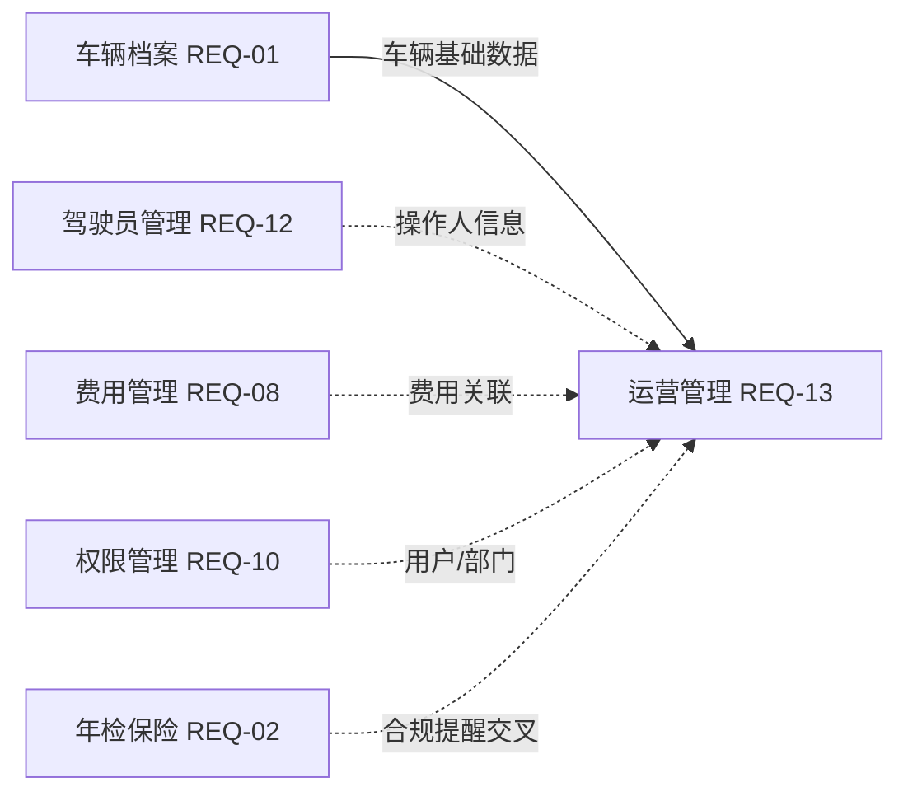
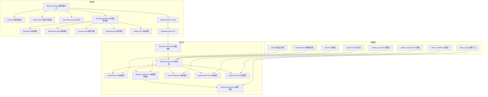
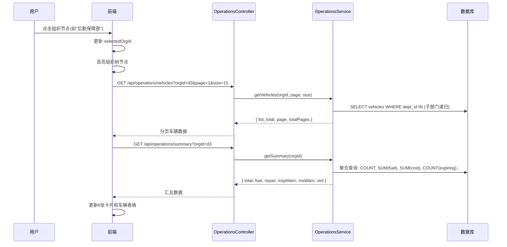
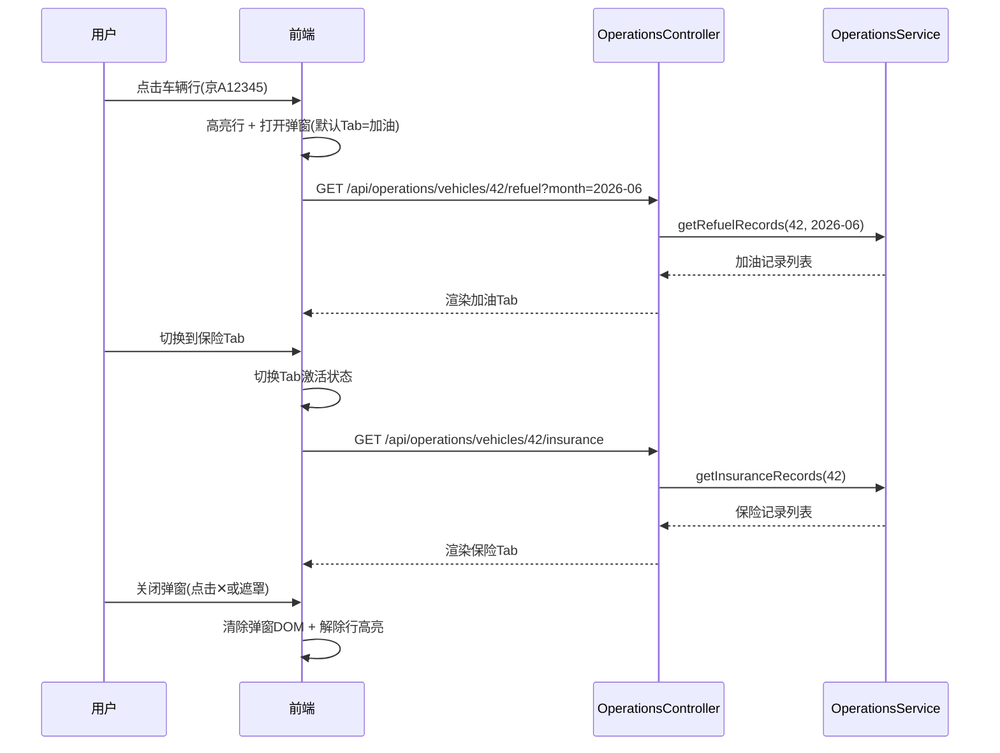

# REQ-13 车辆运营管理 — 概要设计

**文档类型**: 概要设计说明书
**对应需求**: [REQ-13-车辆运营管理](../requirements/REQ-13-车辆运营管理.md)
**更新日期**: 2026-06-30

---

## 1. 模块概述

### 1.1 模块定位

车辆运营管理模块是公务用车管理系统的**日常运营工作台**，围绕加油、维修保养、保险、年检、违章五大业务场景，为运营管理人员提供车辆维度的台账记录、状态跟踪和数据汇总能力。它的系统位置如下：



### 1.2 核心设计决策

| 决策点 | 方案 | 理由 |
|--------|------|------|
| 导航模式 | 组织树（集团→分公司→部门）三级层级 | 800+车辆规模下，扁平列表不可用；按央企组织架构逐级筛选 |
| 详情展示 | 780px 居中模态弹窗 + 5 个 Tab | 减少页面跳转，在同一视图内完成多业务场景操作 |
| 车辆表格 | 分页表格，每页 15 条 | 控制 DOM 节点数，保证大规模数据下的渲染性能 |
| 状态可视化 | mini 标签（红/橙/绿）直显保险/年检/违章 | 运营人员无需逐车点击即可快速识别异常车辆 |
| 数据汇总 | 6 张联动卡片（随组织范围动态更新） | 从集团、分公司到部门各级都能获得对应范围的运营概况 |
| 维修保养 | 同一 Tab 内分维修/保养两个子区块 | 减少 Tab 数量，操作逻辑内聚 |

### 1.3 模块边界

| 边界维度 | 包含 | 不包含 |
|----------|------|--------|
| 功能范围 | 组织树导航、车辆分页列表、5类业务Tab详情弹窗、汇总卡片 | 费用审批流程（REQ-08）、合规自动提醒引擎（REQ-02） |
| 数据范围 | refuels / maintenances / repair_shops / vehicle_insurance / vehicle_inspections / vehicle_violations 6张表 | 费用审批表、费用报销表 |
| 用户角色 | 运营管理员、车队管理员、部门车辆管理员 | 普通员工（仅查看权限范围） |

---

## 2. 架构分层设计



### 2.1 分层职责

| 层级 | 组件 | 职责 |
|------|------|------|
| 前端层 | OperationsView | 主页面布局：左组织树 + 右汇总卡片 + 车辆表格 |
| 前端层 | OrgTree | 三级组织树渲染、展开/折叠、选中联动 |
| 前端层 | VehicleTable | 分页表格、搜索/状态/车型筛选、行高亮、点击触发弹窗 |
| 前端层 | SummaryCards | 6张汇总卡片渲染、随组织范围动态更新 |
| 前端层 | VehicleDetailModal | 780px弹窗容器、遮罩层、关闭逻辑 |
| 前端层 | RefuelTab / MaintenanceTab / InsuranceTab / InspectionTab / ViolationTab | 5个业务Tab，各自独立的数据加载和CRUD操作 |
| 前端层 | OperationsStore | 组织树选中状态、车辆列表分页、弹窗状态管理 |
| 服务层 | OperationsController | RESTful API路由分发、参数校验 |
| 服务层 | OperationsService | 组织范围车辆查询、汇总数据计算 |
| 服务层 | RefuelService 等 | 各业务场景的 CRUD 和统计逻辑 |

---

## 3. 核心数据流程

### 3.1 组织树 → 车辆列表联动脉



### 3.2 车辆详情弹窗流程



---

## 4. 组件与模块划分

### 4.1 前端组件树

```
OperationsView.vue                            # 运营管理主页
├── OperationsSidebar.vue                     # 左侧栏容器
│   └── OrgTree.vue                           # 组织架构树
│       └── OrgTreeNode.vue                   # 单个组织节点(递归)
├── OperationsMain.vue                        # 右侧主区域
│   ├── OperationsToolbar.vue                 # 搜索筛选栏
│   │   ├── 搜索输入框(车牌/型号)
│   │   ├── 状态筛选下拉(空闲/出车中/维修中/报废)
│   │   └── 车型筛选下拉(轿车/SUV/商务车/中型/大型)
│   ├── SummaryCards.vue                      # 6张汇总卡片
│   │   └── SummaryCard.vue                   # 单张汇总卡片
│   └── VehicleTable.vue                      # 车辆分页表格
│       └── Pagination.vue                    # 分页组件

VehicleDetailModal.vue                        # 车辆详情弹窗
├── ModalHeader.vue                           # 弹窗头部(车辆基本信息)
├── ModalTabs.vue                             # 5个Tab切换栏
├── RefuelTab.vue                             # 加油管理Tab
│   ├── RefuelStats.vue                       # 加油统计卡片(3张)
│   ├── RefuelFormDialog.vue                  # 添加加油弹窗
│   └── RefuelTable.vue                       # 加油记录表格
├── MaintenanceTab.vue                        # 维修保养Tab
│   ├── RepairSection.vue                     # 维修记录区块
│   │   ├── RepairFormDialog.vue              # 新增维修弹窗
│   │   └── RepairTable.vue                   # 维修记录表格
│   └── MaintenanceSection.vue                # 保养记录区块
│       ├── MaintenanceFormDialog.vue         # 保养登记弹窗
│       └── MaintenanceTable.vue              # 保养记录表格
├── InsuranceTab.vue                          # 保险管理Tab
│   ├── InsuranceFormDialog.vue               # 新增/续保弹窗
│   └── InsuranceTable.vue                    # 保险记录表格
├── InspectionTab.vue                         # 年检管理Tab
│   ├── InspectionCountdown.vue               # 下次年检倒计时
│   ├── InspectionFormDialog.vue              # 录入年检弹窗
│   └── InspectionTable.vue                   # 年检记录表格
└── ViolationTab.vue                          # 违章处理Tab
    ├── ViolationStats.vue                    # 违章统计卡片(3张)
    ├── ViolationFormDialog.vue               # 录入违章弹窗
    └── ViolationTable.vue                    # 违章记录表格
```

### 4.2 后端服务结构

```
server/
├── routes/
│   └── operations.js                         # 运营管理路由定义
├── services/
│   ├── operationsService.js                  # 车辆列表/汇总查询
│   ├── refuelService.js                      # 加油CRUD + 油耗统计
│   ├── maintenanceService.js                 # 维修保养CRUD
│   ├── insuranceService.js                   # 保险CRUD + 续保
│   ├── inspectionService.js                  # 年检CRUD + 到期计算
│   ├── violationService.js                   # 违章CRUD
│   └── repairShopService.js                  # 维修厂CRUD
├── middleware/
│   └── operationsValidator.js               # 参数校验中间件
└── db/
    └── init.js                               # DDL(新增6张运营表)
```

---

## 5. 接口协议总览

### 5.1 运营管理基座

| 方法 | 路径 | 认证 | 说明 |
|------|------|------|------|
| GET | `/api/operations/vehicles` | 是 | 车辆列表（支持 orgId/search/status/type/page/size） |
| GET | `/api/operations/summary` | 是 | 按组织范围的运营汇总（6卡片数据） |
| GET | `/api/operations/vehicles/:id/summary` | 是 | 单车运营数据汇总 |

### 5.2 加油管理

| 方法 | 路径 | 认证 | 说明 |
|------|------|------|------|
| GET | `/api/operations/vehicles/:id/refuel` | 是 | 加油记录列表（支持 month 参数） |
| POST | `/api/operations/vehicles/:id/refuel` | 是 | 添加加油记录 |
| GET | `/api/operations/vehicles/:id/refuel/stats` | 是 | 单车油耗统计（月累计量/金额/平均油耗） |

### 5.3 维修保养

| 方法 | 路径 | 认证 | 说明 |
|------|------|------|------|
| GET | `/api/operations/vehicles/:id/maintenance` | 是 | 维修保养记录（type=repair/maintenance 区分） |
| POST | `/api/operations/vehicles/:id/maintenance` | 是 | 新增维修/保养记录 |
| PUT | `/api/operations/vehicles/:id/maintenance/:recordId` | 是 | 更新维修状态 |
| GET | `/api/operations/repair-shops` | 是 | 维修厂列表 |
| POST | `/api/operations/repair-shops` | 是 | 新增维修厂 |
| PUT | `/api/operations/repair-shops/:id` | 是 | 更新维修厂 |

### 5.4 保险管理

| 方法 | 路径 | 认证 | 说明 |
|------|------|------|------|
| GET | `/api/operations/vehicles/:id/insurance` | 是 | 保险记录列表 |
| POST | `/api/operations/vehicles/:id/insurance` | 是 | 新增保险记录 |
| PUT | `/api/operations/vehicles/:id/insurance/:recordId` | 是 | 更新保险信息 |
| POST | `/api/operations/vehicles/:id/insurance/renew` | 是 | 续保登记（自动标记旧记录过期） |

### 5.5 年检管理

| 方法 | 路径 | 认证 | 说明 |
|------|------|------|------|
| GET | `/api/operations/vehicles/:id/inspection` | 是 | 年检记录列表 |
| POST | `/api/operations/vehicles/:id/inspection` | 是 | 录入年检记录 |

### 5.6 违章处理

| 方法 | 路径 | 认证 | 说明 |
|------|------|------|------|
| GET | `/api/operations/vehicles/:id/violations` | 是 | 违章记录列表 |
| POST | `/api/operations/vehicles/:id/violations` | 是 | 录入违章记录 |
| PUT | `/api/operations/vehicles/:id/violations/:recordId` | 是 | 更新违章处理状态 |

---

## 6. 关键设计约束

| 约束 | 说明 |
|------|------|
| 分页大小 | 固定 15 条/页，由前端维护 currentPage |
| 组织范围查询 | 选中某分公司时需递归查询其下所有部门的车辆 |
| 弹窗Tab数据加载 | 仅在 Tab 首次激活时请求数据，已加载的 Tab 缓存数据直至弹窗关闭 |
| 汇总卡片 | 与组织树选中节点联动，使用同一 orgId 参数请求 |
| 日期计算 | 年检到期自动计算、保险到期天数计算在前端完成后端也可提供 |
| 状态联动 | 维修完工→车辆状态恢复；保养逾期→仪表盘提醒 |

---

## 7. V2 预留

- 加油卡模块（主副卡体系、余额监控）
- 维修厂评价体系
- 保险理赔闭环
- 年检预约管理
- 费用同比/环比分析
- 车辆全生命周期成本
- 移动端运营入口
