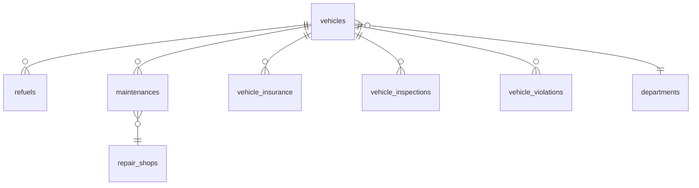

# REQ-13 车辆运营管理 — 详细设计

**文档类型**: 详细设计说明书
**对应需求**: [REQ-13-车辆运营管理](../requirements/REQ-13-车辆运营管理.md)
**对应概要**: [REQ-13-概要设计](REQ-13-概要设计.md)
**更新日期**: 2026-06-30

---

## 1. 数据库表设计

### 1.1 refuels（加油记录表）

```sql
CREATE TABLE IF NOT EXISTS refuels (
    id              INTEGER PRIMARY KEY AUTOINCREMENT,
    vehicle_id      INTEGER NOT NULL REFERENCES vehicles(id),
    refuel_date     TEXT NOT NULL,          -- YYYY-MM-DD
    station_name    TEXT NOT NULL,          -- 加油站名称
    fuel_type       TEXT NOT NULL,          -- 92# / 95# / 98# / 0#柴油
    fuel_amount     REAL NOT NULL,          -- 加油量(升)
    unit_price      REAL NOT NULL,          -- 单价(元/升)
    total_amount    REAL NOT NULL,          -- 金额(自动计算: amount * price)
    current_odometer REAL NOT NULL,         -- 加油时里程数(km)
    fuel_card_number TEXT,                  -- 加油卡号
    operator        TEXT NOT NULL,          -- 操作人姓名
    created_at      TEXT NOT NULL DEFAULT (datetime('now','localtime'))
);

CREATE INDEX idx_refuels_vehicle ON refuels(vehicle_id);
CREATE INDEX idx_refuels_date ON refuels(refuel_date);
CREATE INDEX idx_refuels_vehicle_month ON refuels(vehicle_id, refuel_date);
```

**字段约束**:
- `fuel_amount > 0`
- `unit_price > 0`
- `current_odometer >= 上次里程数`（业务校验，非数据库约束）

### 1.2 maintenances（维修保养记录表）

```sql
CREATE TABLE IF NOT EXISTS maintenances (
    id                      INTEGER PRIMARY KEY AUTOINCREMENT,
    vehicle_id              INTEGER NOT NULL REFERENCES vehicles(id),
    record_type             TEXT NOT NULL,          -- 'repair' | 'maintenance'
    date                    TEXT NOT NULL,          -- YYYY-MM-DD
    -- 维修字段
    repair_type             TEXT,                   -- 事故维修 / 故障维修 / 常规维修
    -- 保养字段
    maintenance_type        TEXT,                   -- 小保养 / 大保养 / 专项保养
    items                   TEXT NOT NULL,          -- 项目描述
    cost                    REAL,                   -- 费用(元)
    shop_id                 INTEGER REFERENCES repair_shops(id),
    -- 维修状态
    status                  TEXT,                   -- 待维修 / 维修中 / 已完工（仅维修记录）
    -- 保养里程
    current_odometer        REAL,                   -- 保养时里程(km)
    next_maintenance_odometer REAL,                 -- 下次保养里程(km)
    next_maintenance_date   TEXT,                   -- 下次保养日期
    operator                TEXT NOT NULL,          -- 操作人姓名
    created_at              TEXT NOT NULL DEFAULT (datetime('now','localtime'))
);

CREATE INDEX idx_maintenances_vehicle ON maintenances(vehicle_id);
CREATE INDEX idx_maintenances_type ON maintenances(record_type);
CREATE INDEX idx_maintenances_date ON maintenances(date);
```

### 1.3 repair_shops（定点维修厂表）

```sql
CREATE TABLE IF NOT EXISTS repair_shops (
    id              INTEGER PRIMARY KEY AUTOINCREMENT,
    name            TEXT NOT NULL,          -- 维修厂名称
    contact_person  TEXT,                   -- 联系人
    contact_phone   TEXT,                   -- 联系电话
    address         TEXT,                   -- 地址
    status          TEXT NOT NULL DEFAULT 'active',  -- active / inactive
    created_at      TEXT NOT NULL DEFAULT (datetime('now','localtime'))
);
```

### 1.4 vehicle_insurance（车辆保险记录表）

```sql
CREATE TABLE IF NOT EXISTS vehicle_insurance (
    id                  INTEGER PRIMARY KEY AUTOINCREMENT,
    vehicle_id          INTEGER NOT NULL REFERENCES vehicles(id),
    insurance_company   TEXT NOT NULL,      -- 保险公司
    insurance_type      TEXT NOT NULL,      -- 交强险 / 商业险
    policy_number       TEXT NOT NULL,      -- 保单号
    coverage_amount     REAL,               -- 保险金额(元)
    premium             REAL,               -- 保费(元)
    effective_date      TEXT NOT NULL,      -- 生效日期 YYYY-MM-DD
    expiry_date         TEXT NOT NULL,      -- 到期日期 YYYY-MM-DD
    status              TEXT NOT NULL DEFAULT 'active',  -- active / expiring / expired
    document_url        TEXT,               -- 保单附件路径
    created_at          TEXT NOT NULL DEFAULT (datetime('now','localtime'))
);

CREATE INDEX idx_insurance_vehicle ON vehicle_insurance(vehicle_id);
CREATE INDEX idx_insurance_expiry ON vehicle_insurance(expiry_date);
CREATE INDEX idx_insurance_status ON vehicle_insurance(status);
```

### 1.5 vehicle_inspections（车辆年检记录表）

```sql
CREATE TABLE IF NOT EXISTS vehicle_inspections (
    id                      INTEGER PRIMARY KEY AUTOINCREMENT,
    vehicle_id              INTEGER NOT NULL REFERENCES vehicles(id),
    inspection_date         TEXT NOT NULL,          -- 本次年检日期 YYYY-MM-DD
    next_inspection_date    TEXT NOT NULL,          -- 下次年检日期 YYYY-MM-DD
    inspection_org          TEXT NOT NULL,          -- 年检单位
    result                  TEXT NOT NULL,          -- 合格 / 不合格 / 限期整改
    cost                    REAL,                   -- 年检费用(元)
    report_url              TEXT,                   -- 年检报告附件路径
    created_at              TEXT NOT NULL DEFAULT (datetime('now','localtime'))
);

CREATE INDEX idx_inspections_vehicle ON vehicle_inspections(vehicle_id);
CREATE INDEX idx_inspections_next ON vehicle_inspections(next_inspection_date);
```

### 1.6 vehicle_violations（车辆违章记录表）

```sql
CREATE TABLE IF NOT EXISTS vehicle_violations (
    id                  INTEGER PRIMARY KEY AUTOINCREMENT,
    vehicle_id          INTEGER NOT NULL REFERENCES vehicles(id),
    violation_date      TEXT NOT NULL,      -- 违章日期 YYYY-MM-DD
    location            TEXT NOT NULL,      -- 违章地点
    behavior            TEXT NOT NULL,      -- 违章行为描述
    points_deducted     INTEGER NOT NULL,   -- 扣分
    penalty_amount      REAL NOT NULL,      -- 罚款金额(元)
    status              TEXT NOT NULL DEFAULT '待处理',  -- 待处理 / 已处理 / 申诉中
    processed_date      TEXT,               -- 处理日期
    processed_result    TEXT,               -- 处理结果
    created_at          TEXT NOT NULL DEFAULT (datetime('now','localtime'))
);

CREATE INDEX idx_violations_vehicle ON vehicle_violations(vehicle_id);
CREATE INDEX idx_violations_status ON vehicle_violations(status);
```

### 1.7 ER 关系图



---

## 2. API 接口详细规格

### 2.1 车辆列表查询

```
GET /api/operations/vehicles
```

**认证**: Bearer Token（运营管理员、车队管理员、部门车辆管理员）

**Query Parameters**:

| 参数 | 类型 | 必填 | 说明 |
|------|------|------|------|
| `orgId` | string | 否 | 组织节点ID，不传返回全部车辆 |
| `search` | string | 否 | 车牌号/品牌型号关键词 |
| `status` | string | 否 | 车辆状态筛选：空闲/出车中/维修中/报废 |
| `type` | string | 否 | 车型筛选：轿车/SUV/商务车/中型客车/大型客车 |
| `page` | integer | 否 | 页码，默认 1 |
| `size` | integer | 否 | 每页条数，默认 15 |

**Response 200**:
```json
{
  "list": [
    {
      "id": 42,
      "plate": "京A12345",
      "model": "奥迪A6L 2024款",
      "type": "轿车",
      "fuel": "汽油",
      "dept": "后勤保障部",
      "status": "空闲",
      "fuelMonth": 175.8,
      "repairMonth": 2800,
      "insuranceStatus": "normal",
      "insuranceExpiry": "2027-01-15",
      "inspectionStatus": "expiring",
      "inspectionExpiry": "2026-07-20",
      "violationCount": 2
    }
  ],
  "total": 88,
  "page": 1,
  "size": 15,
  "totalPages": 6
}
```

**Status 字段说明**:

| 字段 | 值 | 说明 |
|------|------|------|
| `insuranceStatus` | `normal` | 距到期 > 30 天 |
| | `expiring` | 距到期 ≤ 30 天 |
| | `expired` | 已过到期日 |
| `inspectionStatus` | `normal` | 距到期 > 30 天 |
| | `expiring` | 距到期 ≤ 30 天 |
| | `expired` | 已过到期日 |

**后端实现要点**:
- `orgId` 为部门ID时，只查该部门车辆
- `orgId` 为分公司ID时，递归查询其下所有部门的车辆（通过 `departments.parent_id`）
- 加油量和维修费用取当月（当前月份）汇总
- 保险/年检状态由后端根据 `vehicle_insurance.expiry_date` 和 `vehicle_inspections.next_inspection_date` 的最近一条记录实时计算

### 2.2 运营数据汇总

```
GET /api/operations/summary?orgId={orgId}
```

**Response 200**:
```json
{
  "totalVehicles": 88,
  "totalFuel": 15240.5,
  "totalRepair": 128000,
  "inspectionWarning": 12,
  "insuranceWarning": 5,
  "violationVehicles": 8
}
```

### 2.3 加油记录列表

```
GET /api/operations/vehicles/:id/refuel?month=2026-06
```

**Response 200**:
```json
{
  "records": [
    {
      "id": 1,
      "refuel_date": "2026-06-28",
      "station_name": "中石化朝阳站",
      "fuel_type": "95#",
      "fuel_amount": 62.5,
      "unit_price": 8.56,
      "total_amount": 535.0,
      "current_odometer": 15200,
      "fuel_card_number": "ZSY-001",
      "operator": "张伟"
    }
  ],
  "stats": {
    "totalAmount": 175.8,
    "totalCost": 1505.0,
    "avgConsumption": 11.2,
    "isAbnormal": true
  }
}
```

**avgConsumption 计算**: `SUM(fuel_amount) / (MAX(current_odometer) - MIN(current_odometer)) * 100`
按加油时间排序，相邻两条记录计算一次区间油耗，取加权平均。

### 2.4 添加加油记录

```
POST /api/operations/vehicles/:id/refuel
```

**Request Body**:
```json
{
  "refuel_date": "2026-06-30",
  "station_name": "中石化朝阳站",
  "fuel_type": "95#",
  "fuel_amount": 58.5,
  "unit_price": 8.60,
  "current_odometer": 15800,
  "fuel_card_number": "ZSY-001"
}
```

**Response 201**:
```json
{
  "id": 2,
  "total_amount": 503.1,
  "segment_consumption": 10.5,
  "isAbnormal": false
}
```

**后端逻辑**:
1. 自动计算 `total_amount = fuel_amount * unit_price`
2. 查询上次加油记录的 `current_odometer`，计算区间油耗：`fuel_amount / (current_odometer - last_odometer) * 100`
3. 读取该车型基准油耗，若区间油耗超出基准 20%，标记 `isAbnormal = true`
4. `operator` 从当前登录用户 `req.user.real_name` 获取

### 2.5 维修保养记录列表

```
GET /api/operations/vehicles/:id/maintenance
```

**Response 200**:
```json
{
  "repairs": [
    {
      "id": 1,
      "record_type": "repair",
      "date": "2026-06-05",
      "repair_type": "常规维修",
      "items": "更换前刹车片",
      "cost": 2800,
      "shop_name": "北京奥迪4S店",
      "status": "已完工",
      "operator": "张伟"
    }
  ],
  "maintenances": [
    {
      "id": 2,
      "record_type": "maintenance",
      "date": "2026-05-15",
      "maintenance_type": "小保养",
      "items": "更换机油、机滤",
      "cost": 1200,
      "current_odometer": 13000,
      "next_maintenance_odometer": 18000,
      "next_maintenance_date": "2026-11-15",
      "shop_name": "北京奥迪4S店",
      "operator": "张伟"
    }
  ]
}
```

### 2.6 新增维修申请/保养记录

```
POST /api/operations/vehicles/:id/maintenance
```

**Request Body（维修申请）**:
```json
{
  "record_type": "repair",
  "date": "2026-06-30",
  "repair_type": "事故维修",
  "items": "更换前保险杠、右前大灯",
  "cost": 8500,
  "shop_id": 1,
  "status": "待维修"
}
```

**Request Body（保养记录）**:
```json
{
  "record_type": "maintenance",
  "date": "2026-06-30",
  "maintenance_type": "小保养",
  "items": "更换机油、机滤、空滤",
  "cost": 1200,
  "shop_id": 1,
  "current_odometer": 18000,
  "next_maintenance_odometer": 23000,
  "next_maintenance_date": "2026-12-30"
}
```

### 2.7 更新维修状态

```
PUT /api/operations/vehicles/:id/maintenance/:recordId
```

**Request Body**:
```json
{
  "status": "已完工"
}
```

**后端联动**: 当 status 变更为"已完工"时，更新 `vehicles.status = '空闲'`

### 2.8 保险记录列表

```
GET /api/operations/vehicles/:id/insurance
```

**Response 200**:
```json
{
  "records": [
    {
      "id": 1,
      "insurance_company": "中国人保财险",
      "insurance_type": "交强险",
      "policy_number": "PICC-2026-BJ-001234",
      "coverage_amount": 200000,
      "premium": 950,
      "effective_date": "2026-01-15",
      "expiry_date": "2027-01-15",
      "status": "active",
      "document_url": null
    }
  ]
}
```

### 2.9 续保登记

```
POST /api/operations/vehicles/:id/insurance/renew
```

**Request Body**:
```json
{
  "insurance_company": "中国人保财险",
  "insurance_type": "交强险",
  "policy_number": "PICC-2027-BJ-001234",
  "coverage_amount": 200000,
  "premium": 950,
  "effective_date": "2027-01-15",
  "expiry_date": "2028-01-15"
}
```

**后端逻辑**:
1. 将车辆当前所有 `status='active'` 的保险记录更新为 `status='expired'`
2. 插入新记录，设置 `status='active'`

### 2.10 年检记录

```
GET /api/operations/vehicles/:id/inspection
POST /api/operations/vehicles/:id/inspection
```

**POST Request Body**:
```json
{
  "inspection_date": "2026-06-30",
  "next_inspection_date": "2027-06-30",
  "inspection_org": "北京朝阳检测场",
  "result": "合格",
  "cost": 320
}
```

**后端逻辑（next_inspection_date自动计算）**:
若不传 `next_inspection_date`，后端根据以下规则自动计算：
- 车辆年限 ≤ 10年 且 非营运：每2年
- 车辆年限 > 10年：每年
- 营运车辆且年限 ≤ 5年：每年
- 营运车辆且年限 > 5年：每6个月

### 2.11 违章记录

```
GET /api/operations/vehicles/:id/violations
POST /api/operations/vehicles/:id/violations
PUT /api/operations/vehicles/:id/violations/:recordId
```

**PUT Request Body（标记已处理）**:
```json
{
  "status": "已处理",
  "processed_date": "2026-06-30",
  "processed_result": "已缴纳罚款并处理完毕"
}
```

---

## 3. 前端状态管理（Pinia Store）

### 3.1 operationsStore

```javascript
// store/operations.js
export const useOperationsStore = defineStore('operations', () => {
  // --- 组织树状态 ---
  const selectedOrgId = ref('all')
  const expandedNodes = ref(new Set(['g1']))

  // --- 车辆列表 ---
  const vehicles = ref([])
  const totalVehicles = ref(0)
  const currentPage = ref(1)
  const pageSize = ref(15)
  const totalPages = computed(() => Math.ceil(totalVehicles.value / pageSize.value))

  // 筛选条件
  const searchKeyword = ref('')
  const filterStatus = ref('')
  const filterType = ref('')

  // --- 汇总卡片 ---
  const summary = ref({
    totalVehicles: 0,
    totalFuel: 0,
    totalRepair: 0,
    inspectionWarning: 0,
    insuranceWarning: 0,
    violationVehicles: 0
  })

  // --- 弹窗状态 ---
  const selectedVehicleId = ref(null)
  const detailTab = ref('refuel')
  const modalVisible = ref(false)

  // 缓存已加载的Tab数据，避免重复请求
  const cachedTabData = ref({})

  // --- Actions ---
  async function fetchVehicles() { /* GET /api/operations/vehicles */ }
  async function fetchSummary() { /* GET /api/operations/summary */ }
  function selectOrg(orgId) { /* 更新选中节点，重新加载 */ }
  function openVehicleDetail(vehicleId) { /* 打开弹窗 */ }
  function closeVehicleDetail() { /* 关闭弹窗并清除缓存 */ }
  function switchTab(tab) { /* 切换Tab，按需加载数据 */ }

  return {
    selectedOrgId, expandedNodes,
    vehicles, totalVehicles, currentPage, pageSize, totalPages,
    searchKeyword, filterStatus, filterType,
    summary,
    selectedVehicleId, detailTab, modalVisible, cachedTabData,
    fetchVehicles, fetchSummary, selectOrg, openVehicleDetail, closeVehicleDetail, switchTab
  }
})
```

### 3.2 Tab 数据子 Store

```javascript
// store/operations/refuel.js
export const useRefuelStore = defineStore('operations-refuel', () => {
  const records = ref([])
  const stats = ref({ totalAmount: 0, totalCost: 0, avgConsumption: 0, isAbnormal: false })
  const currentMonth = ref(dayjs().format('YYYY-MM'))

  async function fetchRecords(vehicleId, month) { /* GET */ }
  async function addRecord(vehicleId, data) { /* POST */ }

  return { records, stats, currentMonth, fetchRecords, addRecord }
})

// store/operations/maintenance.js
// store/operations/insurance.js
// store/operations/inspection.js
// store/operations/violation.js
```

---

## 4. 前端组件设计要点

### 4.1 OrgTree.vue

**Props**:
| 名称 | 类型 | 说明 |
|------|------|------|
| `data` | `OrgNode[]` | 组织树数据（从 API 获取或使用 departments 数据） |

**Emits**:
| 名称 | 参数 | 说明 |
|------|------|------|
| `select` | `orgId: string` | 选中组织节点时触发 |

**递归渲染**:
- `OrgTreeNode` 组件递归渲染自身
- 通过 `v-for` 遍历 `children`，递归调用 `<OrgTreeNode>`

### 4.2 VehicleTable.vue

**Props**: 从 Store 读取

**Features**:
- Element Plus `<el-table>` + `<el-pagination>`
- 搜索输入框绑定 `searchKeyword`，`@input` 防抖 300ms
- 状态/车型筛选使用 `<el-select>`
- 行点击 `@row-click` 触发 `openVehicleDetail(id)`
- 保险/年检/违章列使用 `<el-tag>` 渲染 mini 标签

**Mini 标签渲染逻辑**:
```javascript
function getInsuranceTag(status) {
  if (status === 'expired') return { type: 'danger', text: '保险逾期' }
  if (status === 'expiring') return { type: 'warning', text: '即将到期' }
  return { type: 'success', text: '正常' }
}
// 同理: getInspectionTag, getViolationTag
```

### 4.3 SummaryCards.vue

**Props**: 从 Store 读取 `summary`

**6 张卡片布局**:
- 使用 Element Plus `<el-row :gutter="12">` + `<el-col :span="4">`
- 预警数值 > 0 时数值颜色变橙/红

### 4.4 VehicleDetailModal.vue

**Features**:
- 使用 Element Plus `<el-dialog>`，`width="780px"`, `top="5vh"`
- `:before-close` 绑定 `closeVehicleDetail`
- 头部使用 `<el-descriptions>` 展示车辆基本信息
- Tab 使用 `<el-tabs v-model="detailTab" @tab-change="switchTab">`
- 每个 `<el-tab-pane>` 内使用 `<KeepAlive>` 缓存已渲染的 Tab 内容

**Tab 切换逻辑**:
```javascript
function switchTab(tabName) {
  detailTab.value = tabName
  // 检查缓存，未加载则请求
  if (!cachedTabData.value[tabName]) {
    loadTabData(selectedVehicleId.value, tabName)
  }
}
```

---

## 5. 业务规则详细说明

### 5.1 油耗计算规则

```javascript
// 区间油耗 = 本次加油量 / (本次里程 - 上次里程) * 100
function calculateSegmentConsumption(currentOdo, lastOdo, fuelAmount) {
  if (!lastOdo || currentOdo <= lastOdo) return null
  return (fuelAmount / (currentOdo - lastOdo)) * 100
}

// 月度平均油耗 = Σ(区间油耗 × 区间里程) / Σ(区间里程)
function calculateMonthlyAvg(records) {
  if (records.length < 2) return null
  let totalWeighted = 0, totalDistance = 0
  for (let i = 1; i < records.length; i++) {
    const dist = records[i-1].current_odometer - records[i].current_odometer
    const consumption = calculateSegmentConsumption(
      records[i-1].current_odometer,
      records[i].current_odometer,
      records[i-1].fuel_amount
    )
    if (consumption !== null) {
      totalWeighted += consumption * dist
      totalDistance += dist
    }
  }
  return totalDistance > 0 ? totalWeighted / totalDistance : null
}

// 异常判定：实际油耗 > 基准油耗 * 1.2
function isAbnormal(actualConsumption, baselineConsumption) {
  return actualConsumption > baselineConsumption * 1.2
}
```

**车型基准油耗参考**:

| 车型 | 基准油耗 (L/100km) |
|------|---------------------|
| 轿车（汽油） | 9.0 |
| SUV（汽油） | 12.0 |
| 商务车（汽油） | 11.0 |
| 中型客车（柴油） | 15.0 |
| 大型客车（柴油） | 22.0 |
| 轿车（电动） | - |

### 5.2 年检到期自动计算

```javascript
const YEARLY_INSPECTION_RULES = {
  // 非营运小型客车（10年以内）
  nonCommercialUnder10: { intervalYears: 2 },
  // 非营运小型客车（10年以上）
  nonCommercialOver10: { intervalYears: 1 },
  // 营运车辆（5年以内）
  commercialUnder5: { intervalYears: 1 },
  // 营运车辆（5年以上）
  commercialOver5: { intervalMonths: 6 },
}

function calculateNextInspection(vehicle, lastInspectionDate) {
  const age = dayjs().diff(dayjs(vehicle.purchase_date), 'year')
  if (vehicle.usage_type === 'commercial') {
    if (age <= 5) return dayjs(lastInspectionDate).add(1, 'year')
    return dayjs(lastInspectionDate).add(6, 'month')
  }
  if (age <= 10) return dayjs(lastInspectionDate).add(2, 'year')
  return dayjs(lastInspectionDate).add(1, 'year')
}
```

### 5.3 保险到期天数计算

```javascript
function getInsuranceStatus(expiryDate) {
  const days = dayjs(expiryDate).diff(dayjs(), 'day')
  if (days < 0) return { status: 'expired', label: '已逾期', tagType: 'danger' }
  if (days <= 30) return { status: 'expiring', label: `${days}天后到期`, tagType: 'warning' }
  return { status: 'normal', label: '正常', tagType: 'success' }
}
```

### 5.4 维修完工联动

```javascript
// maintenanceService.js
async function updateStatus(vehicleId, recordId, newStatus) {
  db.run('UPDATE maintenances SET status = ? WHERE id = ?', [newStatus, recordId])
  if (newStatus === '已完工') {
    db.run("UPDATE vehicles SET status = '空闲' WHERE id = ?", [vehicleId])
  }
}
```

### 5.5 组织范围车辆递归查询

```javascript
// operationsService.js
function getVehicleIdsByOrg(orgId) {
  const node = db.get('SELECT * FROM departments WHERE id = ?', [orgId])
  if (!node) return []

  // 如果是部门（level=3），直接返回该部门车辆
  if (node.level === 3) {
    const rows = db.all('SELECT id FROM vehicles WHERE department_id = ?', [orgId])
    return rows.map(r => r.id)
  }

  // 如果是分公司（level=2），递归查询子部门
  if (node.level === 2) {
    const children = db.all('SELECT id FROM departments WHERE parent_id = ?', [orgId])
    const ids = children.flatMap(c => getVehicleIdsByOrg(c.id))
    return ids
  }

  // 集团级（level=1），返回全部
  return db.all('SELECT id FROM vehicles').map(r => r.id)
}
```

---

## 6. 文件变更清单

### 6.1 新增文件

| 文件 | 说明 |
|------|------|
| `server/routes/operations.js` | 运营管理路由（约 120 行） |
| `server/services/operationsService.js` | 车辆列表/汇总查询 |
| `server/services/refuelService.js` | 加油 CRUD + 油耗统计 |
| `server/services/maintenanceService.js` | 维修保养 CRUD |
| `server/services/insuranceService.js` | 保险 CRUD + 续保 |
| `server/services/inspectionService.js` | 年检 CRUD + 到期计算 |
| `server/services/violationService.js` | 违章 CRUD |
| `server/services/repairShopService.js` | 维修厂 CRUD |
| `frontend/src/views/OperationsView.vue` | 运营管理主页 |
| `frontend/src/views/operations/OrgTree.vue` | 组织架构树 |
| `frontend/src/views/operations/VehicleTable.vue` | 车辆分页表格 |
| `frontend/src/views/operations/SummaryCards.vue` | 汇总卡片 |
| `frontend/src/views/operations/VehicleDetailModal.vue` | 车辆详情弹窗 |
| `frontend/src/views/operations/tabs/RefuelTab.vue` | 加油管理 Tab |
| `frontend/src/views/operations/tabs/MaintenanceTab.vue` | 维修保养 Tab |
| `frontend/src/views/operations/tabs/InsuranceTab.vue` | 保险管理 Tab |
| `frontend/src/views/operations/tabs/InspectionTab.vue` | 年检管理 Tab |
| `frontend/src/views/operations/tabs/ViolationTab.vue` | 违章处理 Tab |
| `frontend/src/stores/operations.js` | Pinia 状态管理 |
| `frontend/src/api/operations.js` | Axios API 封装 |

### 6.2 修改文件

| 文件 | 变更内容 |
|------|----------|
| `server/db/init.js` | 新增 6 张表的 DDL |
| `server/index.js` | 注册 `/api/operations` 路由 |
| `frontend/src/router/index.js` | 新增运营管理路由 |

---

## 7. V2 预留设计点

- 加油卡模块（`fuel_cards` 表，主副卡体系、余额字段、充值记录表）
- 维修厂评价（`repair_shop_ratings` 表，评分、评价内容、评价人）
- 保险理赔（`insurance_claims` 表，报案号、定损金额、维修关联、理赔状态）
- 年检预约（`inspection_appointments` 表，预约时间、预约单位、提醒设置）
- 智能提醒引擎（定时任务，扫描即将到期的保养/年检/保险，自动生成通知）
- 年度费用统计（同比/环比分析图表，基于运营数据聚合查询）
