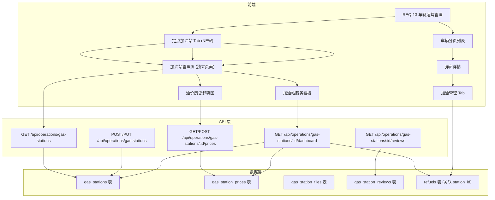

# 定点加油站信息维护 - 技术设计文档

**Feature Name**: gas-station-management
**Updated**: 2026-07-02
**关联需求**: REQ-15

## 1. 概要设计

### 1.1 模块定位

定点加油站信息维护模块作为 REQ-13 车辆运营管理的子模块嵌入，与现有的加油管理 Tab 协同工作。加油登记表单中的"加油站选择"下拉列表，数据源完全来自本模块维护的加油站档案。

### 1.2 架构图



### 1.3 前端路由设计

在现有路由树中增加：

```
/operations/gas-stations              → GasStationList.vue       (加油站列表管理)
/operations/gas-stations/:id          → GasStationDetail.vue     (加油站详情/看板)
/operations/gas-stations/:id/prices   → GasStationPrices.vue     (油价维护)
```

### 1.4 前端组件树

```
GasStationList.vue
├── GasStationSearch.vue           (搜索+筛选栏)
├── GasStationTable.vue            (分页表格)
├── GasStationFormModal.vue        (新增/编辑弹窗)
├── GasStationStatusModal.vue      (状态变更确认弹窗)
├── GasStationPriceModal.vue       (油价录入弹窗)

GasStationDetail.vue
├── GasStationInfoCard.vue         (基本信息卡片)
├── GasStationDashboard.vue        (服务看板)
│   ├── StatsCards.vue             (统计数据卡片)
│   ├── MonthlyChart.vue           (月度加油量/金额图表)
│   ├── FuelTypePieChart.vue       (油品占比饼图)
│   └── DepartmentUsageChart.vue   (部门使用占比图)
├── GasStationPriceTrend.vue       (油价趋势折线图)
├── GasStationFileList.vue         (附件列表)
└── GasStationReviewList.vue       (评价列表)
```

## 2. 详细设计

### 2.1 数据模型 (Go Structs)

```go
// GasStation 定点加油站主模型
type GasStation struct {
    ID               uint       `gorm:"primaryKey" json:"id"`
    Name             string     `gorm:"size:200;not null" json:"name"`
    CreditCode       string     `gorm:"size:18;uniqueIndex" json:"credit_code"`
    Brand            string     `gorm:"size:50;not null;index" json:"brand"`
    StationType      string     `gorm:"size:20" json:"station_type"`
    Province         string     `gorm:"size:50" json:"province"`
    City             string     `gorm:"size:50" json:"city"`
    District         string     `gorm:"size:50" json:"district"`
    Address          string     `gorm:"size:500;not null" json:"address"`
    Longitude        float64    `json:"longitude"`
    Latitude         float64    `json:"latitude"`
    ContactPerson    string     `gorm:"size:100;not null" json:"contact_person"`
    ContactPhone     string     `gorm:"size:20;not null" json:"contact_phone"`
    BusinessHours24h bool       `gorm:"default:true" json:"business_hours_24h"`
    BusinessHoursStart string   `gorm:"size:10" json:"business_hours_start"`
    BusinessHoursEnd   string   `gorm:"size:10" json:"business_hours_end"`
    AgreementType    string     `gorm:"size:20" json:"agreement_type"`
    AgreementStartDate string   `gorm:"size:10" json:"agreement_start_date"`
    AgreementEndDate   string   `gorm:"size:10" json:"agreement_end_date"`
    Status           string     `gorm:"size:20;not null;index;default:'active'" json:"status"`
    CreatedAt        time.Time  `json:"created_at"`
    UpdatedAt        time.Time  `json:"updated_at"`
    CreatedBy        string     `gorm:"size:100" json:"created_by"`
    
    // 关联
    Prices  []GasStationPrice  `gorm:"foreignKey:StationID" json:"prices,omitempty"`
    Files   []GasStationFile   `gorm:"foreignKey:StationID" json:"files,omitempty"`
    Reviews []GasStationReview `gorm:"foreignKey:StationID" json:"reviews,omitempty"`
    Refuels []Refuel           `gorm:"foreignKey:StationID" json:"refuels,omitempty"`
}

// GasStationPrice 油价记录
type GasStationPrice struct {
    ID            uint      `gorm:"primaryKey" json:"id"`
    StationID     uint      `gorm:"index;not null" json:"station_id"`
    FuelType      string    `gorm:"size:20;not null" json:"fuel_type"`
    Price         float64   `gorm:"not null" json:"price"`
    EffectiveDate string    `gorm:"size:10;not null" json:"effective_date"`
    UpdatedBy     string    `gorm:"size:100" json:"updated_by"`
    CreatedAt     time.Time `json:"created_at"`
}

// GasStationFile 加油站附件
type GasStationFile struct {
    ID         uint      `gorm:"primaryKey" json:"id"`
    StationID  uint      `gorm:"index;not null" json:"station_id"`
    FileType   string    `gorm:"size:30;not null" json:"file_type"`
    FileName   string    `gorm:"size:255;not null" json:"file_name"`
    FilePath   string    `gorm:"size:500;not null" json:"file_path"`
    FileSize   int64     `json:"file_size"`
    UploadedAt time.Time `json:"uploaded_at"`
    UploadedBy string    `gorm:"size:100" json:"uploaded_by"`
}

// GasStationReview 加油站评价
type GasStationReview struct {
    ID                uint      `gorm:"primaryKey" json:"id"`
    StationID         uint      `gorm:"index;not null" json:"station_id"`
    Reviewer          string    `gorm:"size:100;not null" json:"reviewer"`
    ReviewDate        string    `gorm:"size:10;not null" json:"review_date"`
    FuelQuality       int       `gorm:"default:0" json:"fuel_quality"`
    ServiceAttitude   int       `gorm:"default:0" json:"service_attitude"`
    InvoiceEfficiency int       `gorm:"default:0" json:"invoice_efficiency"`
    WaitTime          int       `gorm:"default:0" json:"wait_time"`
    Comment           string    `gorm:"size:500" json:"comment"`
    CreatedAt         time.Time `json:"created_at"`
}
```

### 2.2 API 接口详细定义

#### 2.2.1 获取加油站列表

```
GET /api/operations/gas-stations?keyword=&brand=&status=&province=&city=&district=&page=1&page_size=20&sort_by=name&sort_order=asc

Response 200:
{
  "code": 0,
  "data": {
    "items": [
      {
        "id": 1,
        "name": "中石化北京朝阳加油站",
        "brand": "中石化",
        "city": "北京",
        "contact_person": "张三",
        "contact_phone": "13800138000",
        "status": "active",
        "agreement_end_date": "2027-06-30",
        "price_summary": {
          "92#": 7.45,
          "95#": 7.92,
          "0#柴油": 7.10
        },
        "refuel_count": 1280,
        "total_amount": 356000.00,
        "created_at": "2026-01-15T10:00:00Z"
      }
    ],
    "total": 56,
    "page": 1,
    "page_size": 20
  }
}
```

#### 2.2.2 新增加油站

```
POST /api/operations/gas-stations
Content-Type: application/json

Request:
{
  "name": "中石化北京朝阳加油站",
  "credit_code": "91110000MA12345678",
  "brand": "中石化",
  "station_type": "直营站",
  "province": "北京",
  "city": "北京",
  "district": "朝阳区",
  "address": "北京市朝阳区建国路100号",
  "longitude": 116.4805,
  "latitude": 39.9055,
  "contact_person": "张三",
  "contact_phone": "13800138000",
  "business_hours_24h": true,
  "agreement_type": "long-term",
  "agreement_start_date": "2026-07-01",
  "agreement_end_date": "2027-06-30"
}

Response 201:
{
  "code": 0,
  "data": { "id": 1, ... }
}

Errors:
- 400: 必填字段缺失
- 409: 信用代码已存在
```

#### 2.2.3 编辑加油站信息

```
PUT /api/operations/gas-stations/:id
Content-Type: application/json

Request: (同 POST，所有字段可选更新)
Response 200: { "code": 0, "data": {...} }
```

#### 2.2.4 变更合作状态

```
PUT /api/operations/gas-stations/:id/status
Content-Type: application/json

Request:
{
  "status": "suspended",       // active | suspended | terminated
  "reason": "合同到期"          // 必填
}

Response 200:
{
  "code": 0,
  "data": {
    "id": 1,
    "previous_status": "active",
    "new_status": "suspended",
    "changed_at": "2026-07-02T14:00:00Z",
    "changed_by": "管理员"
  }
}

Errors:
- 400: 状态值无效
- 403: 无权限
```

#### 2.2.5 加油站价格管理

```
GET /api/operations/gas-stations/:id/prices

Response 200:
{
  "code": 0,
  "data": {
    "station_id": 1,
    "station_name": "中石化北京朝阳加油站",
    "current_prices": [
      { "fuel_type": "92#", "price": 7.45, "effective_date": "2026-07-01", "updated_by": "管理员" },
      { "fuel_type": "95#", "price": 7.92, "effective_date": "2026-07-01", "updated_by": "管理员" },
      { "fuel_type": "0#柴油", "price": 7.10, "effective_date": "2026-06-15", "updated_by": "管理员" }
    ]
  }
}

POST /api/operations/gas-stations/:id/prices
Content-Type: application/json

Request:
{
  "fuel_type": "92#",
  "price": 7.48,
  "effective_date": "2026-07-15"
}

Response 201: { "code": 0, "data": {...} }

GET /api/operations/gas-stations/:id/prices/history?fuel_type=92#&months=6

Response 200:
{
  "code": 0,
  "data": {
    "fuel_type": "92#",
    "history": [
      { "price": 7.30, "effective_date": "2026-01-01" },
      { "price": 7.35, "effective_date": "2026-02-15" },
      { "price": 7.45, "effective_date": "2026-03-10" },
      ...
      { "price": 7.45, "effective_date": "2026-07-01" }
    ],
    "max_price": 7.55,
    "min_price": 7.25,
    "avg_price": 7.38,
    "current_price": 7.45
  }
}
```

#### 2.2.6 加油站服务看板

```
GET /api/operations/gas-stations/:id/dashboard

Response 200:
{
  "code": 0,
  "data": {
    "station_id": 1,
    "station_name": "中石化北京朝阳加油站",
    "stats": {
      "total_refuel_count": 1280,
      "total_fuel_liters": 56000.5,
      "total_amount": 356000.00,
      "vehicle_count": 45,
      "avg_unit_price": 7.42
    },
    "monthly_data": [
      { "month": "2026-01", "liters": 5200, "amount": 38500 },
      { "month": "2026-02", "liters": 4800, "amount": 35600 },
      ...
      { "month": "2026-07", "liters": 0, "amount": 0 }
    ],
    "fuel_type_distribution": [
      { "fuel_type": "92#", "liters": 32000, "amount": 238400, "percentage": 57.0 },
      { "fuel_type": "95#", "liters": 18000, "amount": 142560, "percentage": 32.0 },
      { "fuel_type": "0#柴油", "liters": 6000, "amount": 42600, "percentage": 11.0 }
    ],
    "department_distribution": [
      { "department": "机关车队", "liters": 20000, "percentage": 35.7 },
      { "department": "业务一部车队", "liters": 15000, "percentage": 26.8 },
      { "department": "业务二部车队", "liters": 12000, "percentage": 21.4 },
      { "department": "外勤车队", "liters": 9000, "percentage": 16.1 }
    ],
    "price_trend": [
      { "month": "2026-01", "92#": 7.30, "95#": 7.80, "0#柴油": 6.95 },
      ...
      { "month": "2026-07", "92#": 7.45, "95#": 7.92, "0#柴油": 7.10 }
    ],
    "average_rating": {
      "fuel_quality": 4.2,
      "service_attitude": 4.0,
      "invoice_efficiency": 3.8,
      "wait_time": 4.1
    }
  }
}
```

#### 2.2.7 加油站评价

```
GET /api/operations/gas-stations/:id/reviews?page=1&page_size=10

POST /api/operations/gas-stations/:id/reviews
Content-Type: application/json

Request:
{
  "reviewer": "管理员",
  "review_date": "2026-07-02",
  "fuel_quality": 4,
  "service_attitude": 5,
  "invoice_efficiency": 3,
  "wait_time": 4,
  "comment": "油品质量好，服务态度优秀"
}
```

### 2.3 表结构 SQL

```sql
-- 定点加油站主表
CREATE TABLE IF NOT EXISTS gas_stations (
    id                SERIAL PRIMARY KEY,
    name              VARCHAR(200) NOT NULL,
    credit_code       VARCHAR(18),
    brand             VARCHAR(50) NOT NULL,
    station_type      VARCHAR(20),
    province          VARCHAR(50),
    city              VARCHAR(50),
    district          VARCHAR(50),
    address           VARCHAR(500) NOT NULL,
    longitude         DOUBLE PRECISION,
    latitude          DOUBLE PRECISION,
    contact_person    VARCHAR(100) NOT NULL,
    contact_phone     VARCHAR(20) NOT NULL,
    business_hours_24h BOOLEAN DEFAULT TRUE,
    business_hours_start VARCHAR(10),
    business_hours_end   VARCHAR(10),
    agreement_type    VARCHAR(20),
    agreement_start_date VARCHAR(10),
    agreement_end_date   VARCHAR(10),
    status            VARCHAR(20) NOT NULL DEFAULT 'active',
    created_at        TIMESTAMP DEFAULT CURRENT_TIMESTAMP,
    updated_at        TIMESTAMP DEFAULT CURRENT_TIMESTAMP,
    created_by        VARCHAR(100)
);

CREATE UNIQUE INDEX IF NOT EXISTS idx_gas_stations_credit_code ON gas_stations(credit_code) WHERE credit_code IS NOT NULL AND credit_code != '';
CREATE INDEX IF NOT EXISTS idx_gas_stations_status ON gas_stations(status);
CREATE INDEX IF NOT EXISTS idx_gas_stations_brand ON gas_stations(brand);
CREATE INDEX IF NOT EXISTS idx_gas_stations_city ON gas_stations(city);

-- 油价表
CREATE TABLE IF NOT EXISTS gas_station_prices (
    id             SERIAL PRIMARY KEY,
    station_id     INTEGER NOT NULL REFERENCES gas_stations(id),
    fuel_type      VARCHAR(20) NOT NULL,
    price          DOUBLE PRECISION NOT NULL,
    effective_date VARCHAR(10) NOT NULL,
    updated_by     VARCHAR(100),
    created_at     TIMESTAMP DEFAULT CURRENT_TIMESTAMP
);

CREATE INDEX IF NOT EXISTS idx_gas_station_prices_station ON gas_station_prices(station_id);
CREATE INDEX IF NOT EXISTS idx_gas_station_prices_date ON gas_station_prices(effective_date);

-- 附件表
CREATE TABLE IF NOT EXISTS gas_station_files (
    id          SERIAL PRIMARY KEY,
    station_id  INTEGER NOT NULL REFERENCES gas_stations(id),
    file_type   VARCHAR(30) NOT NULL,
    file_name   VARCHAR(255) NOT NULL,
    file_path   VARCHAR(500) NOT NULL,
    file_size   BIGINT NOT NULL,
    uploaded_at TIMESTAMP NOT NULL DEFAULT CURRENT_TIMESTAMP,
    uploaded_by VARCHAR(100)
);

CREATE INDEX IF NOT EXISTS idx_gas_station_files_station ON gas_station_files(station_id);

-- 评价表
CREATE TABLE IF NOT EXISTS gas_station_reviews (
    id                 SERIAL PRIMARY KEY,
    station_id         INTEGER NOT NULL REFERENCES gas_stations(id),
    reviewer           VARCHAR(100) NOT NULL,
    review_date        VARCHAR(10) NOT NULL,
    fuel_quality       INTEGER DEFAULT 0 CHECK (fuel_quality >= 0 AND fuel_quality <= 5),
    service_attitude   INTEGER DEFAULT 0 CHECK (service_attitude >= 0 AND service_attitude <= 5),
    invoice_efficiency INTEGER DEFAULT 0 CHECK (invoice_efficiency >= 0 AND invoice_efficiency <= 5),
    wait_time          INTEGER DEFAULT 0 CHECK (wait_time >= 0 AND wait_time <= 5),
    comment            VARCHAR(500),
    created_at         TIMESTAMP DEFAULT CURRENT_TIMESTAMP
);

CREATE INDEX IF NOT EXISTS idx_gas_station_reviews_station ON gas_station_reviews(station_id);
```

### 2.4 状态变更审计日志

每次状态变更记录到操作日志表：

```sql
CREATE TABLE IF NOT EXISTS gas_station_audit_logs (
    id            SERIAL PRIMARY KEY,
    station_id    INTEGER NOT NULL,
    action        VARCHAR(50) NOT NULL,      -- status_change / price_update / info_edit / file_upload
    field_name    VARCHAR(100),              -- 变更的字段名
    old_value     TEXT,                      -- 变更前值
    new_value     TEXT,                      -- 变更后值
    operator      VARCHAR(100) NOT NULL,
    operated_at   TIMESTAMP DEFAULT CURRENT_TIMESTAMP
);
```

### 2.5 协议到期自动处理 (后台定时任务)

```go
// 每日凌晨执行
func AutoExpireAgreements() {
    // 查找协议已到期且状态仍为"合作中"的加油站
    var stations []GasStation
    db.Where("status = 'active' AND agreement_end_date < ?", 
        time.Now().AddDate(0, 0, -7).Format("2006-01-02")).
        Find(&stations)
    
    for _, s := range stations {
        s.Status = "terminated"
        db.Save(&s)
        
        // 记录审计日志
        db.Create(&GasStationAuditLog{
            StationID:  s.ID,
            Action:     "status_change",
            FieldName:  "status",
            OldValue:   "active",
            NewValue:   "terminated",
            Operator:   "system",
            OperatedAt: time.Now(),
        })
        
        // 发送通知
        SendNotification("管理员", fmt.Sprintf(
            "加油站 [%s] 合作协议已到期超过7天，已自动终止合作", s.Name))
    }
}
```

### 2.6 价格偏差检测逻辑

```go
// RefuelRecord 加装加油记录时的价格校验
func ValidateFuelPrice(refuel *Refuel) error {
    if refuel.StationID == 0 {
        return nil // 未关联加油站，跳过校验
    }
    
    var latestPrice GasStationPrice
    err := db.Where("station_id = ? AND fuel_type = ?", 
        refuel.StationID, refuel.FuelType).
        Order("effective_date DESC").
        First(&latestPrice).Error
    
    if err != nil {
        return nil // 该站无该油品维护价格，跳过
    }
    
    deviation := math.Abs(refuel.UnitPrice-latestPrice.Price) / latestPrice.Price * 100
    refuel.PriceDeviation = deviation
    
    if deviation > 5 {
        refuel.PriceAbnormal = true
    }
    
    return nil
}
```

### 2.7 前端技术方案

#### 2.7.1 在 REQ-13 弹窗中增加第6个Tab: "定点加油站"

弹窗宽度从 780px 扩展为 900px，新增第6个Tab：

```
弹窗详情 Tab 顺序:
1. 加油管理
2. 定点加油站 [NEW]
3. 维修保养
4. 保险管理
5. 年检管理
6. 违章处理
```

Tab 内容：在当前车辆已关联的加油站信息列表 + "管理定点加油站" 按钮（跳转到完整加油站管理页）。

#### 2.7.2 独立加油站管理页面

GasStationList.vue 作为独立页面，路由为 /operations/gas-stations。页面布局：
- 左侧：筛选面板（品牌、状态、行政区域）
- 右侧：搜索栏 + "新增加油站" 按钮 + 分页表格 + 操作列（详情/编辑/油价/状态变更）

#### 2.7.3 油价趋势图

使用 Chart.js 或 ECharts 实现：
- 折线图展示近6个月油价趋势
- 多条折线代表不同油品
- 支持切换油品类型显示/隐藏

#### 2.7.4 看板图表

使用 ECharts 实现：
- 柱状图：月度加油量/金额（双轴）
- 饼图：油品类型加油量占比
- 饼图：各部门加油量占比
- 折线图：油价波动趋势

## 3. 与现有模块的集成点

### 3.1 refuels 表增加 station_id 字段

```sql
ALTER TABLE refuels ADD COLUMN station_id INTEGER REFERENCES gas_stations(id);
ALTER TABLE refuels ADD COLUMN price_deviation REAL;     -- 价格偏差百分比
ALTER TABLE refuels ADD COLUMN price_abnormal BOOLEAN DEFAULT FALSE;  -- 是否价格异常
```

### 3.2 加油登记表单改造

当前 REQ-13 加油登记表单中，加油站名称是自由文本框。
改造后变为下拉选择框，数据源为 status=active 的加油站列表。
同时计算并显示价格偏差。

### 3.3 费用管理关联

费用管理中类型为"燃油费"的记录，如果关联了加油记录（refuel_id），可通过加油记录追溯到加油站，支持按加油站维度统计燃油费用。

### 3.4 统计分析报表

在 REQ-09 统计分析中增加两个维度：
1. 按品牌统计加油量（中石油/中石化/壳牌/其他）
2. 按加油站 TOP10 排行（加油量降序）

## 4. 变更日志

| 日期 | 版本 | 变更内容 | 变更人 |
|------|------|---------|--------|
| 2026-07-02 | V1 | 初始版本 | AI Agent |
