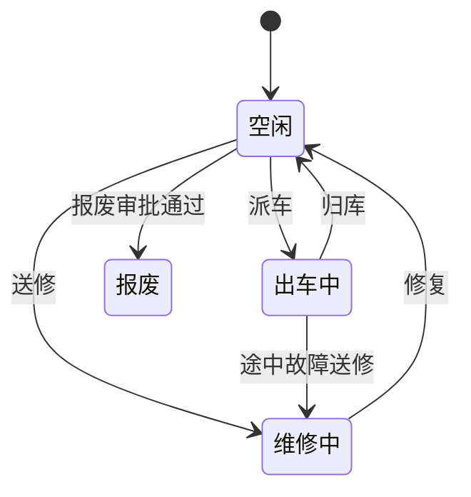

# REQ-01: 车辆档案管理 (V1)

**优先级**: P0
**版本**: V1（第一版基础功能）

## 描述

建立车辆基础档案，支持车辆信息的登记、查询、修改和状态变更，实现编制限额管控。

## 需求条目

### 第一节：车辆信息登记

REQ-01-1-1: When 车队管理员录入车辆信息时，the system shall 要求提供车牌号、品牌型号、车辆类型、燃油类型、座位数、排量、购置日期、编制类型作为必填字段。

REQ-01-1-2: When 车牌号已被占用时，the system shall 拒绝录入并提示"该车牌号已存在"。

REQ-01-1-3: While 录入车辆时，if 该部门车辆数已达编制限额，then the system shall 提示"超出编制限额"但允许管理员确认后继续录入。

REQ-01-1-4: The system shall 支持上传车辆照片和证件扫描件（JPG/PNG/PDF格式，单文件不超过5MB）。

### 第二节：车辆列表与查询

REQ-01-2-1: The system shall 提供车辆列表页面，默认按登记时间倒序排列，每页显示20条记录。

REQ-01-2-2: When 用户输入车牌号关键词时，the system shall 支持模糊匹配查询。

REQ-01-2-3: The system shall 支持按车辆类型、部门、状态组合筛选。

### 第三节：车辆状态管理

REQ-01-3-1: The system shall 维护车辆状态为以下四种之一：空闲、出车中、维修中、报废。

REQ-01-3-2: When 车辆被派车后，the system shall 自动将状态更新为"出车中"。

REQ-01-3-3: When 行程结束归库后，the system shall 自动将状态恢复为"空闲"。

REQ-01-3-4: When 管理员手动标记车辆为"维修中"时，the system shall 禁止对该车辆进行派车操作。

REQ-01-3-5: When 车辆被标记为"报废"，the system shall 禁止对该车辆进行任何业务操作。

### 第四节：编制管理

REQ-01-4-1: The system shall 支持按部门设置车辆编制限额。

REQ-01-4-2: When 部门车辆数超过编制限额时，the system shall 在车辆列表页显示超编提醒。

REQ-01-4-3: The system shall 在仪表盘展示各部门车辆编制执行情况（实有数/编制数）。

## 状态机

## 关联接口

| 方法 | 路径 | 说明 |
|------|------|------|
| GET | `/api/vehicles` | 车辆列表（支持筛选） |
| GET | `/api/vehicles/:id` | 车辆详情 |
| POST | `/api/vehicles` | 新增车辆 |
| PUT | `/api/vehicles/:id` | 更新车辆信息 |
| DELETE | `/api/vehicles/:id` | 删除车辆（无关联行程时允许） |

## V2 预留（本次不实现）

- 车辆全生命周期追溯（采购计划→接收→调拨→报废完整链条）
- 加油卡、ETC 设备绑定管理
- 年度审验到期自动提醒（整合至 REQ-02）
- 车辆调拨管理流程
- 车辆处置审批流程
