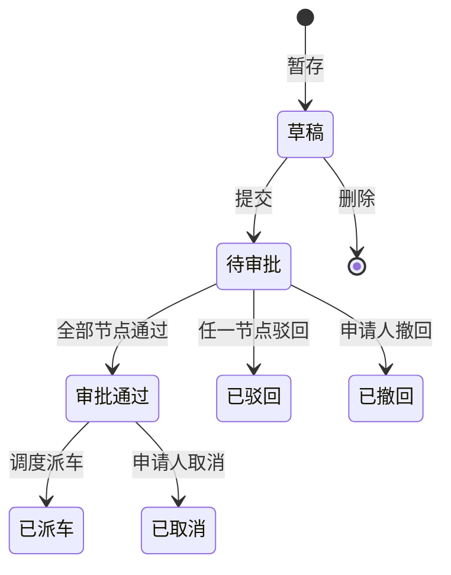

# REQ-03: 用车申请 (V1)

**优先级**: P0
**版本**: V1（第一版基础功能）

## 描述

用户提交用车申请，填写出行需求信息，系统校验合规性并生成申请单进入审批流程。

## 需求条目

### 第一节：申请表单

REQ-03-1-1: When 用户提交用车申请时，the system shall 要求提供以下必填字段：用车事由、出发地点、目的地点、预计出发时间、预计返回时间、乘车人数。

REQ-03-1-2: The system shall 支持选择是否需要司机（默认需要）。

REQ-03-1-3: The system shall 支持填写备注信息（可选，最多500字）。

REQ-03-1-4: The system shall 自动记录申请人姓名、所在部门和申请时间。

### 第二节：场景分类

REQ-03-2-1: When 用户选择用车场景时，the system shall 提供以下基本场景类型：日常公务出行、会议/活动保障、接待来访、机要通信、应急用车、集体活动。

REQ-03-2-2: When 场景为"应急用车"时，the system shall 标记申请为"紧急"，审批流程可提速。

### 第三节：合规性校验

REQ-03-3-1: When 出发时间为节假日时，the system shall 要求用户填写节假日用车理由。

REQ-03-3-2: When 预计返回时间晚于当天22:00时，the system shall 提示"非工作时段用车"并要求确认。

REQ-03-3-3: When 乘车人数超过可用车辆最大座位数时，the system shall 提示"乘车人数超出可用车辆容量"。

### 第四节：申请提交

REQ-03-4-1: When 用户确认提交申请时，the system shall 将申请状态设置为"待审批"并生成申请编号。

REQ-03-4-2: The system shall 向申请人的直属上级推送待审批通知。

REQ-03-4-3: When 申请提交成功时，the system shall 跳转至申请记录页面，并展示8位数字申请编号。

## 状态机

## 关联接口

| 方法 | 路径 | 说明 |
|------|------|------|
| POST | `/api/applications` | 提交用车申请 |
| GET | `/api/applications` | 查询申请列表 |
| GET | `/api/applications/:id` | 申请详情 |
| PUT | `/api/applications/:id/cancel` | 取消申请 |

## V2 预留

- 21种子场景细分类别（会议/培训/调研/接待等详细分类）
- 智能填表辅助（根据历史记录预填常用信息）
- 时间冲突预检（时段资源占用检查）
- 车辆规格智能匹配引擎
- 拼车匹配与合并引擎
- 费用预估
- 信用评分体系（频繁取消/撤回扣分）
- 用车日历与资源可见性
- 用车需求预报
