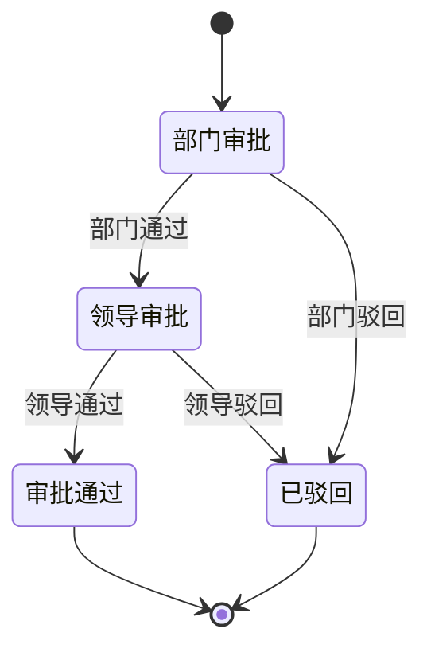

# REQ-04: 用车审批 (V1)

**优先级**: P0
**版本**: V1（第一版基础功能）

## 描述

审批人对用车申请进行审核，支持通过和驳回操作，审批结果自动流转。

## 需求条目

### 第一节：待审批列表

REQ-04-1-1: When 审批人登录系统时，the system shall 在待审批列表展示所有需要该审批人处理的申请单。

REQ-04-1-2: The system shall 在仪表盘以数字角标展示当前待审批数量。

REQ-04-1-3: The system shall 支持按申请时间、紧急程度排序。

### 第二节：审批操作

REQ-04-2-1: When 审批人点击"通过"时，the system shall 记录审批意见（可选），更新该审批节点状态为"已通过"。

REQ-04-2-2: When 审批人点击"驳回"时，the system shall 要求填写驳回理由，更新申请单状态为"已驳回"。

REQ-04-2-3: When 申请单被驳回时，the system shall 向申请人推送驳回通知，包含驳回理由。

REQ-04-2-4: The system shall 支持申请人在收到驳回后修改并重新提交。

### 第三节：审批流程

REQ-04-3-1: The system shall 按"部门负责人→分管领导"两级审批流程执行。

REQ-04-3-2: When 申请人为部门负责人时，the system shall 跳过本部门审批节点，由上级直接审批。

REQ-04-3-3: When 所有审批节点通过时，the system shall 将申请单状态更新为"审批通过"并推送通知至调度员。

### 第四节：审批记录

REQ-04-4-1: The system shall 记录每次审批操作的操作人、操作时间、审批结果和审批意见。

REQ-04-4-2: The system shall 在申请详情页展示完整的审批流转记录（时间线形式）。

## 状态机

## 关联接口

| 方法 | 路径 | 说明 |
|------|------|------|
| GET | `/api/approvals/pending` | 待审批列表 |
| POST | `/api/approvals/:id/approve` | 审批通过 |
| POST | `/api/approvals/:id/reject` | 审批驳回 |

## V2 预留

- 加签与转审（审批人可将审批转给其他人）
- 代理审批（设置代理人在指定时间段代为审批）
- 审批时效催办（超时自动提醒）
- 紧急快速通道（应急用车场景缩短审批时限）
- 审批效率统计与异常监控
- 移动端审批适配
