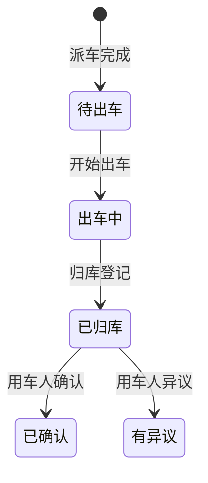

# REQ-06: 司机出车与归库 (V1)

**优先级**: P0
**版本**: V1（第一版基础功能）

## 描述

驾驶员执行出车任务，记录出车和归库信息，完成行程闭环。

## 需求条目

### 第一节：出车确认

REQ-06-1-1: When 驾驶员收到出车任务时，the system shall 在驾驶员端展示待出车任务列表。

REQ-06-1-2: When 驾驶员点击"开始出车"时，the system shall 要求确认车辆基本信息（车牌号、当前里程数）。

REQ-06-1-3: When 驾驶员确认出车时，the system shall 记录出车时间和起始里程，将行程状态更新为"出车中"。

### 第二节：归库登记

REQ-06-2-1: When 驾驶员完成用车任务后，the system shall 支持点击"归库登记"。

REQ-06-2-2: When 归库登记时，the system shall 要求填写结束里程数，自动计算本次行程里程（结束里程 - 起始里程）。

REQ-06-2-3: When 归库登记完成时，the system shall 将车辆状态恢复为"空闲"，驾驶员状态恢复为"空闲"，行程状态更新为"已归库"。

### 第三节：用车人确认

REQ-06-3-1: The system shall 在归库后向用车申请人推送行程确认通知。

REQ-06-3-2: When 用车人确认无异议时，the system shall 标记行程为"已确认"。

REQ-06-3-3: When 用车人对里程有异议时，the system shall 支持填写异议说明。

## 状态机

## 关联接口

| 方法 | 路径 | 说明 |
|------|------|------|
| POST | `/api/trips/start` | 开始出车 |
| POST | `/api/trips/end` | 归库登记 |
| PUT | `/api/trips/:id/confirm` | 用车人确认 |
| GET | `/api/trips` | 行程记录列表 |

## V2 预留

- 出车前安全检查清单（灯光/制动/轮胎/证件等逐项确认）
- 途中异常处理（故障报告、事故记录、路线变更申报）
- 车辆交接管理（多班制交接登记）
- 延时归库申报与审批
- 出车日志与统计
