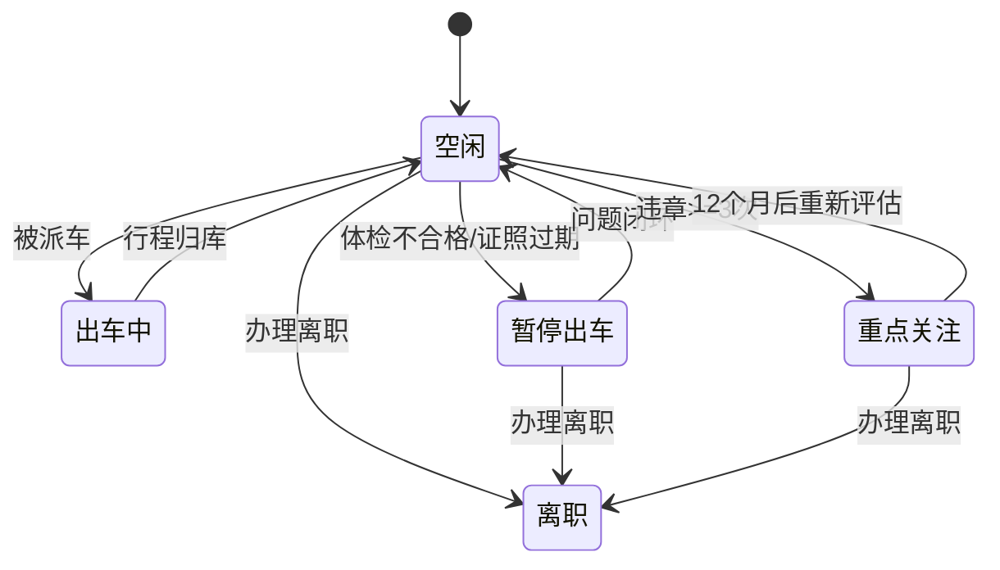

# REQ-12: 驾驶员信息管理 (V1)

**优先级**: P0
**版本**: V1（第一版基础功能）

## 描述

建立驾驶员基础档案，管理驾驶证、从业资格证和体检信息，支持出车状态自动管理。

## 需求条目

### 第一节：驾驶员基础档案

REQ-12-1-1: When 录入驾驶员信息时，the system shall 自动生成工号（格式：DRV+年份+3位序号，如 DRV2026001）。

REQ-12-1-2: The system shall 要求提供以下必填字段：姓名、电话。以下字段为可选：性别、出生日期、政治面貌、编制类型、入职日期、所属部门。

REQ-12-1-3: The system shall 根据出生日期自动计算年龄，根据入职日期自动计算工龄。

### 第二节：驾驶证管理

REQ-12-2-1: The system shall 支持记录驾驶证信息：驾驶证号、准驾车型（A1/A2/B1/B2/C1/C2）、初次领证日期、有效期起止、发证机关。

REQ-12-2-2: When 驾驶证有效期截止日期已过时，the system shall 将驾驶员标记为"证照过期"并自动将状态改为"暂停出车"。

REQ-12-2-3: The system shall 根据初次领证日期自动计算驾龄。

REQ-12-2-4: The system shall 在驾驶证有效期截止前30天展示"即将到期"提醒。

### 第三节：从业资格证管理

REQ-12-3-1: The system shall 支持记录从业资格证信息：资格证号、资格类型、有效期起止。

REQ-12-3-2: When 资格证有效期截止日期已过时，the system shall 标记"资格证过期"。

### 第四节：体检管理

REQ-12-4-1: The system shall 支持录入驾驶员体检记录：体检日期、体检机构、体检结论。

REQ-12-4-2: When 体检结论为"不合格"或"需复查"时，the system shall 自动将驾驶员状态改为"暂停出车"。

REQ-12-4-3: When 最近一次体检距今超过12个月时，the system shall 标记"体检逾期"提醒。

### 第五节：培训管理

> 驾驶员培训管理已独立为子需求文档 [REQ-12T-驾驶员培训管理.md](REQ-12T-驾驶员培训管理.md)，覆盖培训计划、执行记录、考核评估、逾期管理、状态联动等完整业务闭环。以下为概要：

REQ-12-5-1: The system shall 支持录入驾驶员安全培训记录：培训日期、培训类型、考核结果。

REQ-12-5-2: When 最近一次培训距今超过6个月时，the system shall 标记"培训逾期"提醒。

REQ-12-5-3: When 培训逾期超过30天时，the system shall 自动将驾驶员状态改为"暂停出车"。

### 第六节：违章管理

REQ-12-6-1: The system shall 支持录入驾驶员违章记录：违章日期、违章类型、地点、行为描述、处罚结果、扣分。

REQ-12-6-2: When 12个月内累计违章次数达到或超过3次时，the system shall 将驾驶员标记为"重点关注"。

### 第七节：驾驶员状态管理

REQ-12-7-1: The system shall 维护驾驶员状态为以下五种之一：空闲、出车中、暂停出车、重点关注、离职。

REQ-12-7-2: When 驾驶员被派车时，the system shall 自动将状态更新为"出车中"。

REQ-12-7-3: When 行程归库后，the system shall 自动将状态恢复为"空闲"（除非有未闭环的暂停出车条件）。

REQ-12-7-4: When 以下任一条件触发时，the system shall 自动将状态改为"暂停出车"：体检不合格/需复查未闭环、驾驶证过期。

REQ-12-7-5: When 12个月内违章>=3次时，the system shall 将关注等级改为"重点关注"但不自动暂停出车。

### 第八节：驾驶员列表与查询

REQ-12-8-1: The system shall 在驾驶员列表展示三龄（驾龄/工龄/年龄）标签。

REQ-12-8-2: The system shall 支持按状态、准驾车型筛选驾驶员。

REQ-12-8-3: The system shall 以不同颜色标签展示驾驶员状态（空闲=绿、出车中=蓝、暂停出车=红、重点关注=橙、离职=灰）。

## 状态机

## 关联接口

| 方法 | 路径 | 说明 |
|------|------|------|
| GET | `/api/drivers` | 驾驶员列表（支持筛选） |
| GET | `/api/drivers/:id` | 驾驶员详情（含培训/违章/体检记录） |
| POST | `/api/drivers` | 新增驾驶员 |
| PUT | `/api/drivers/:id` | 更新驾驶员信息 |
| POST | `/api/drivers/:id/training` | 录入培训记录 |
| POST | `/api/drivers/:id/violation` | 录入违章记录 |
| POST | `/api/drivers/:id/health-check` | 录入体检记录 |
| GET | `/api/drivers/:id/training` | 培训记录列表 |
| GET | `/api/drivers/:id/violation` | 违章记录列表 |
| GET | `/api/drivers/:id/health-check` | 体检记录列表 |

## V2 预留

- 保密管理（保密岗位标记、保密等级、保密审查日期）
- 劳动合同管理（合同期限、到期提醒）
- 出车偏好配置（常驾车辆、熟悉路线）
- 绩效评分体系
- 驾驶员画像（综合雷达图）
