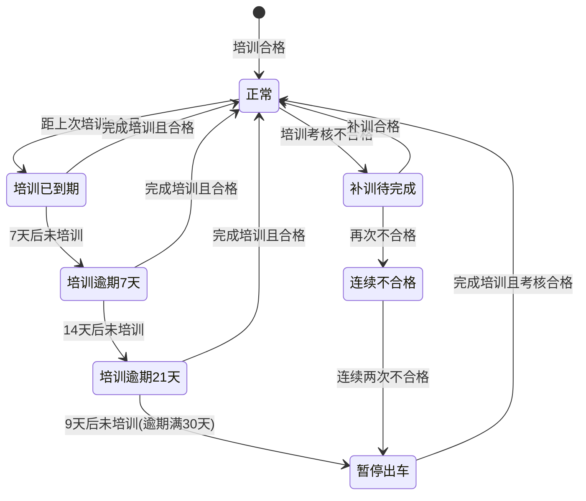
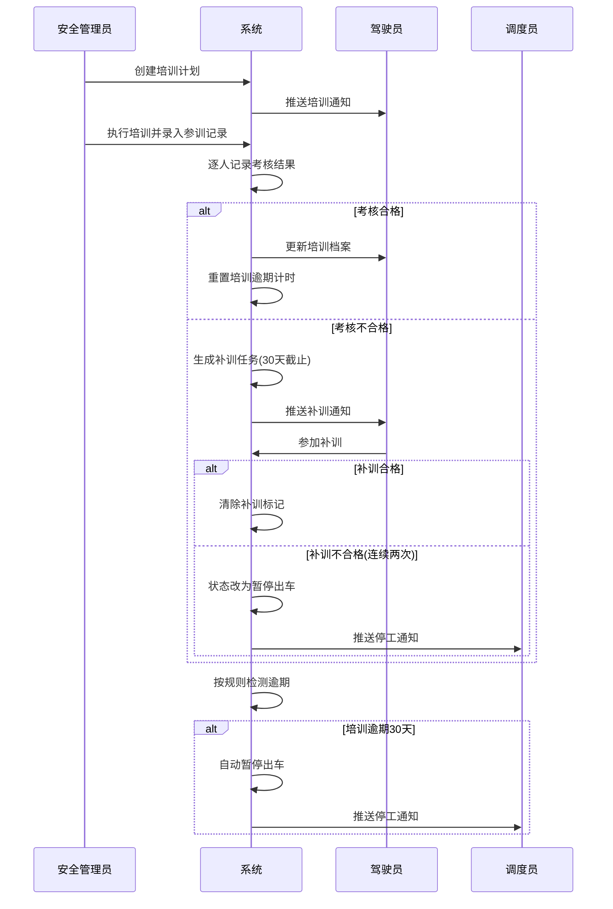

# REQ-12-T: 驾驶员培训管理 (V1)

**优先级**: P0（安全合规要求）
**版本**: V1（第一版基础功能）
**父模块**: REQ-12 驾驶员信息管理

## 描述

央企驾驶员培训管理是车队安全运营的合规底线。依据《道路交通安全法》和国资委关于央企公务车辆安全管理的要求，驾驶员须定期接受安全教育培训并考核合格方可上岗。本需求定义培训计划制定、培训执行记录、考核评估、逾期预警和与驾驶员上岗状态联动的完整业务闭环。

## 业务背景

央企车队管理中培训不可缺失的原因：

1. **法规强制**：道路交通安全法规定营运驾驶员每年须接受不少于规定学时的安全教育培训
2. **央企合规**：国资委对央企公务用车有专项安全管理考核，培训记录是必查项
3. **事故预防**：驾驶员安全意识和驾驶技能直接影响人员安全和国有资产安全
4. **保密要求**：央企公务出行常涉密，驾驶员须通过保密培训
5. **服务质量**：礼仪规范培训确保接待任务的标准化服务水准

## 术语

| 术语 | 定义 |
|------|------|
| 培训计划 | 按年度/季度制定的驾驶员培训总体安排，包含培训主题、目标人数、时间窗口 |
| 培训学时 | 培训时长的计量单位，1学时=45分钟 |
| 培训逾期 | 最近一次培训距今超过规定周期（默认6个月）的状态 |
| 必修培训 | 法规或企业内部规章制度要求所有驾驶员必须参加的培训类型 |
| 选培课程 | 特定驾驶员群体需要参加的专业培训（如新能源车操作、防滑链安装等） |
| 考核结果 | 培训结束后的评估结论：合格/不合格/缺考 |
| 培训档案 | 驾驶员全职业生涯的培训履历，作为晋档、评优依据 |
| 持证上岗 | 驾驶员在完成必修培训并考核合格后方可执行出车任务 |

## 需求条目

### 第一节：培训计划管理

REQ-12T-1-1: When 安全管理员创建年度培训计划时，the system shall 要求提供计划名称、计划年度、培训类型、计划学时、计划人数范围。

REQ-12T-1-2: The system shall 支持以下预置培训类型：安全驾驶、礼仪规范、保密教育、车辆维护、法规政策、应急处置、新能源车辆操作、冬季行车安全。

REQ-12T-1-3: While 驾驶员未完成当年必修培训学时，the system shall 在驾驶员状态面板标记"培训未达标"。

REQ-12T-1-4: The system shall 支持为不同准驾车型的驾驶员制定差异化培训方案（A1/A2驾驶员额外要求车辆维护实操培训）。

### 第二节：培训执行与记录

REQ-12T-2-1: When 安全管理员录入培训执行记录时，the system shall 要求提供以下必填字段：培训日期、培训类型、培训主题、培训讲师、总时长（学时）。

REQ-12T-2-2: When 录入参训驾驶员时，the system shall 支持从驾驶员列表批量选择参训人员。

REQ-12T-2-3: The system shall 为每位参训驾驶员单独记录考核结果（合格/不合格/缺考）、考核分数（可选）和培训内容摘要。

REQ-12T-2-4: When 驾驶员考核结果为"不合格"或"缺考"时，the system shall 标记该驾驶员需要补训。

### 第三节：培训考核与评估

REQ-12T-3-1: The system shall 支持培训考核结果分为以下四档：优秀（>=90分）、合格（60-89分）、不合格（<60分）、缺考。

REQ-12T-3-2: When 驾驶员考核结果为"不合格"时，the system shall 自动生成补训任务，设置补训截止日期为原培训日期后30天。

REQ-12T-3-3: When 补训截止日期到期且未完成补训时，the system shall 向安全管理员推送催办通知。

REQ-12T-3-4: When 驾驶员连续两次培训考核不合格时，the system shall 将驾驶员状态改为"暂停出车"并推送通知至安全管理员和调度员。

### 第四节：培训逾期管理

REQ-12T-4-1: When 驾驶员最近一次培训记录距今超过6个月时，the system shall 将驾驶员标记为"培训逾期"。

REQ-12T-4-2: When 驾驶员被标记为"培训逾期"且逾期超过30天时，the system shall 自动将驾驶员状态改为"暂停出车"并生成系统通知。

REQ-12T-4-3: When 培训逾期驾驶员完成培训且考核合格后，the system shall 自动清除"培训逾期"标记，恢复出车状态。

REQ-12T-4-4: The system shall 在仪表盘独立区域展示"培训逾期驾驶员列表"，按逾期天数从高到低排序。

REQ-12T-4-5: The system shall 在培训到期前30天向驾驶员和安全管理员推送"培训即将到期"提醒。

### 第五节：培训档案与统计

REQ-12T-5-1: The system shall 为每位驾驶员建立全职业生涯培训档案，按时间倒序展示培训履历。

REQ-12T-5-2: The system shall 在驾驶员详情页以时间轴形式展示培训履历，标注考核结果（合格=蓝色、不合格=红色、缺考=灰色）。

REQ-12T-5-3: The system shall 提供以下培训统计：

| 统计维度 | 说明 |
|----------|------|
| 培训覆盖率 | 统计周期内参训驾驶员数 / 在册驾驶员总数 |
| 合格率 | 考核合格人数 / 参训总人数 |
| 人均培训学时 | 统计周期内总培训学时 / 在册驾驶员数 |
| 逾期率 | 培训逾期驾驶员数 / 在册驾驶员总数 |
| 培训类型分布 | 各类培训的场次和参训人次 |

REQ-12T-5-4: The system shall 支持按驾驶员查询个人培训统计：累计培训次数、累计学时、合格率、最近一次培训日期。

### 第六节：培训类型详细定义

REQ-12T-6-1: The system shall 将以下8种培训类型作为标准分类：

| 培训类型 | 必修/选修 | 最低频次 | 适用驾驶员 | 考核方式 |
|----------|-----------|----------|------------|----------|
| 安全驾驶 | 必修 | 每6个月 | 全部 | 笔试+实操 |
| 礼仪规范 | 必修 | 每年 | 全部 | 笔试 |
| 保密教育 | 必修 | 每年 | 涉密岗位驾驶员 | 笔试 |
| 车辆维护 | 必修 | 每年 | A1/A2驾驶员 | 实操 |
| 法规政策 | 必修 | 每年 | 全部 | 笔试 |
| 应急处置 | 必修 | 每年 | 全部 | 实操 |
| 新能源车辆操作 | 选修 | — | 电动/混动车辆驾驶员 | 实操 |
| 冬季行车安全 | 选修 | 每年冬季前 | 北方地区驾驶员 | 笔试 |

REQ-12T-6-2: When 驾驶员的准驾车型为A1或A2时，the system shall 在培训计划中自动增加"车辆维护"实操培训要求。

REQ-12T-6-3: When 驾驶员被标记为涉密岗位时，the system shall 在培训计划中自动增加"保密教育"培训要求。

### 第七节：培训与驾驶员状态联动

REQ-12T-7-1: When 以下培训相关条件触发时，the system shall 执行对应的驾驶员状态变更：

| 触发条件 | 状态变更 | 通知对象 |
|----------|----------|----------|
| 培训逾期超过30天 | 改为"暂停出车" | 安全管理员、调度员 |
| 连续两次考核不合格 | 改为"暂停出车" | 安全管理员、调度员 |
| 补训考核合格后 | 恢复为"空闲" | 安全管理员 |
| 完成全部必修培训 | 清除"培训未达标"标记 | 驾驶员 |
| 培训即将到期（30天内） | 不改变状态，仅预警 | 驾驶员、安全管理员 |

REQ-12T-7-2: When 驾驶员状态为"暂停出车"且有未完成的补训任务时，the system shall 在调度员派车界面过滤掉该驾驶员并标注"培训未达标，暂不可派"。

### 第八节：培训通知与催办

REQ-12T-8-1: When 新培训计划发布时，the system shall 向计划范围内的全部驾驶员推送培训通知。

REQ-12T-8-2: When 驾驶员培训逾期7天时，the system shall 推送第一次催办通知。

REQ-12T-8-3: When 驾驶员培训逾期21天时，the system shall 推送第二次催办通知，同时抄送其直属上级。

REQ-12T-8-4: When 驾驶员培训逾期30天时，the system shall 推送第三次催办通知，同时自动将状态改为"暂停出车"，并抄送安全管理员和调度员。

## 业务状态机

## 培训流程时序图

## 关联接口

| 方法 | 路径 | 说明 |
|------|------|------|
| POST | `/api/training/plans` | 创建培训计划 |
| GET | `/api/training/plans` | 查询培训计划列表 |
| GET | `/api/training/plans/:id` | 培训计划详情 |
| POST | `/api/training/plans/:id/execute` | 执行培训（批量录入参训驾驶员和考核结果） |
| GET | `/api/training/records` | 培训记录查询（支持按驾驶员/日期/类型筛选） |
| GET | `/api/training/drivers/:driverId` | 某驾驶员培训履历 |
| GET | `/api/training/stats` | 培训统计（覆盖率/合格率/逾期率等） |
| GET | `/api/training/overdue` | 培训逾期驾驶员列表 |
| PUT | `/api/training/records/:id` | 更新培训记录（含考核结果变更） |

## V2 预留

- 培训课程库管理（课程大纲、课件、教材关联）
- 在线培训与考试模块（培训材料在线阅读、在线答题考试）
- 培训证书自动生成（PDF格式，含公章水印）
- 外部培训记录导入（外派培训、第三方机构培训统一纳入档案）
- 培训费用管理（培训场租、讲师费、教材费独立核算）
- 驾驶员培训学分银行（学分累积、跨年度结转）
- 基于培训大数据的驾驶员能力画像
- 人工智能推荐培训课程（根据违章记录、事故记录推荐强化课程）
