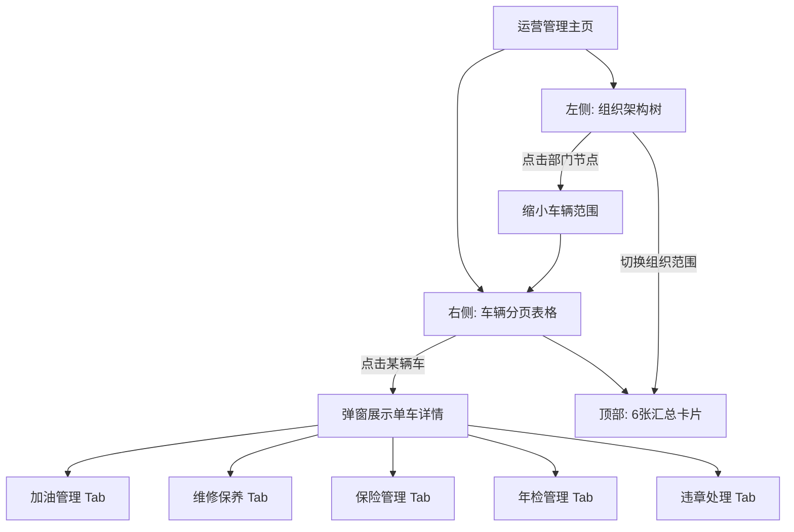
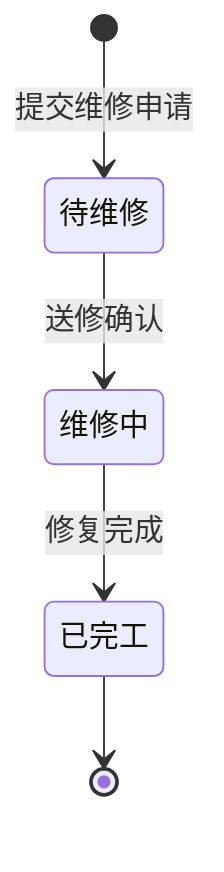
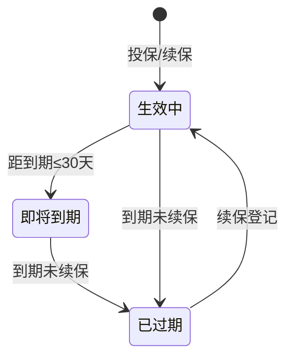

# REQ-13: 车辆运营管理 (V1)

**优先级**: P0
**版本**: V1（第一版基础功能）
**交互模式**: 组织树导航 → 车辆分页列表 → 弹窗查看单车业务详情

## 描述

车辆运营管理是车队日常运营的核心工作台。运营管理人员围绕加油、维修保养、保险、年检、违章五大业务场景，进行日常记录、状态跟踪和台账维护。针对800+车辆规模，采用「组织树导航 + 分页表格 + 弹窗详情」三级交互模式，确保大规模车队下的操作效率和页面性能。

## 总体交互范式

各子场景共享统一的交互模式：

1. 运营管理主页分左右两栏：左侧组织架构树，右侧车辆表格+汇总卡片
2. 组织树支持展开/折叠，按「集团→分公司→部门」三级层级导航
3. 点击组织节点后，汇总卡片和车辆表格联动更新为该组织范围内的数据
4. 车辆表格每页15条，支持关键词搜索、状态筛选、车型筛选
5. 每辆车从表格可直观看到保险到期、年检到期、违章状态的 mini 标签
6. 点击某辆车，弹出 780px 宽模态框，内含 5 个 Tab 展示该车五大业务数据
7. 点击遮罩或关闭按钮关闭弹窗，恢复表格浏览

## 需求条目

### 第一节：车辆运营管理主页

REQ-13-1-1: The system shall 在左侧提供组织架构树，按三级层级（集团→分公司→部门）展示组织节点，每个部门节点旁显示该部门车辆数。

REQ-13-1-2: The system shall 支持组织树节点的展开与折叠，默认展开集团根节点。

REQ-13-1-3: The system shall 在组织树顶部提供"全部车辆"选项，点击后展示所有车辆，不区分部门。

REQ-13-1-4: The system shall 在右侧以分页表格形式展示车辆列表，每页15条记录，底部提供分页导航（上一页/页码/下一页 + 当前页/总页数）。

REQ-13-1-5: Each 车辆列表行 shall 包含以下列：车牌号、品牌型号、车型、所属部门、车辆状态（空闲/出车中/维修中/报废）、本月加油量(L)、本月维修费用(元)、保险到期状态、年检到期状态、违章数量。

REQ-13-1-6: The system shall 在保险到期、年检到期、违章列使用 mini 标签展示状态：红色=逾期/有违章、橙色=即将到期（30天内）、绿色=正常/无违章。

REQ-13-1-7: The system shall 支持按车牌号/品牌型号关键词搜索车辆。

REQ-13-1-8: The system shall 支持按车辆状态筛选（空闲、出车中、维修中、报废）。

REQ-13-1-9: The system shall 支持按车型筛选（轿车、SUV、商务车、中型客车、大型客车）。

REQ-13-1-10: When 用户点击组织树节点时，the system shall 联动更新顶部汇总卡片和车辆表格为该节点范围内的数据。

REQ-13-1-11: When 用户点击车辆行时，the system shall 高亮该行并以弹窗形式展示该车的详细运营数据。

### 第二节：弹窗详情

REQ-13-2-1: When 用户点击车辆行时，the system shall 以 780px 宽居中模态弹窗展示该车辆详情。

REQ-13-2-2: The system shall 在弹窗头部展示车辆基本信息：车牌号、品牌型号、车型、燃油类型、车辆状态标签、所属部门。

REQ-13-2-3: The system shall 在弹窗头部以下提供 5 个 Tab 切换：加油管理、维修保养、保险管理、年检管理、违章处理。

REQ-13-2-4: The system shall 在 Tab 内容区域提供可滚动区域（最大高度 50vh），展示对应业务数据。

REQ-13-2-5: The system shall 支持点击弹窗遮罩或关闭按钮关闭弹窗，关闭后恢复到车辆表格浏览状态。

REQ-13-2-6: The system shall 在关闭弹窗时解除车辆行高亮。

### 第三节：加油管理

REQ-13-3-1: When 用户在弹窗中切换到加油管理 Tab 时，the system shall 加载该车辆当月的所有加油记录，按时间倒序排列。

REQ-13-3-2: The system shall 在加油记录列表顶部展示本月加油统计卡片：累计加油量（升）、累计金额（元）、平均油耗（升/百公里）。

REQ-13-3-3: Each 加油记录 shall 包含：加油日期、加油站名称、油品标号、加油量（升）、单价（元/升）、金额、当前里程数、加油卡号、操作人。

REQ-13-3-4: When 用户点击"添加加油"时，the system shall 弹出加油登记表单，加油日期、油品标号、加油量、单价、当前里程数为必填项。

REQ-13-3-5: The system shall 在录入当前里程数后自动计算本期油耗：本期油耗 = 本期加油量 / (本期里程数 - 上次里程数) * 100。

REQ-13-3-6: When 计算出的油耗超出该车型基准油耗的 20% 时，the system shall 标记为"油耗异常"并以橙色高亮展示。

REQ-13-3-7: The system shall 支持按月份切换查看历史加油记录。

### 第四节：维修保养

REQ-13-4-1: When 用户在弹窗中切换到维修保养 Tab 时，the system shall 加载该车辆的维修保养记录，分为维修记录和保养记录两个子区块。

REQ-13-4-2: The system shall 在页面上方提供"新增维修申请"和"保养记录"两个操作按钮。

REQ-13-4-3: Each 维修记录 shall 包含：维修日期、维修类型（事故维修/故障维修/常规维修）、维修项目描述、维修费用、维修厂名称、维修状态（待维修/维修中/已完工）、操作人。

REQ-13-4-4: Each 保养记录 shall 包含：保养日期、保养类型（小保养/大保养/专项保养）、保养项目、保养费用、保养里程数、下次保养里程/日期、操作人。

REQ-13-4-5: When 用户点击"新增维修申请"时，the system shall 弹出维修申请表单，维修类型、维修项目描述、维修厂为必填项。

REQ-13-4-6: When 用户点击"保养记录"时，the system shall 弹出保养登记表单，保养类型、保养项目、保养里程、下次保养里程/日期为必填项。

REQ-13-4-7: The system shall 支持维护定点维修厂信息：维修厂名称、联系人、联系电话、地址、合作状态。

REQ-13-4-8: When 维修记录状态变更为"已完工"时，the system shall 将车辆状态从"维修中"恢复为"空闲"。

REQ-13-4-9: When 保养后录入下次保养里程时，the system shall 在车辆当前里程接近下次保养里程（差值<500公里）时在仪表盘展示保养提醒。

### 第五节：保险管理

REQ-13-5-1: When 用户在弹窗中切换到保险管理 Tab 时，the system shall 加载该车辆的全部保险信息，按生效日期倒序排列。

REQ-13-5-2: Each 保险记录 shall 包含：保险公司、险种类型（交强险/商业险全险/商业险部分险）、保单号、保险金额、保费、生效日期、到期日期、保单状态、操作按钮。

REQ-13-5-3: The system shall 在车辆列表中以 mini 标签直观展示保险到期状态：正常（绿色）、即将到期（30天内，橙色）、已逾期（红色）。

REQ-13-5-4: The system shall 支持新增保险记录、更新保险信息。

REQ-13-5-5: When 用户续保登记时，the system shall 自动将旧保险记录标记为"已过期"，新记录标记为"生效中"。

### 第六节：年检管理

REQ-13-6-1: When 用户在弹窗中切换到年检管理 Tab 时，the system shall 加载该车辆的年检信息。

REQ-13-6-2: The system shall 在年检区域顶部展示下次年检倒计时，以颜色区分：正常（距到期>60天，绿色）、临近（30-60天，橙色）、紧急（距到期<30天，红色）、已逾期（红色）。

REQ-13-6-3: Each 年检记录 shall 包含：年检日期、下次年检日期、年检单位、年检结果（合格/不合格/限期整改）、年检费用。

REQ-13-6-4: The system shall 根据最近年检日期和车辆类型自动计算下次年检日期。

REQ-13-6-5: The system shall 在车辆列表中以 mini 标签直观展示年检到期状态（同保险标签规则）。

REQ-13-6-6: When 年检到期日已过且未录入新年检记录时，the system shall 展示"年检逾期"红色标签。

REQ-13-6-7: The system shall 支持手动录入年检记录：年检日期、下次年检日期、年检单位、年检结果。

### 第七节：违章处理

REQ-13-7-1: When 用户在弹窗中切换到违章处理 Tab 时，the system shall 展示该车辆的全部违章记录。

REQ-13-7-2: The system shall 在违章列表顶部汇总展示：累计违章次数、累计扣分、累计罚款金额。

REQ-13-7-3: Each 违章记录 shall 包含：违章日期、违章地点、违章行为、扣分、罚款金额、处理状态（待处理/已处理/申诉中）。

REQ-13-7-4: When 用户修改违章处理状态为"已处理"时，the system shall 要求填写处理日期和处理结果。

REQ-13-7-5: The system shall 支持手动录入车辆违章记录。

REQ-13-7-6: The system shall 在车辆列表中以 mini 标签展示违章数量（有违章=红色显示次数，无违章=绿色"无"）。

### 第八节：运营数据汇总

REQ-13-8-1: The system shall 在运营管理主页顶部提供本月运营数据汇总卡片，共 6 张：车辆总数、本月总加油量(L)、本月维修费用(元)、年检预警数、保险预警数、违章车辆数。

REQ-13-8-2: When 用户点击组织树不同节点时，the system shall 动态更新 6 张汇总卡片为所选组织范围内的数据。

REQ-13-8-3: The system shall 在年检预警、保险预警和违章车辆卡片中使用颜色标识：预警数>0时数值为橙色/红色。

## 业务场景状态机

### 维修记录状态机

### 保险记录状态机

## 关联接口

### 运营管理基座

| 方法 | 路径 | 说明 |
|------|------|------|
| GET | `/api/operations/vehicles` | 运营车辆列表（支持组织ID、关键词、状态、车型筛选 + 分页） |
| GET | `/api/operations/vehicles/:id/summary` | 单车运营数据汇总 |
| GET | `/api/operations/summary` | 按组织范围的运营数据汇总（6张卡片） |

### 加油管理

| 方法 | 路径 | 说明 |
|------|------|------|
| GET | `/api/operations/vehicles/:id/refuel` | 加油记录列表（支持月份筛选） |
| POST | `/api/operations/vehicles/:id/refuel` | 添加加油记录 |
| GET | `/api/operations/vehicles/:id/refuel/stats` | 单车油耗统计 |

### 维修保养

| 方法 | 路径 | 说明 |
|------|------|------|
| GET | `/api/operations/vehicles/:id/maintenance` | 维修保养记录列表（区分维修/保养） |
| POST | `/api/operations/vehicles/:id/maintenance` | 新增维修申请/保养记录 |
| PUT | `/api/operations/vehicles/:id/maintenance/:recordId` | 更新维修状态 |
| GET | `/api/operations/repair-shops` | 定点维修厂列表 |
| POST | `/api/operations/repair-shops` | 新增维修厂 |
| PUT | `/api/operations/repair-shops/:id` | 更新维修厂信息 |

### 保险管理

| 方法 | 路径 | 说明 |
|------|------|------|
| GET | `/api/operations/vehicles/:id/insurance` | 保险记录列表 |
| POST | `/api/operations/vehicles/:id/insurance` | 新增保险记录 |
| PUT | `/api/operations/vehicles/:id/insurance/:recordId` | 更新保险信息 |
| POST | `/api/operations/vehicles/:id/insurance/renew` | 续保登记 |

### 年检管理

| 方法 | 路径 | 说明 |
|------|------|------|
| GET | `/api/operations/vehicles/:id/inspection` | 年检记录列表 |
| POST | `/api/operations/vehicles/:id/inspection` | 录入年检记录 |

### 违章处理

| 方法 | 路径 | 说明 |
|------|------|------|
| GET | `/api/operations/vehicles/:id/violations` | 车辆违章记录列表 |
| POST | `/api/operations/vehicles/:id/violations` | 录入违章记录 |
| PUT | `/api/operations/vehicles/:id/violations/:recordId` | 更新违章处理状态 |

## 数据表设计

### refuels 加油记录表

| 字段 | 类型 | 说明 |
|------|------|------|
| id | INTEGER PK | 主键 |
| vehicle_id | INTEGER FK | 关联车辆 |
| refuel_date | TEXT | 加油日期 |
| station_name | TEXT | 加油站名称 |
| fuel_type | TEXT | 油品标号（92#/95#/98#/0#柴油） |
| fuel_amount | REAL | 加油量(升) |
| unit_price | REAL | 单价(元/升) |
| total_amount | REAL | 金额 |
| current_odometer | REAL | 当前里程数 |
| fuel_card_number | TEXT | 加油卡号 |
| operator | TEXT | 操作人 |
| created_at | DATETIME | 创建时间 |

### maintenances 维修保养记录表

| 字段 | 类型 | 说明 |
|------|------|------|
| id | INTEGER PK | 主键 |
| vehicle_id | INTEGER FK | 关联车辆 |
| record_type | TEXT | 类型：repair（维修）/ maintenance（保养） |
| date | TEXT | 日期 |
| repair_type | TEXT | 维修类型：事故维修/故障维修/常规维修（维修记录） |
| maintenance_type | TEXT | 保养类型：小保养/大保养/专项保养（保养记录） |
| items | TEXT | 项目描述 |
| cost | REAL | 费用 |
| shop_id | INTEGER FK | 维修厂ID |
| status | TEXT | 状态：待维修/维修中/已完工（维修记录） |
| current_odometer | REAL | 当前里程（保养记录） |
| next_maintenance_odometer | REAL | 下次保养里程（保养记录） |
| next_maintenance_date | TEXT | 下次保养日期（保养记录） |
| operator | TEXT | 操作人 |
| created_at | DATETIME | 创建时间 |

### repair_shops 定点维修厂表

| 字段 | 类型 | 说明 |
|------|------|------|
| id | INTEGER PK | 主键 |
| name | TEXT | 维修厂名称 |
| contact_person | TEXT | 联系人 |
| contact_phone | TEXT | 联系电话 |
| address | TEXT | 地址 |
| status | TEXT | 合作状态：active/inactive |
| created_at | DATETIME | 创建时间 |

### vehicle_insurance 车辆保险记录表

| 字段 | 类型 | 说明 |
|------|------|------|
| id | INTEGER PK | 主键 |
| vehicle_id | INTEGER FK | 关联车辆 |
| insurance_company | TEXT | 保险公司 |
| insurance_type | TEXT | 险种类型：交强险/商业险 |
| policy_number | TEXT | 保单号 |
| coverage_amount | REAL | 保险金额 |
| premium | REAL | 保费 |
| effective_date | TEXT | 生效日期 |
| expiry_date | TEXT | 到期日期 |
| status | TEXT | 状态：active/expiring/expired |
| document_url | TEXT | 保单附件路径 |
| created_at | DATETIME | 创建时间 |

### vehicle_inspections 车辆年检记录表

| 字段 | 类型 | 说明 |
|------|------|------|
| id | INTEGER PK | 主键 |
| vehicle_id | INTEGER FK | 关联车辆 |
| inspection_date | TEXT | 年检日期 |
| next_inspection_date | TEXT | 下次年检日期 |
| inspection_org | TEXT | 年检单位 |
| result | TEXT | 年检结果：合格/不合格/限期整改 |
| cost | REAL | 年检费用 |
| report_url | TEXT | 年检报告附件路径 |
| created_at | DATETIME | 创建时间 |

### vehicle_violations 车辆违章记录表

| 字段 | 类型 | 说明 |
|------|------|------|
| id | INTEGER PK | 主键 |
| vehicle_id | INTEGER FK | 关联车辆 |
| violation_date | TEXT | 违章日期 |
| location | TEXT | 违章地点 |
| behavior | TEXT | 违章行为 |
| points_deducted | INTEGER | 扣分 |
| penalty_amount | REAL | 罚款金额 |
| status | TEXT | 处理状态：待处理/已处理/申诉中 |
| processed_date | TEXT | 处理日期 |
| processed_result | TEXT | 处理结果 |
| created_at | DATETIME | 创建时间 |

## V2 预留

- 加油卡统一管理（主卡/副卡体系、余额监控、充值记录）
- 维修厂评价与评级体系
- 保险理赔闭环管理（报案→定损→维修→理赔款回收）
- 年检到期自动提醒与预约管理
- 违章处理与驾驶员扣分自动绑定
- 基于加油数据和行驶里程的油耗异常智能预警
- 维修保养费用同比/环比分析
- 车辆全生命周期运营成本分析
- 移动端运营管理（现场拍照上传加油小票、维修确认等）
- 智能提醒推送（保养到期、年检到期、保险到期由系统自动生成通知）
