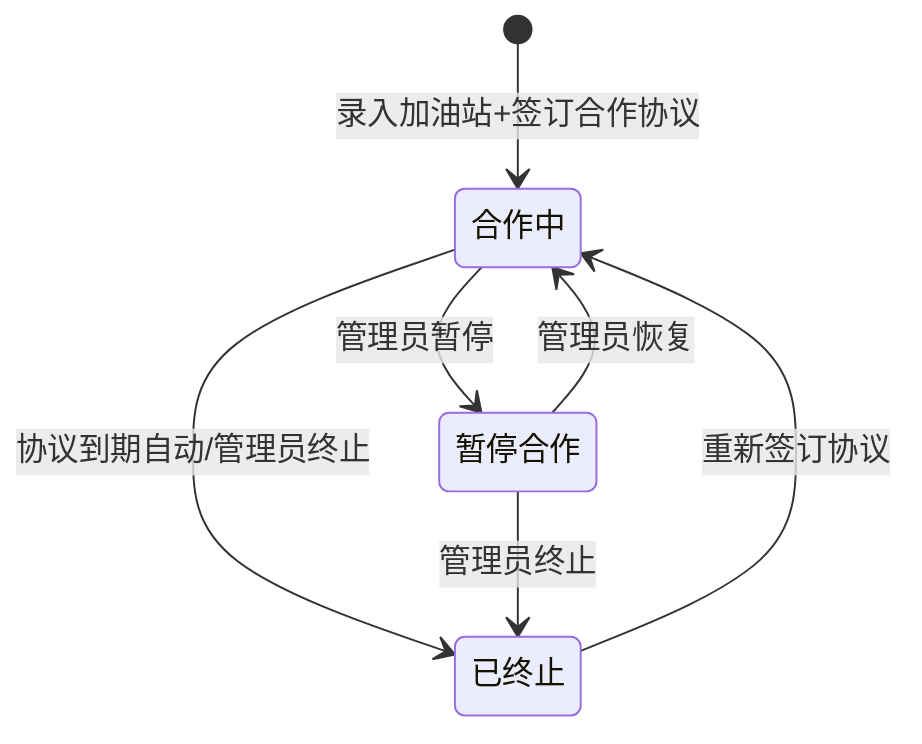

# REQ-15: 定点加油站信息维护 (V1)

**优先级**: P1
**版本**: V1
**模块归属**: 车辆运营管理（REQ-13 子模块）

## 业务场景分析

### 场景背景

大型公车车队年均燃油费支出占运营总支出的 40%-55%。以 800 辆车、年均行驶 25000 公里/车、百公里油耗 10L、92#汽油 7.5 元/L 估算，年燃油费约 1500 万元。油品管理涉及三个方面：车辆去哪里加、每笔加了多少、有没有异常。

目前车队加油主要依赖实体加油卡体系（一车一卡或多车共卡），但加油卡缺少与"到哪里加"的地理绑定。同一个车队在城市不同片区运营（机关驻地附近、卫星城站点、跨区域任务点），驾驶员往往在就近加油站加油——但车队管理员不清楚这些加油站的资质、位置、当前油价，无法判断"这个价格是否合理"、"这个加油站对这支车队是否最优"。

### 痛点分析

| 痛点 | 现状 | 影响 |
|------|------|------|
| 加油站信息碎片化 | 驾驶员口头告知、Excel 散落在不同车队管理员手里 | 新管理员接手时失去历史参考，重复踩坑 |
| 油价无系统对比 | 每次加油单价随行就市，管理员事后审批时无基准价可参照 | 异常高价无法及时识别，审批流于形式 |
| 合作加油站无档案 | 长期合作的加油站没有系统化的合同/协议管理 | 合同到期无人跟进、优惠协议失效无感知 |
| 加油与发票脱节 | 加油小票/增值税发票是纸质或零星电子档，与系统加油记录不关联 | 年底对账耗时，税务稽查支撑不足 |
| 地理覆盖盲区 | 不了解各加油站在车队运营线路上的覆盖情况 | 绕路加油浪费里程、偏远片区无可用站点 |

### 用户角色

- **车队管理员**: 负责加油站信息的录入、合同维护、价格更新、服务评价
- **运营管理人员**: 在车辆运营模块查看车辆历次加油记录时，快速关联加油站信息
- **驾驶员**: 不直接操作加油站模块，但在加油登记表单中可从下拉列表选择已维护的加油站

### 与现有模块的关系

```
REQ-13 车辆运营管理
├── 加油管理 Tab（加油登记表单中需关联加油站）
│   └── 加油站下拉选择 → REQ-15 定点加油站
├── 维修保养 Tab → REQ-14 定点维修车厂
├── 保险管理 Tab
├── 年检管理 Tab
└── 违章处理 Tab

REQ-08 费用管理
├── 燃油费记录 → 可关联加油站（追溯加油地点）

REQ-09 统计分析
├── 按加油站统计加油量/加油金额 → 合作效益分析
```

加油站在系统中作为独立的引用实体，被加油记录（refuels）和费用记录（fees）关联引用。

## 需求条目

### 第一节：加油站基本信息登记

REQ-15-1-1: When 车队管理员新增加油站时，the system shall 要求提供加油站名称、经营地址、联系人姓名、联系电话作为必填字段。

REQ-15-1-2: The system shall 支持录入统一社会信用代码（18位）作为选填字段，用于增值税发票开具。

REQ-15-1-3: When 车队管理员录入行政区域信息时，the system shall 支持选择省/市/区三级行政区域，并支持输入详细街道地址。

REQ-15-1-4: The system shall 支持录入加油站所属品牌（中石油、中石化、中海油、壳牌、民营、其他）和加油站类型（直营站/加盟站/自有站）。

REQ-15-1-5: The system shall 支持录入营业时间（24小时营业 or 分时段），选填字段。

REQ-15-1-6: The system shall 支持上传加油站相关文件，包括合作协议扫描件、危险化学品经营许可证、成品油零售经营批准证书，格式为 JPG、PNG 或 PDF，单文件不超过 10MB。

### 第二节：加油站列表与查询

REQ-15-2-1: The system shall 提供加油站列表页面（嵌入车辆运营管理模块），默认按名称升序排列，每页显示 20 条记录。

REQ-15-2-2: When 用户输入加油站名称、地址、品牌关键词时，the system shall 支持模糊匹配查询。

REQ-15-2-3: The system shall 支持按品牌类型筛选加油站（中石油、中石化、中海油、壳牌、民营、其他）。

REQ-15-2-4: The system shall 支持按合作状态筛选：合作中、暂停合作、已终止。

REQ-15-2-5: The system shall 支持按行政区域筛选加油站（省/市/区）。

REQ-15-2-6: When 车队管理员编辑加油站信息时，the system shall 保留历史修改记录并记录修改人和修改时间。

### 第三节：定点合作关系管理

REQ-15-3-1: The system shall 维护定点合作状态为三种：合作中、暂停合作、已终止。

REQ-15-3-2: When 车队管理员将状态设为合作中时，the system shall 要求选择协议类型（长期协议/年度框架/单次合作）及录入协议有效期起止日期。

REQ-15-3-3: While 加油站处于合作中状态时，the system shall 允许在加油登记表单的下拉列表中选择该加油站。

REQ-15-3-4: When 状态变更为暂停合作时，the system shall 在加油登记表单中将该加油站标记为"暂停合作"，允许选择但给出提示。

REQ-15-3-5: When 状态变更为已终止时，the system shall 将该加油站从加油登记表单的下拉列表中移除。

REQ-15-3-6: If 合作协议到期前 30 天，then the system shall 生成到期提醒通知并推送至车队管理员。

REQ-15-3-7: When 合作协议到期后 7 天未更新时，the system shall 自动将状态变更为已终止，并通知车队管理员。

### 第四节：油价信息维护

REQ-15-4-1: The system shall 支持车队管理员为每个合作中加油站维护各油品的最新油价：92#汽油、95#汽油、98#汽油、0#柴油、-10#柴油。

REQ-15-4-2: When 车队管理员更新油价时，the system shall 记录价格生效日期和更新人。

REQ-15-4-3: The system shall 保留每次油价变更的历史记录，支持查看该加油站近 6 个月的油价趋势折线图。

REQ-15-4-4: When 驾驶员在加油登记表单中输入加油单价时，the system shall 自动对比该加油站的最新维护油价，偏差超过 5% 时标记为"价格异常"并高亮展示。

REQ-15-4-5: The system shall 在加油站列表中展示各油品最新维护价格，作为审批加价加油记录的参考基准。

### 第五节：加油站服务看板

REQ-15-5-1: When 车队管理员查看加油站服务看板时，the system shall 展示该加油站的累计加油次数、累计加油量（升）、累计加油金额（元）。

REQ-15-5-2: When 车队管理员查看加油站服务看板时，the system shall 展示最近 12 个月的月度加油量柱状图和月度加油金额折线图。

REQ-15-5-3: When 车队管理员查看加油站服务看板时，the system shall 按油品类型（92#/95#/98#/柴油）统计各油品加油量占比，以饼图展示。

REQ-15-5-4: When 车队管理员查看加油站服务看板时，the system shall 展示该加油站负责的车队分布（各部门在该站的加油量占比）。

REQ-15-5-5: The system shall 基于该加油站最近 12 个月的加油数据，展示油价波动趋势（折线图），并标注协议优惠价与实际加油价的偏差。

REQ-15-5-6: The system shall 支持车队管理员对加油站进行服务评价，维度包括油品质量、服务态度、发票开具效率、等待时间。

### 第六节：加油站地理位置管理

REQ-15-6-1: The system shall 支持为每个加油站维护经纬度坐标，用于在地图上标注加油站位置。

REQ-15-6-2: When 用户在加油登记表单中选择了加油站后，the system shall 如果该站有经纬度坐标，展示加油站至车辆最后 GPS 位置的直线距离。

REQ-15-6-3: The system shall 在加油站服务看板中提供地图视图，展示该加油站与经常在此加油的车辆的行驶路线热力图（V2 阶段实现）。

REQ-15-6-4: The system shall 支持按车队当前位置检索附近 5km 内的合作中加油站（V2 移动端功能）。

## 业务约束

1. 同一统一社会信用代码对应唯一一条加油站记录
2. 加油登记的加油站必须为合作中状态的站点
3. 油价变更记录不可物理删除，每次变更保留完整审计日志
4. 每次状态变更须记录操作人、操作时间和变更前后状态
5. 协议类型为"长期协议"时，有效期必填，到期后 7 天自动终止

## 业务场景状态机

### 加油定价模型

```
定点合作协议
├── 长期协议 (≥1年): 协议价 = 市场基准日价 × 折扣系数
│   └── 例: 92# 基准价 7.5元 × 0.97 = 7.275元/L
├── 年度框架 (1年): 固定折扣 or 固定价格
│   └── 例: 92# 7.2元/L (全年不变)
└── 单次合作: 按次议价，无协议约束
    └── 例: 应急加油，按当日市场价结算
```

### 合作状态流转



## 数据表设计

### gas_stations 定点加油站表

| 字段 | 类型 | 必填 | 说明 |
|------|------|------|------|
| id | INTEGER PK | Y | 主键，自增 |
| name | TEXT | Y | 加油站名称 |
| credit_code | TEXT(18) | N | 统一社会信用代码，唯一索引 |
| brand | TEXT | Y | 品牌：中石油/中石化/中海油/壳牌/民营/其他 |
| station_type | TEXT | N | 类型：直营站/加盟站/自有站 |
| province | TEXT | N | 省份 |
| city | TEXT | N | 城市 |
| district | TEXT | N | 行政区 |
| address | TEXT | Y | 详细地址 |
| longitude | REAL | N | 经度 |
| latitude | REAL | N | 纬度 |
| contact_person | TEXT | Y | 联系人 |
| contact_phone | TEXT | Y | 联系电话 |
| business_hours_24h | BOOLEAN | N | 是否 24 小时营业，默认 true |
| business_hours_start | TEXT | N | 营业开始时间（非 24h 时必填） |
| business_hours_end | TEXT | N | 营业结束时间（非 24h 时必填） |
| agreement_type | TEXT | N | 协议类型：long-term/annual/one-time |
| agreement_start_date | TEXT | N | 协议开始日期 |
| agreement_end_date | TEXT | N | 协议结束日期 |
| status | TEXT | Y | 合作状态：active/suspended/terminated |
| created_at | DATETIME | Y | 创建时间 |
| updated_at | DATETIME | Y | 更新时间 |
| created_by | TEXT | Y | 创建人 |

### gas_station_prices 加油站油价表

| 字段 | 类型 | 必填 | 说明 |
|------|------|------|------|
| id | INTEGER PK | Y | 主键，自增 |
| station_id | INTEGER FK | Y | 关联加油站 |
| fuel_type | TEXT | Y | 油品类型：92#/95#/98#/0#柴油/-10#柴油 |
| price | REAL | Y | 单价（元/升） |
| effective_date | TEXT | Y | 生效日期 |
| updated_by | TEXT | Y | 更新人 |
| created_at | DATETIME | Y | 创建时间 |

### gas_station_files 加油站附件表

| 字段 | 类型 | 必填 | 说明 |
|------|------|------|------|
| id | INTEGER PK | Y | 主键，自增 |
| station_id | INTEGER FK | Y | 关联加油站 |
| file_type | TEXT | Y | 文件类型：agreement/license/permit/other |
| file_name | TEXT | Y | 原始文件名 |
| file_path | TEXT | Y | 存储路径 |
| file_size | INTEGER | Y | 文件大小（字节） |
| uploaded_at | DATETIME | Y | 上传时间 |
| uploaded_by | TEXT | Y | 上传人 |

### gas_station_reviews 加油站评价表

| 字段 | 类型 | 必填 | 说明 |
|------|------|------|------|
| id | INTEGER PK | Y | 主键，自增 |
| station_id | INTEGER FK | Y | 关联加油站 |
| reviewer | TEXT | Y | 评价人 |
| review_date | TEXT | Y | 评价日期 |
| fuel_quality | INTEGER | N | 油品质量评分（1-5） |
| service_attitude | INTEGER | N | 服务态度评分（1-5） |
| invoice_efficiency | INTEGER | N | 发票开具效率（1-5） |
| wait_time | INTEGER | N | 等待时间评分（1-5） |
| comment | TEXT | N | 评价备注 |
| created_at | DATETIME | Y | 创建时间 |

## 关联接口

| 方法 | 路径 | 说明 |
|------|------|------|
| GET | `/api/operations/gas-stations` | 加油站列表（支持关键词、品牌、状态、区域筛选 + 分页） |
| POST | `/api/operations/gas-stations` | 新增加油站 |
| GET | `/api/operations/gas-stations/:id` | 加油站详情 |
| PUT | `/api/operations/gas-stations/:id` | 编辑加油站信息 |
| PUT | `/api/operations/gas-stations/:id/status` | 变更合作状态 |
| GET | `/api/operations/gas-stations/:id/prices` | 加油站油价列表 |
| POST | `/api/operations/gas-stations/:id/prices` | 更新油价 |
| GET | `/api/operations/gas-stations/:id/prices/history` | 油价变更历史（6个月） |
| GET | `/api/operations/gas-stations/:id/dashboard` | 加油站服务看板数据 |
| GET | `/api/operations/gas-stations/:id/reviews` | 加油站评价列表 |
| POST | `/api/operations/gas-stations/:id/reviews` | 新增评价 |
| GET | `/api/operations/gas-stations/:id/stats` | 加油站月度加油数据 |
| POST | `/api/operations/gas-stations/:id/files` | 上传附件 |

## V2 预留

- 加油站地图分布视图（按车队区域展示所有合作中加油站位置）
- 加油站推荐引擎（基于车辆位置、油价、历史偏好推荐最优加油站）
- 加油站优惠活动发布与管理
- 电子发票自动归集（加油站开具的发票自动关联到加油记录）
- 加油后评价收集（驾驶员加油完成后自动推送评价入口）
- 油价预测与采购建议（基于历史数据 + 市场趋势预测未来油价走势）

## 变更日志

| 日期 | 版本 | 变更内容 | 变更人 |
|------|------|---------|--------|
| 2026-07-02 | V1 | 初始版本 | AI Agent |
