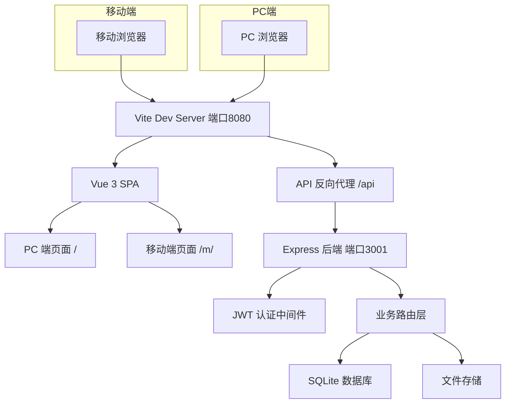
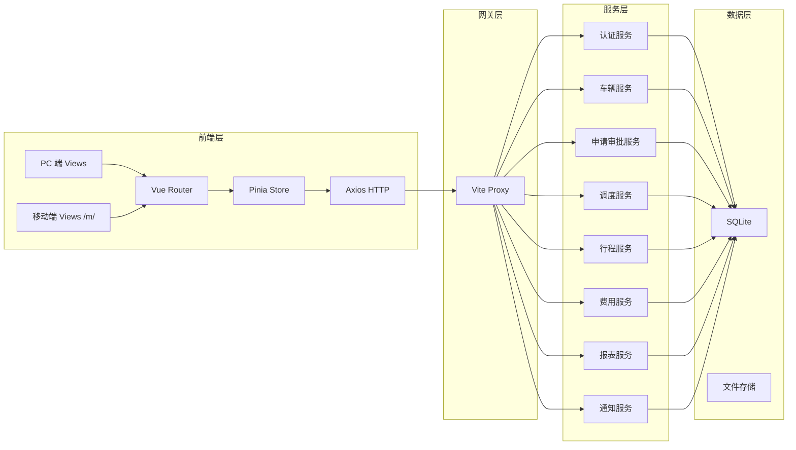
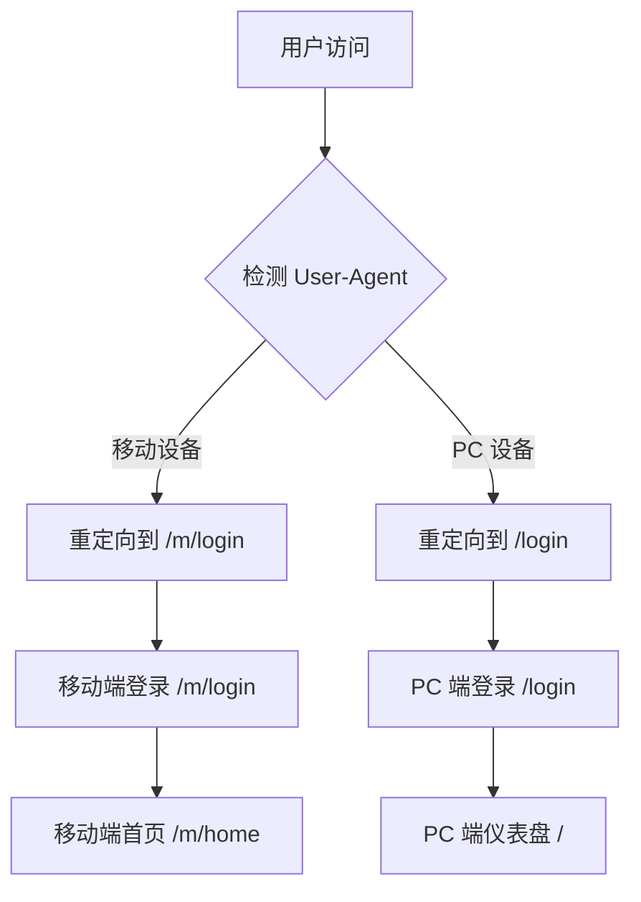
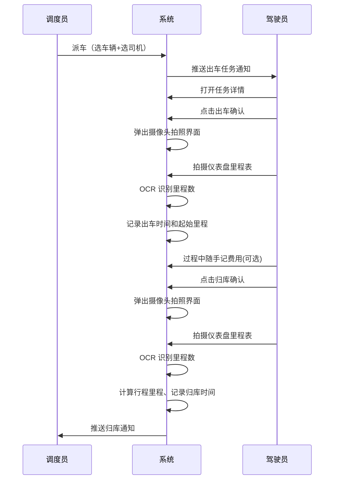
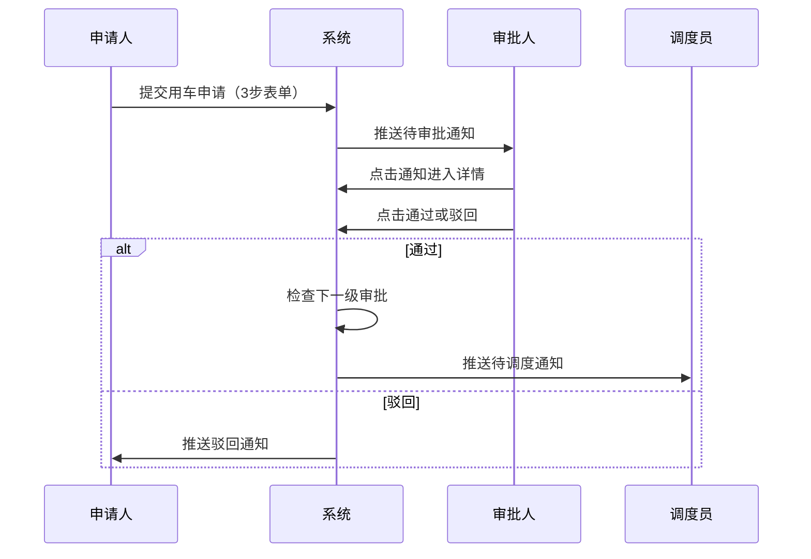

# 公务用车移动端 - 技术设计文档

Feature Name: official-vehicle-mobile
Updated: 2026-07-09

## 描述

在现有 Vue 3 + Element Plus 的 PC 端管理后台基础上，新增移动端轻量操作终端。移动端采用独立路由和独立页面组件，复用现有后端 API 和 Pinia 状态管理。利用移动设备摄像头实现拍照上传和 OCR 里程识别，不支持 GPS 定位功能（车辆无定位装置）。

## 架构

### 系统架构图



### 分层架构



## 组件与接口

### 移动端路由设计

移动端路由统一使用 `/m` 前缀，与 PC 端路由隔离：

| 路径 | 名称 | 组件 | 角色 |
|------|------|------|------|
| `/m/login` | 登录 | MobileLoginView | 公开 |
| `/m/home` | 首页 | MobileHomeView | 全部（按角色渲染） |
| `/m/apply/create` | 用车申请 | MobileApplyCreateView | 普通员工 |
| `/m/apply/list` | 我的申请 | MobileApplyListView | 普通员工 |
| `/m/apply/:id` | 申请详情 | MobileApplyDetailView | 普通员工、审批人 |
| `/m/approve/list` | 待审批列表 | MobileApproveListView | 部门负责人、分管领导 |
| `/m/dispatch/list` | 待调度列表 | MobileDispatchListView | 调度员 |
| `/m/dispatch/assign/:id` | 快速派车 | MobileDispatchAssignView | 调度员 |
| `/m/task/list` | 我的任务 | MobileTaskListView | 驾驶员 |
| `/m/task/:id/start` | 出车确认 | MobileTripStartView | 驾驶员 |
| `/m/task/:id/end` | 归库确认 | MobileTripEndView | 驾驶员 |
| `/m/expense/create` | 费用随手记 | MobileExpenseCreateView | 驾驶员 |
| `/m/repair/create` | 一键报修 | MobileRepairCreateView | 驾驶员 |
| `/m/monitor` | 全局看板 | MobileMonitorView | 管理员 |
| `/m/vehicle/status` | 车辆状态看板 | MobileVehicleStatusView | 调度员、负责人、领导 |
| `/m/notifications` | 消息列表 | MobileNotificationView | 全部 |

### 移动端组件树

```
App.vue
├── RouterView
│   ├── PC 端路由 (/)
│   │   └── Layout (Sidebar + Header + Content)
│   └── 移动端路由 (/m)
│       └── MobileLayout (无侧边栏，底部 TabBar)
│           ├── MobileHomeView
│           │   ├── RoleHomeEmployee      -- 普通员工首页
│           │   ├── RoleHomeApprover      -- 审批人首页
│           │   ├── RoleHomeDispatcher    -- 调度员首页
│           │   ├── RoleHomeDriver        -- 驾驶员首页
│           │   └── RoleHomeAdmin         -- 管理员首页
│           ├── MobileApplyCreateView
│           │   ├── FormSteps             -- 分步表单（3步）
│           │   ├── RoutePicker           -- 常用路线选择
│           │   └── DateTimePicker        -- 时间选择
│           ├── MobileApproveListView
│           │   ├── ApproveCard           -- 审批卡片
│           │   └── StatusTab             -- 状态筛选 Tab
│           ├── MobileDispatchListView
│           │   └── DispatchCard          -- 调度任务卡片
│           ├── MobileDispatchAssignView
│           │   ├── VehicleSelector       -- 可用车辆选择器
│           │   └── DriverSelector        -- 可用司机选择器
│           ├── MobileTaskListView
│           │   └── TaskCard              -- 任务卡片
│           ├── MobileTripStartView
│           │   └── CameraCapture         -- 拍照组件（里程表）
│           ├── MobileTripEndView
│           │   └── CameraCapture         -- 拍照组件（里程表）
│           ├── MobileExpenseCreateView
│           │   ├── ExpenseTypePicker     -- 费用类型选择
│           │   └── CameraCapture         -- 拍照组件（小票）
│           ├── MobileRepairCreateView
│           │   └── CameraCapture         -- 拍照组件（故障）
│           ├── MobileMonitorView
│           │   └── StatCard              -- 指标卡片
│           ├── MobileVehicleStatusView
│           │   └── StatusGrid            -- 状态色块网格
│           └── MobileNotificationView
│               └── NotificationCard      -- 通知卡片
```

### 移动端 UI 组件库选择

使用 Vant 4 作为移动端 UI 组件库，原因：

- 轻量级，专为移动端设计
- 内置 Tabbar、Card、Uploader（拍照）、Steps 等移动端常用组件
- 与 Vue 3 完全兼容
- 与现有 Element Plus 并存，互不冲突

### 新增/复用后端 API

移动端复用现有全部后端 API，仅针对移动端场景新增以下接口：

| 方法 | 路径 | 说明 | 关联需求 |
|------|------|------|---------|
| POST | `/api/mobile/ocr/odometer` | OCR 识别里程表读数 | REQ-MOB-05 |
| GET | `/api/mobile/dashboard/overview` | 全局看板数据 | REQ-MOB-09 |
| GET | `/api/mobile/vehicle/status-grid` | 车辆状态色块数据 | REQ-MOB-10 |
| GET | `/api/mobile/routes/frequent` | 常用路线列表 | REQ-MOB-02 |

### 路由切换策略



路由守卫中检测 `navigator.userAgent`，移动设备自动跳转 `/m/` 路由，PC 设备保持 `/` 路由。同时 `/m/` 路由在 PC 端也可直接访问，方便开发调试。

## 数据模型

### 新增数据表

移动端不引入新的核心数据表，复用现有的 Application、Trip、Expense、Notification 等表结构。

### 费用随手记 - 关联增强

Expense 表现在已有 `vehicle_id` 和 `trip_id` 字段。移动端费用随手记提交时自动关联当前驾驶员正在进行中的 Trip 记录：

```
Expense {
    ...existing fields
    int vehicle_id FK    -- 自动取自当前行程的车辆
    int trip_id FK       -- 自动取自驾驶员进行中行程
    string photo_url     -- 小票照片 URL（利用现有字段）
}
```

## 核心业务流程

### 驾驶员出车归库流程



### 审批流程



## 正确性约束

1. 出车时里程数必须大于等于该车辆上次归库时的里程数
2. 归库时里程数必须大于等于该车辆本次出车时的里程数
3. 同一驾驶员同时最多存在一条进行中的行程
4. 同一车辆同时最多被一个进行中的行程占用
5. 费用随手记必须关联到驾驶员当前进行中的行程
6. 移动端和 PC 端共享同一 JWT token 认证体系
7. 移动端 OCR 识别结果异常时允许驾驶员手动修正

## 错误处理

| 场景 | 行为 |
|------|------|
| OCR 识别失败 | 提示手动输入里程数，照片一并保存 |
| 网络断开时提交 | 数据暂存本地，网络恢复后自动提交 |
| 拍照权限被拒 | 提示用户授予相机权限，或切换为手动输入 |
| 无进行中行程时记费用 | 提示当前无进行中行程，费用记入最近一次行程 |
| 退登后重新登录 | 恢复断网暂存数据并自动提交 |

## 测试策略

- **单元测试**：OCR 识别逻辑、里程校验逻辑、角色首页渲染逻辑
- **集成测试**：出车-归库完整流程、申请-审批-调度完整流程
- **移动端适配测试**：主要移动设备尺寸（375px、390px、414px 宽度）视觉验证
- **离线场景测试**：断网状态下提交费用、恢复网络后数据上传

## 技术栈

| 组件 | 版本 |
|------|------|
| Vue | 3.4.x (已有) |
| Vite | 5.x (已有) |
| Vant | 4.x (新增) |
| Pinia | 2.x (已有) |
| Vue Router | 4.x (已有) |
| Axios | 1.x (已有) |
| Node.js + Express | 20.x / 4.x (已有) |
| SQLite | 已有 |

## 附录

### Vant 与 Element Plus 并存方案

Vant 和 Element Plus 互相独立，通过路由前缀隔离：
- `/` 前缀路由加载 Element Plus 组件
- `/m/` 前缀路由加载 Vant 组件

两个 UI 库的样式互不干扰，通过 Vite 的 CSS 模块化和 scoped style 保证隔离。
