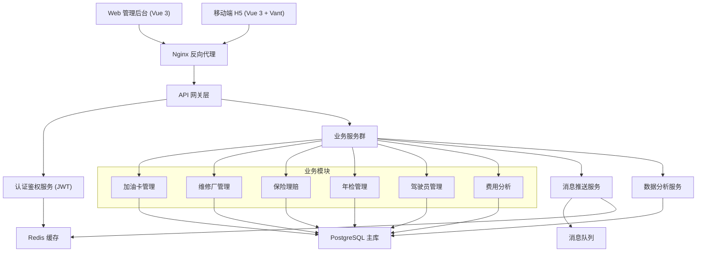
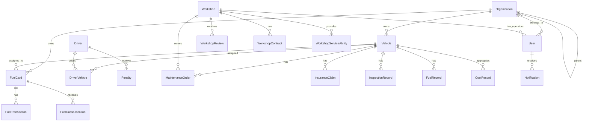
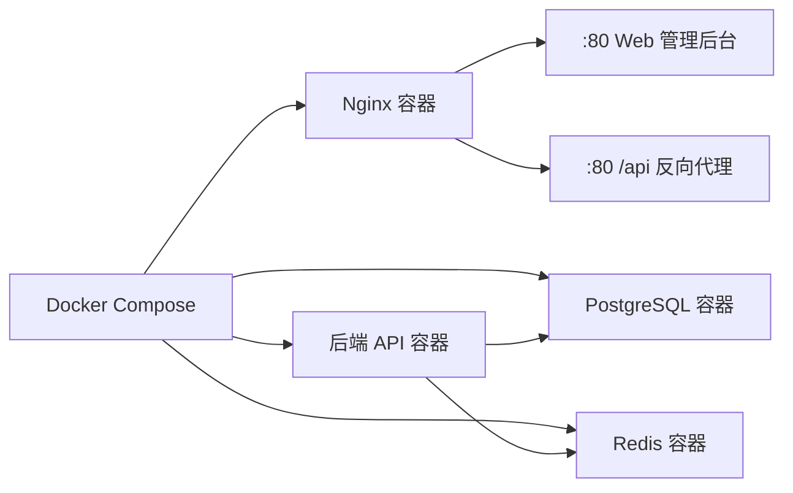

# 车辆管理系统技术设计

Feature Name: vehicle-management-system
Updated: 2026-06-30

## Description

车辆管理系统采用前后端分离架构，支持 Web 管理后台和移动端 H5 双入口。后端提供统一 RESTful API，前端管理后台负责运营管理，移动端 H5 响应式适配提供移动运营入口。系统按总公司-分公司-车队三级组织架构实现数据权限隔离。定点维修车厂模块支持维修厂全生命周期管理，覆盖信息登记、资质管理、合作状态流转、服务能力配置、操作员管理及服务数据看板。

## Architecture



## Technology Stack

| 层级 | 技术选型 | 说明 |
|------|---------|------|
| 前端框架 | Vue 3 + TypeScript + Vite | 组件化开发，TypeScript 类型安全 |
| UI 组件库 | Element Plus (管理后台) / Vant (移动端) | 国内主流企业级 UI 库 |
| 状态管理 | Pinia | Vue 3 官方推荐状态管理 |
| HTTP 客户端 | Axios | 请求拦截、统一错误处理 |
| 后端语言 | Go (Gin 框架) | 高性能、适合数据分析场景 |
| ORM | GORM | Go 主流 ORM 框架 |
| 数据库 | PostgreSQL 15 | 关系型数据库，支持复杂分析查询 |
| 缓存 | Redis 7 | 会话管理、热点数据缓存、消息队列 |
| 消息队列 | Redis Streams | 轻量级消息队列，无需额外部署 |
| 认证 | JWT + RBAC | 无状态认证 + 基于角色的权限控制 |
| API 文档 | Swagger (gin-swagger) | 自动生成 API 文档 |
| 容器化 | Docker + Docker Compose | 一键部署 |

## Components and Interfaces

### 1. 前端模块划分

```
src/
├── views/
│   ├── dashboard/          # 运营仪表盘
│   ├── fuel-card/          # 加油卡管理 (R1)
│   ├── workshop/           # 定点维修厂管理 (R2, R12)
│   ├── insurance/          # 保险理赔 (R3)
│   ├── inspection/         # 年检管理 (R4)
│   ├── driver/             # 驾驶员扣分 (R5)
│   ├── fuel-analysis/      # 油耗预警 (R6)
│   ├── cost-analysis/      # 费用分析 (R7, R8)
│   ├── notification/       # 消息中心 (R10)
│   └── organization/       # 组织架构 (R11)
├── components/             # 公共组件
├── router/                 # 路由配置
├── store/                  # 状态管理
├── api/                    # API 封装
└── utils/                  # 工具函数
```

### 2. 后端模块划分

```
server/
├── cmd/                    # 入口
├── internal/
│   ├── handler/            # HTTP 处理层
│   ├── service/            # 业务逻辑层
│   ├── repository/         # 数据访问层
│   ├── model/              # 数据模型
│   ├── middleware/         # 中间件 (认证/权限/日志)
│   └── scheduler/          # 定时任务
├── pkg/                    # 公共工具
└── config/                 # 配置文件
```

### 3. API 接口设计

所有 API 前缀：`/api/v1`

| 模块 | 方法 | 路径 | 说明 |
|------|------|------|------|
| 加油卡 | GET | `/fuel-cards` | 获取加油卡树形列表 |
| 加油卡 | POST | `/fuel-cards/{id}/recharge` | 主卡充值 |
| 加油卡 | POST | `/fuel-cards/{id}/allocate` | 副卡额度分配 |
| 维修厂 | GET | `/workshops` | 维修厂列表（含评分） |
| 维修厂 | POST | `/workshops/{id}/reviews` | 提交评价 |
| 保险理赔 | POST | `/insurance-claims` | 创建理赔申请 |
| 保险理赔 | PUT | `/insurance-claims/{id}/status` | 更新理赔状态 |
| 年检 | GET | `/inspections/upcoming` | 到期年检列表 |
| 年检 | POST | `/inspections/booking` | 创建年检预约 |
| 驾驶员 | GET | `/drivers/{id}/penalties` | 驾驶员扣分记录 |
| 驾驶员 | POST | `/penalties` | 录入交通违法 |
| 油耗 | GET | `/fuel-consumption/anomalies` | 油耗异常列表 |
| 油耗 | GET | `/fuel-consumption/stats/{vehicle_id}` | 车辆油耗统计 |
| 费用 | GET | `/cost-analysis/yoy` | 同比分析 |
| 费用 | GET | `/cost-analysis/mom` | 环比分析 |
| 费用 | GET | `/cost-analysis/tco/{vehicle_id}` | 车辆TCO |
| 消息 | GET | `/notifications` | 消息列表 |
| 消息 | PUT | `/notifications/{id}/read` | 标记已读 |
| 组织 | GET | `/organizations/tree` | 组织架构树 |
| 组织 | POST | `/organizations` | 创建组织节点 |
| 定点维修厂 | GET | `/workshops` | 维修厂列表（含筛选/排序） |
| 定点维修厂 | POST | `/workshops` | 新增维修厂 |
| 定点维修厂 | PUT | `/workshops/{id}` | 编辑维修厂信息 |
| 定点维修厂 | GET | `/workshops/{id}` | 维修厂详情 |
| 定点维修厂 | POST | `/workshops/{id}/documents` | 上传资质文件 |
| 定点维修厂 | PUT | `/workshops/{id}/status` | 变更定点状态 |
| 定点维修厂 | PUT | `/workshops/{id}/services` | 配置服务能力 |
| 定点维修厂 | POST | `/workshops/{id}/operators` | 创建操作员账号 |
| 定点维修厂 | PUT | `/workshops/{id}/operators/{opId}/password` | 重置操作员密码 |
| 定点维修厂 | GET | `/workshops/{id}/dashboard` | 维修厂服务看板 |
| 定点维修厂 | GET | `/workshops/{id}/orders` | 维修厂工单列表 |
| 维修厂评价 | POST | `/workshops/{id}/reviews` | 提交评价 |

## Data Models

### 核心实体关系



### 关键表结构

#### Organization (组织架构)
| 字段 | 类型 | 说明 |
|------|------|------|
| id | UUID | 主键 |
| name | VARCHAR(100) | 组织名称 |
| parent_id | UUID | 父组织ID |
| org_type | ENUM | 类型: company/branch/fleet |
| level | INT | 层级深度 |

#### FuelCard (加油卡)
| 字段 | 类型 | 说明 |
|------|------|------|
| id | UUID | 主键 |
| card_number | VARCHAR(50) | 卡号 |
| card_type | ENUM | 类型: main/sub |
| parent_id | UUID | 主卡ID |
| balance | DECIMAL(12,2) | 当前余额 |
| daily_limit | DECIMAL(12,2) | 日消费限额 |
| balance_threshold | DECIMAL(12,2) | 余额预警阈值 |
| org_id | UUID | 归属组织 |

#### FuelTransaction (加油消费记录)
| 字段 | 类型 | 说明 |
|------|------|------|
| id | UUID | 主键 |
| card_id | UUID | 加油卡ID |
| amount | DECIMAL(12,2) | 消费金额 |
| liters | DECIMAL(10,2) | 加油量(升) |
| odometer | INT | 里程表读数 |
| transaction_time | TIMESTAMP | 消费时间 |

#### Penalty (交通违法记录)
| 字段 | 类型 | 说明 |
|------|------|------|
| id | UUID | 主键 |
| driver_id | UUID | 驾驶员ID |
| vehicle_id | UUID | 车辆ID |
| points | INT | 扣分数 |
| incident_time | TIMESTAMP | 违法时间 |
| status | ENUM | 状态: pending/processed/cleared |

#### MaintenanceOrder (维修工单)
| 字段 | 类型 | 说明 |
|------|------|------|
| id | UUID | 主键 |
| vehicle_id | UUID | 车辆ID |
| workshop_id | UUID | 维修厂ID |
| order_type | ENUM | 类型: repair/maintenance |
| total_cost | DECIMAL(12,2) | 总费用 |
| status | ENUM | 状态流程跟踪 |
| completed_at | TIMESTAMP | 完成时间 |

#### Workshop (定点维修厂)
| 字段 | 类型 | 说明 |
|------|------|------|
| id | UUID | 主键 |
| name | VARCHAR(200) | 维修厂名称 |
| credit_code | VARCHAR(50) | 统一社会信用代码 |
| address | VARCHAR(500) | 经营地址 |
| contact_person | VARCHAR(50) | 联系人姓名 |
| contact_phone | VARCHAR(20) | 联系电话 |
| business_scope | TEXT | 经营范围描述 |
| business_hours_start | TIME | 营业开始时间 |
| business_hours_end | TIME | 营业结束时间 |
| station_count | INT | 工位数量 |
| has_tow_service | BOOLEAN | 拖车服务 |
| has_replacement_car | BOOLEAN | 代步车服务 |
| status | ENUM | 定点状态: active/suspended/terminated |
| org_id | UUID | 归属组织 |

#### WorkshopContract (定点合作合同)
| 字段 | 类型 | 说明 |
|------|------|------|
| id | UUID | 主键 |
| workshop_id | UUID | 维修厂ID |
| contract_number | VARCHAR(100) | 合同编号 |
| sign_date | DATE | 签约日期 |
| expire_date | DATE | 合同到期日 |
| status | ENUM | 合同状态: active/expired/terminated |

#### WorkshopServiceAbility (维修厂服务能力)
| 字段 | 类型 | 说明 |
|------|------|------|
| id | UUID | 主键 |
| workshop_id | UUID | 维修厂ID |
| service_type | VARCHAR(50) | 服务类型: engine/body/paint/tire/detailing/alignment/ac/electrical/gearbox |

#### WorkshopDocument (维修厂资质文件)
| 字段 | 类型 | 说明 |
|------|------|------|
| id | UUID | 主键 |
| workshop_id | UUID | 维修厂ID |
| doc_type | ENUM | 类型: business_license/certificate/other |
| file_name | VARCHAR(255) | 文件名 |
| file_path | VARCHAR(500) | 存储路径 |
| uploaded_at | TIMESTAMP | 上传时间 |

#### WorkshopReview (维修厂评价)
| 字段 | 类型 | 说明 |
|------|------|------|
| id | UUID | 主键 |
| workshop_id | UUID | 维修厂ID |
| order_id | UUID | 关联工单ID |
| reviewer_id | UUID | 评价人ID |
| quality_score | INT | 维修质量评分(1-5) |
| timeliness_score | INT | 交付时效评分(1-5) |
| service_score | INT | 服务态度评分(1-5) |
| price_score | INT | 价格合理性评分(1-5) |
| comment | TEXT | 评价内容 |
| created_at | TIMESTAMP | 评价时间 |

## Correctness Properties

1. **余额一致性**: 主卡余额 = 主卡可用余额 + SUM(所有副卡余额)，任何充值/分配操作必须在事务中完成
2. **扣分累积**: 驾驶员累计扣分 = SUM(该驾驶员所有未清零扣分记录的points)
3. **TCO完整性**: 车辆TCO = 购置成本 + SUM(燃油费) + SUM(维修费) + SUM(保险费) + SUM(年检费)
4. **组织数据隔离**: 用户查询范围 = 用户所属组织节点及其所有子孙节点的数据
5. **消息去重**: 同一事件同一用户24小时内仅生成一条未处理提醒
6. **维修厂信用代码唯一性**: 系统中每个统一社会信用代码对应唯一一条维修厂记录
7. **工单分配约束**: 维修工单分配的目标维修厂必须满足 status=active 且 service_type 匹配工单需求
8. **合同到期状态联动**: 合同到期次日自动将维修厂状态变更为 terminated，同时禁用该维修厂所有操作员账号

## Error Handling

| 场景 | HTTP 状态码 | 处理策略 |
|------|------------|---------|
| 认证失败 | 401 | 返回统一错误格式，前端跳转登录页 |
| 权限不足 | 403 | 返回权限不足提示 |
| 资源不存在 | 404 | 返回资源未找到提示 |
| 参数校验失败 | 422 | 返回具体校验错误字段和原因 |
| 副卡消费超限 | 422 | 返回超限金额和剩余额度 |
| 维修厂信用代码重复 | 409 | 返回已存在的维修厂名称 |
| 维修厂被暂停时分配工单 | 422 | 返回该维修厂暂不可用的提示信息 |
| 维修厂不存在 | 404 | 返回维修厂未找到提示 |
| 数据库异常 | 500 | 记录日志，返回通用错误，不影响用户体验 |
| 外部服务超时 | 504 | 重试3次后降级处理 |

## Test Strategy

### 单元测试
- 后端 Service 层业务逻辑：覆盖率 > 80%
- 前端 Pinia Store 逻辑：覆盖率 > 70%

### 集成测试
- API 端点测试：所有核心 CRUD 流程
- 权限隔离验证：不同角色/组织的 CRUD 行为
- 事务一致性测试：充值扣减、扣分累计

### 关键测试用例
- 主卡充值 1000 元后余额正确增加，且事务回滚验证
- 副卡日消费超限时交易被拒绝
- 驾驶员扣分达6分时生成警告通知
- 油耗偏离基准20%触发异常预警
- 组织用户只能查看本节点及下级节点数据
- 重复统一社会信用代码录入时被拒绝
- 暂停合作状态下的维修厂无法接收新工单
- 合同到期30天前自动生成提醒通知
- 维修厂操作员账号随终止合作自动禁用

## Deployment



- 前端静态资源由 Nginx 直接服务
- `/api` 路径反向代理到后端 Go 服务
- 通过 Docker Compose 一键启动全部依赖

## References

[^1]: requirements.md - 需求文档（当前目录）
